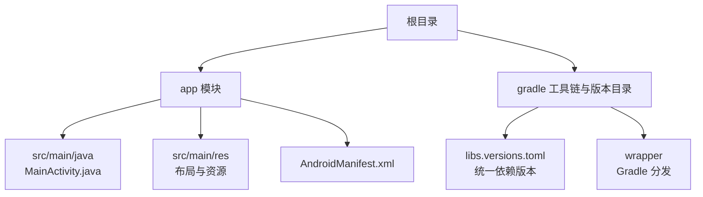
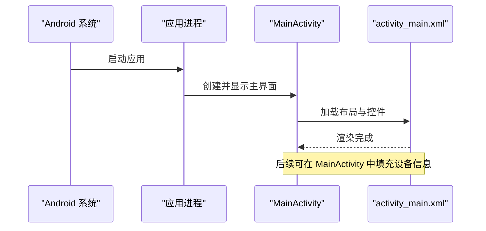
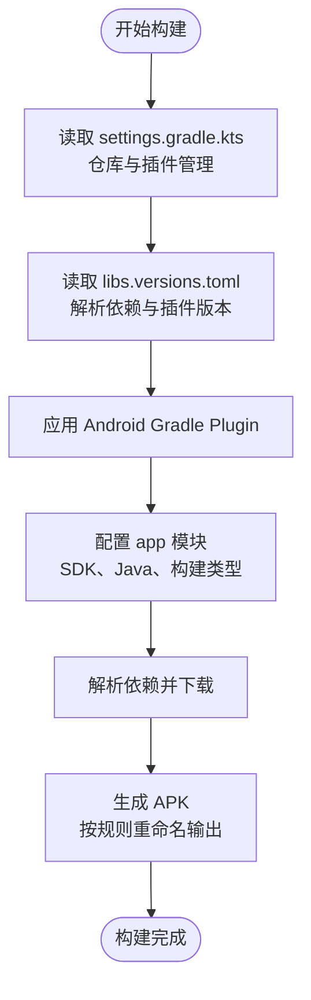
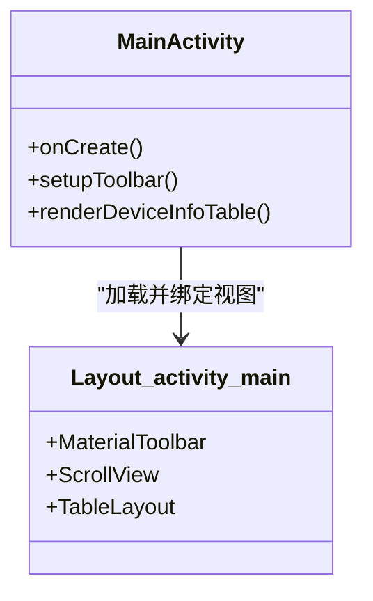
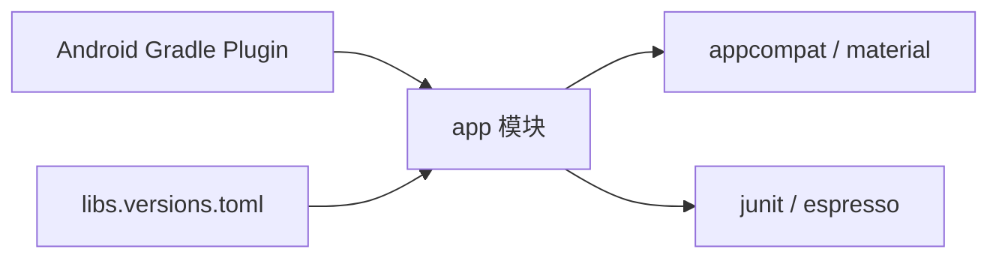

# 快速开始

<cite>
**本文引用的文件**
- [build.gradle.kts](file://build.gradle.kts)
- [app/build.gradle.kts](file://app/build.gradle.kts)
- [settings.gradle.kts](file://settings.gradle.kts)
- [gradle/libs.versions.toml](file://gradle/libs.versions.toml)
- [gradle.properties](file://gradle.properties)
- [gradle/wrapper/gradle-wrapper.properties](file://gradle/wrapper/gradle-wrapper.properties)
- [app/src/main/AndroidManifest.xml](file://app/src/main/AndroidManifest.xml)
- [app/src/main/res/layout/activity_main.xml](file://app/src/main/res/layout/activity_main.xml)
- [app/src/main/res/values/strings.xml](file://app/src/main/res/values/strings.xml)
</cite>

## 目录
1. [简介](#简介)
2. [项目结构](#项目结构)
3. [核心组件](#核心组件)
4. [架构总览](#架构总览)
5. [详细组件分析](#详细组件分析)
6. [依赖分析](#依赖分析)
7. [性能考虑](#性能考虑)
8. [故障排除指南](#故障排除指南)
9. [结论](#结论)
10. [附录](#附录)

## 简介
本指南面向首次接触该 Android 设备信息应用的开发者，提供从环境准备、依赖安装到导入构建与运行的完整步骤。你将学会如何配置 Android Studio、JDK、Android SDK，并成功编译和运行应用。同时包含常见问题的排查建议，帮助初学者快速上手，也便于有经验的开发者迅速完成环境搭建。

## 项目结构
该项目采用标准的 Android Gradle 多模块结构（当前仅包含 app 模块），使用 Kotlin DSL 的 build.gradle.kts 进行构建配置，并通过版本目录 libs.versions.toml 统一管理依赖版本。资源文件位于 app/src/main/res，清单文件定义应用入口 Activity 为 MainActivity。

图表来源
- [settings.gradle.kts:1-27](file://settings.gradle.kts#L1-L27)
- [app/build.gradle.kts:1-80](file://app/build.gradle.kts#L1-L80)
- [gradle/libs.versions.toml:1-19](file://gradle/libs.versions.toml#L1-L19)
- [gradle/wrapper/gradle-wrapper.properties:1-10](file://gradle/wrapper/gradle-wrapper.properties#L1-L10)

章节来源
- [settings.gradle.kts:1-27](file://settings.gradle.kts#L1-L27)
- [app/build.gradle.kts:1-80](file://app/build.gradle.kts#L1-L80)
- [gradle/libs.versions.toml:1-19](file://gradle/libs.versions.toml#L1-L19)
- [gradle/wrapper/gradle-wrapper.properties:1-10](file://gradle/wrapper/gradle-wrapper.properties#L1-L10)

## 核心组件
- 构建系统：基于 Android Gradle Plugin 与 Gradle Wrapper，使用版本目录集中管理依赖与插件版本。
- 应用模块：app 模块定义了命名空间、编译目标、最低/目标 SDK、Java 版本、输出 APK 命名规则等。
- 资源与界面：使用 Material Components 与 Toolbar，主界面通过 TableLayout 展示设备信息列表。
- 入口点：AndroidManifest.xml 声明 MainActivity 为启动入口。

章节来源
- [app/build.gradle.kts:10-43](file://app/build.gradle.kts#L10-L43)
- [app/src/main/AndroidManifest.xml:5-21](file://app/src/main/AndroidManifest.xml#L5-L21)
- [app/src/main/res/layout/activity_main.xml:1-62](file://app/src/main/res/layout/activity_main.xml#L1-L62)
- [gradle/libs.versions.toml:1-19](file://gradle/libs.versions.toml#L1-L19)

## 架构总览
下图展示了应用从启动到界面的基本流程：系统根据 Manifest 启动 MainActivity，界面加载 activity_main.xml，使用 MaterialToolbar 作为标题栏，并在可滚动区域中以表格形式展示设备信息。

图表来源
- [app/src/main/AndroidManifest.xml:14-20](file://app/src/main/AndroidManifest.xml#L14-L20)
- [app/src/main/res/layout/activity_main.xml:1-62](file://app/src/main/res/layout/activity_main.xml#L1-L62)

## 详细组件分析

### 构建与依赖配置
- 根级构建脚本仅声明 Android 应用插件，具体版本由版本目录管理。
- app 模块定义了命名空间、compileSdk/targetSdk/minSdk、Java 版本、构建类型与输出 APK 命名策略。
- 依赖通过 libs.versions.toml 引入 androidx.appcompat 与 com.google.android.material，测试依赖包括 JUnit、Espresso。

图表来源
- [settings.gradle.kts:1-27](file://settings.gradle.kts#L1-L27)
- [gradle/libs.versions.toml:1-19](file://gradle/libs.versions.toml#L1-L19)
- [app/build.gradle.kts:10-80](file://app/build.gradle.kts#L10-L80)

章节来源
- [build.gradle.kts:1-4](file://build.gradle.kts#L1-L4)
- [app/build.gradle.kts:10-80](file://app/build.gradle.kts#L10-L80)
- [gradle/libs.versions.toml:1-19](file://gradle/libs.versions.toml#L1-L19)

### 应用入口与界面
- 入口 Activity：MainActivity，在 Manifest 中标记为 LAUNCHER。
- 界面布局：MaterialToolbar 作为标题栏，TableLayout 用于展示属性与值两列数据，支持滚动查看。
- 资源：应用名称来自 strings.xml。

图表来源
- [app/src/main/AndroidManifest.xml:14-20](file://app/src/main/AndroidManifest.xml#L14-L20)
- [app/src/main/res/layout/activity_main.xml:1-62](file://app/src/main/res/layout/activity_main.xml#L1-L62)

章节来源
- [app/src/main/AndroidManifest.xml:5-21](file://app/src/main/AndroidManifest.xml#L5-L21)
- [app/src/main/res/layout/activity_main.xml:1-62](file://app/src/main/res/layout/activity_main.xml#L1-L62)
- [app/src/main/res/values/strings.xml:1-3](file://app/src/main/res/values/strings.xml#L1-L3)

## 依赖分析
- 插件：Android Application 插件由版本目录统一控制。
- 运行时依赖：androidx.appcompat、com.google.android.material。
- 测试依赖：junit、androidx.test.ext.junit、espresso-core。
- 仓库：Google、Maven Central；插件管理还启用了 Gradle Toolchains 约定以自动解析 JDK。

图表来源
- [gradle/libs.versions.toml:1-19](file://gradle/libs.versions.toml#L1-L19)
- [app/build.gradle.kts:74-80](file://app/build.gradle.kts#L74-L80)
- [settings.gradle.kts:14-16](file://settings.gradle.kts#L14-L16)

章节来源
- [gradle/libs.versions.toml:1-19](file://gradle/libs.versions.toml#L1-L19)
- [app/build.gradle.kts:74-80](file://app/build.gradle.kts#L74-L80)
- [settings.gradle.kts:14-16](file://settings.gradle.kts#L14-L16)

## 性能考虑
- Gradle 内存：可通过 gradle.properties 调整 JVM 参数以提升构建速度（例如增大堆内存）。
- 并行构建：在多模块项目中可启用并行构建，但需确保项目解耦良好。
- 依赖缓存：合理使用本地与远程仓库缓存，减少重复下载。
- 构建产物命名：已配置带时间戳与版本信息的 APK 文件名，便于区分不同构建。

[本节为通用指导，不直接分析具体代码]

## 故障排除指南
- 无法下载依赖或插件
  - 检查网络与代理设置，确认 Google/Maven Central 可达。
  - 清理 Gradle 缓存后重试。
- JDK 版本不匹配
  - 项目使用 Java 11 作为编译兼容版本，请确保 IDE 与 Gradle 使用的 JDK 满足要求。
  - 若出现 toolchain 相关错误，保持 settings.gradle.kts 中的工具链解析插件可用。
- Gradle 版本问题
  - 项目通过 wrapper 指定了特定 Gradle 版本，建议使用 ./gradlew 执行构建以避免版本不一致。
- 构建失败或内存不足
  - 在 gradle.properties 中适当增加 org.gradle.jvmargs 的堆大小。
- 模拟器/真机连接问题
  - 确保已安装对应版本的 Android SDK Platform 与 Build Tools，并在 Android Studio 中正确选择目标设备。

章节来源
- [gradle.properties:1-13](file://gradle.properties#L1-L13)
- [gradle/wrapper/gradle-wrapper.properties:1-10](file://gradle/wrapper/gradle-wrapper.properties#L1-L10)
- [settings.gradle.kts:14-16](file://settings.gradle.kts#L14-L16)
- [app/build.gradle.kts:39-42](file://app/build.gradle.kts#L39-L42)

## 结论
通过以上步骤，你可以快速完成 Android 设备信息应用的开发环境搭建、导入与构建运行。项目采用现代 Android 构建体系，依赖与插件版本集中管理，便于维护与升级。遇到问题时，可参考故障排除部分定位并解决。

## 附录

### 环境要求
- Android Studio：建议使用最新稳定版，以便获得对新版 AGP 与 Gradle 的最佳支持。
- JDK：项目编译兼容 Java 11，请确保 IDE 与 Gradle 使用匹配的 JDK 版本。
- Android SDK：
  - compileSdk/targetSdk：36（含 minor API level）
  - minSdk：24
  - 请在 SDK Manager 中安装对应的 Platform 与 Build Tools。

章节来源
- [app/build.gradle.kts:12-23](file://app/build.gradle.kts#L12-L23)
- [app/build.gradle.kts:39-42](file://app/build.gradle.kts#L39-L42)

### 依赖安装说明
- 首次打开项目时，Android Studio 会自动下载 Gradle 与依赖。如遇网络问题，可配置镜像或代理。
- 如需手动同步，点击“Sync Project with Gradle Files”。

章节来源
- [gradle/wrapper/gradle-wrapper.properties:1-10](file://gradle/wrapper/gradle-wrapper.properties#L1-L10)
- [settings.gradle.kts:1-23](file://settings.gradle.kts#L1-L23)

### 项目导入与构建步骤
- 导入项目：在 Android Studio 中选择 Open Existing Project，指向仓库根目录。
- 同步构建：等待 Gradle 同步完成。
- 运行应用：连接设备或启动模拟器，点击 Run 按钮。
- 构建产物：APK 将按版本、构建类型与时间戳命名，便于区分。

章节来源
- [app/build.gradle.kts:45-72](file://app/build.gradle.kts#L45-L72)
- [app/src/main/AndroidManifest.xml:14-20](file://app/src/main/AndroidManifest.xml#L14-L20)

### 常见问题与解决方案
- 构建速度慢
  - 开启 Gradle 守护进程与并行构建（谨慎使用），并合理配置内存。
- 依赖下载失败
  - 检查网络与代理，清理 .gradle 缓存后重试。
- 编译报错提示 JDK 版本不匹配
  - 确保 IDE 与 Gradle 使用 Java 11 或以上版本。
- 找不到目标 SDK
  - 在 SDK Manager 中安装 compileSdk/targetSdk 对应的平台与构建工具。

章节来源
- [gradle.properties:1-13](file://gradle.properties#L1-L13)
- [app/build.gradle.kts:12-23](file://app/build.gradle.kts#L12-L23)
- [app/build.gradle.kts:39-42](file://app/build.gradle.kts#L39-L42)