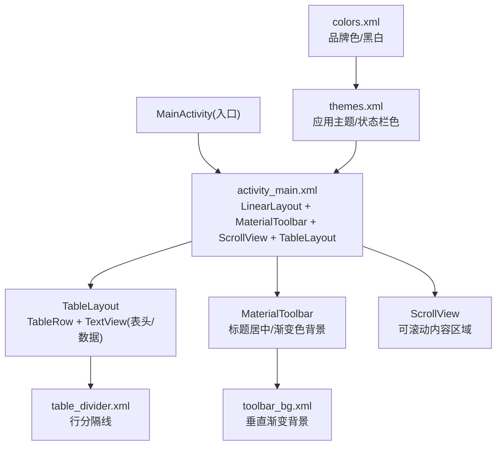
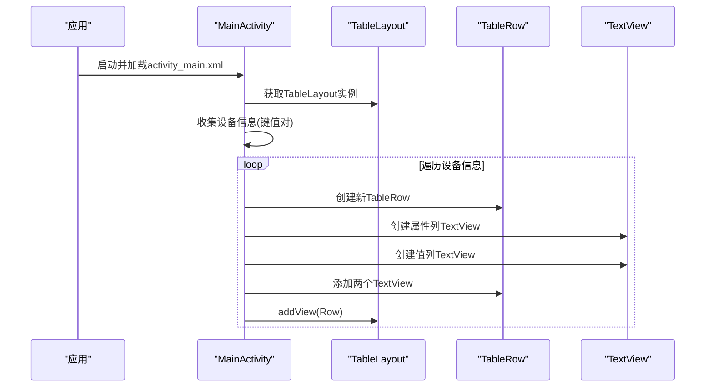
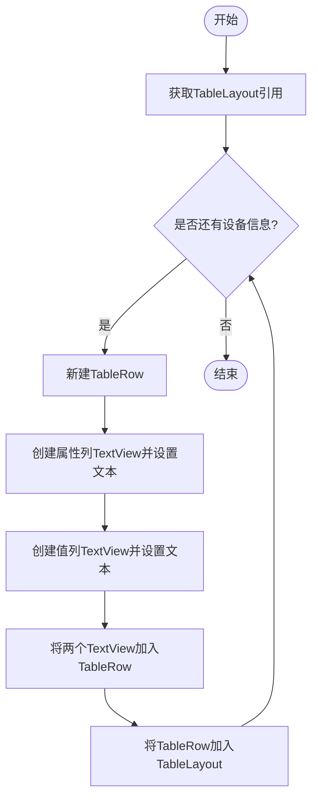
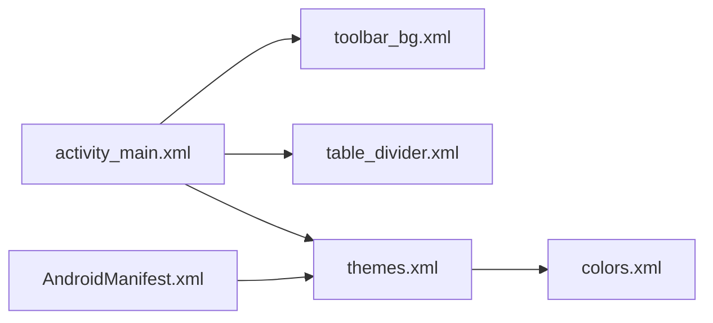

# UI展示逻辑

<cite>
**本文引用的文件**
- [activity_main.xml](file://app/src/main/res/layout/activity_main.xml)
- [themes.xml](file://app/src/main/res/values/themes.xml)
- [colors.xml](file://app/src/main/res/values/colors.xml)
- [table_divider.xml](file://app/src/main/res/drawable/table_divider.xml)
- [toolbar_bg.xml](file://app/src/main/res/drawable/toolbar_bg.xml)
- [AndroidManifest.xml](file://app/src/main/AndroidManifest.xml)
</cite>

## 目录
1. [简介](#简介)
2. [项目结构](#项目结构)
3. [核心组件](#核心组件)
4. [架构总览](#架构总览)
5. [详细组件分析](#详细组件分析)
6. [依赖关系分析](#依赖关系分析)
7. [性能与UI更新策略](#性能与ui更新策略)
8. [故障排查指南](#故障排查指南)
9. [结论](#结论)
10. [附录：响应式布局要点](#附录响应式布局要点)

## 简介
本文件聚焦于该Android应用的界面展示逻辑，围绕TableLayout的布局方式、动态行/列添加思路、数据绑定到UI的策略、Material Design组件（如Toolbar、TextView）的样式定制、以及响应式布局的实现原理进行系统化说明。同时提供UI更新策略与性能优化建议，并给出用户交互处理与事件响应的通用方案。内容兼顾初学者友好与进阶技术深度。

## 项目结构
应用采用典型的Android资源组织方式：
- 布局文件位于 res/layout，主界面使用LinearLayout包裹MaterialToolbar与ScrollView，内部以TableLayout承载设备信息列表。
- 主题与颜色定义在 res/values，通过Theme.MaterialComponents.DayNight.NoActionBar实现无ActionBar的主题，并通过自定义drawable为Toolbar设置渐变背景。
- 清单文件声明了入口Activity与主题引用。

图表来源
- [activity_main.xml:1-62](file://app/src/main/res/layout/activity_main.xml#L1-L62)
- [themes.xml:1-16](file://app/src/main/res/values/themes.xml#L1-L16)
- [colors.xml:1-10](file://app/src/main/res/values/colors.xml#L1-L10)
- [table_divider.xml:1-6](file://app/src/main/res/drawable/table_divider.xml#L1-L6)
- [toolbar_bg.xml:1-9](file://app/src/main/res/drawable/toolbar_bg.xml#L1-L9)
- [AndroidManifest.xml:1-23](file://app/src/main/AndroidManifest.xml#L1-L23)

章节来源
- [activity_main.xml:1-62](file://app/src/main/res/layout/activity_main.xml#L1-L62)
- [themes.xml:1-16](file://app/src/main/res/values/themes.xml#L1-L16)
- [colors.xml:1-10](file://app/src/main/res/values/colors.xml#L1-L10)
- [table_divider.xml:1-6](file://app/src/main/res/drawable/table_divider.xml#L1-L6)
- [toolbar_bg.xml:1-9](file://app/src/main/res/drawable/toolbar_bg.xml#L1-L9)
- [AndroidManifest.xml:1-23](file://app/src/main/AndroidManifest.xml#L1-L23)

## 核心组件
- 容器与滚动：外层LinearLayout负责纵向排列；ScrollView确保长列表可滚动。
- 工具栏：MaterialToolbar用于显示应用标题，支持居中与自定义背景。
- 表格：TableLayout作为数据展示容器，配合TableRow与TextView构建“属性-值”两列布局。
- 样式资源：通过themes.xml统一主题，colors.xml管理色彩，drawable资源提供分隔线与渐变背景。

章节来源
- [activity_main.xml:1-62](file://app/src/main/res/layout/activity_main.xml#L1-L62)
- [themes.xml:1-16](file://app/src/main/res/values/themes.xml#L1-L16)
- [colors.xml:1-10](file://app/src/main/res/values/colors.xml#L1-L10)
- [table_divider.xml:1-6](file://app/src/main/res/drawable/table_divider.xml#L1-L6)
- [toolbar_bg.xml:1-9](file://app/src/main/res/drawable/toolbar_bg.xml#L1-L9)

## 架构总览
界面由XML静态布局定义骨架，运行时通过Java/Kotlin代码将设备信息映射到TableLayout的动态行中。整体流程如下：

图表来源
- [activity_main.xml:20-60](file://app/src/main/res/layout/activity_main.xml#L20-L60)

章节来源
- [activity_main.xml:20-60](file://app/src/main/res/layout/activity_main.xml#L20-L60)

## 详细组件分析

### TableLayout的使用与动态行/列
- 布局角色：TableLayout作为二维表格容器，TableRow表示一行，每个子视图为一列。
- 列宽控制：通过stretchColumns指定可拉伸列，使“值”列自适应剩余空间，提升可读性。
- 行分隔：使用showDividers与divider资源在行间绘制分隔线，增强视觉层次。
- 动态添加：
  - 在运行时为TableLayout循环创建TableRow，并向其中添加两个TextView（属性列与值列）。
  - 使用addView将行追加至TableLayout末尾。
  - 若需插入或移除某行，可使用insertView/removeView等方法。
- 表头处理：当前布局包含一个隐藏表头行（visibility="gone"），可在需要时改为可见，或通过代码动态生成表头。

图表来源
- [activity_main.xml:26-32](file://app/src/main/res/layout/activity_main.xml#L26-L32)

章节来源
- [activity_main.xml:26-32](file://app/src/main/res/layout/activity_main.xml#L26-L32)

### 数据绑定机制（设备信息到UI）
- 数据源：从系统API或本地服务收集设备信息，形成键值对集合。
- 映射策略：
  - 遍历键值对，为每项创建一对TextView（属性名与属性值）。
  - 根据字段长度或类型，可对值列进行格式化（如单位、精度）。
  - 对于敏感或过长信息，可截断或折叠显示。
- 刷新时机：
  - 首次加载时一次性填充。
  - 当设备配置变化（如屏幕方向切换）或数据更新时，调用适配器的刷新方法重新渲染。
- 推荐模式：
  - 小数据量：直接操作TableLayout.addView。
  - 大数据量：建议使用RecyclerView替代TableLayout以获得更好的性能与复用能力。

章节来源
- [activity_main.xml:26-60](file://app/src/main/res/layout/activity_main.xml#L26-L60)

### Material Design组件与样式定制
- Toolbar：
  - 使用MaterialToolbar，设置标题居中、标题颜色与高度。
  - 背景使用自定义渐变drawable，营造品牌感。
- 主题：
  - 基于Theme.MaterialComponents.DayNight.NoActionBar，去除默认ActionBar，便于自定义Toolbar。
  - 通过colorPrimary等项统一品牌色，statusBarColor设置状态栏颜色。
- 颜色：
  - colors.xml集中管理品牌色与基础色，便于全局替换与夜间模式适配。
- 分隔线：
  - table_divider.xml定义1dp浅灰分隔线，配合showDividers实现表格行分隔。

章节来源
- [activity_main.xml:10-18](file://app/src/main/res/layout/activity_main.xml#L10-L18)
- [themes.xml:1-16](file://app/src/main/res/values/themes.xml#L1-L16)
- [colors.xml:1-10](file://app/src/main/res/values/colors.xml#L1-L10)
- [table_divider.xml:1-6](file://app/src/main/res/drawable/table_divider.xml#L1-L6)
- [toolbar_bg.xml:1-9](file://app/src/main/res/drawable/toolbar_bg.xml#L1-L9)

### 响应式布局实现原理
- 宽度适配：
  - 根容器与子控件多使用match_parent，保证占满可用宽度。
  - stretchColumns="1"使第二列（值列）自动拉伸，适应不同屏幕宽度。
- 高度与滚动：
  - ScrollView包裹TableLayout，避免内容溢出；TableLayout高度wrap_content按需增长。
- 密度与字体：
  - 使用sp定义字号，随系统字体缩放；dp定义间距与边框厚度，适配不同密度。
- 主题与夜间模式：
  - DayNight主题自动适配深色模式，颜色资源可通过values-night覆盖。

章节来源
- [activity_main.xml:2-7](file://app/src/main/res/layout/activity_main.xml#L2-L7)
- [activity_main.xml:26-32](file://app/src/main/res/layout/activity_main.xml#L26-L32)
- [themes.xml:1-16](file://app/src/main/res/values/themes.xml#L1-L16)
- [colors.xml:1-10](file://app/src/main/res/values/colors.xml#L1-L10)

## 依赖关系分析
- 布局依赖资源：
  - activity_main.xml依赖toolbar_bg.xml（Toolbar背景）、table_divider.xml（行分隔线）。
  - themes.xml与colors.xml共同决定应用外观。
- 清单依赖：
  - AndroidManifest.xml声明入口Activity与应用主题。

图表来源
- [activity_main.xml:10-32](file://app/src/main/res/layout/activity_main.xml#L10-L32)
- [themes.xml:1-16](file://app/src/main/res/values/themes.xml#L1-L16)
- [colors.xml:1-10](file://app/src/main/res/values/colors.xml#L1-L10)
- [AndroidManifest.xml:13-13](file://app/src/main/AndroidManifest.xml#L13-L13)

章节来源
- [activity_main.xml:10-32](file://app/src/main/res/layout/activity_main.xml#L10-L32)
- [themes.xml:1-16](file://app/src/main/res/values/themes.xml#L1-L16)
- [colors.xml:1-10](file://app/src/main/res/values/colors.xml#L1-L10)
- [AndroidManifest.xml:13-13](file://app/src/main/AndroidManifest.xml#L13-L13)

## 性能与UI更新策略
- 列表渲染：
  - 数据量较小：直接使用TableLayout.addView即可。
  - 数据量大：建议迁移到RecyclerView，利用ViewHolder复用与差量更新，显著降低内存与重绘开销。
- 批量更新：
  - 使用post或runOnUiThread在主线程更新UI。
  - 大量新增行时，考虑分批添加或使用Adapter的notifyDataSetChanged/notifyItemRangeInserted减少频繁重排。
- 测量与绘制：
  - 避免在onDraw中进行复杂计算；尽量使用静态资源与简单Drawable。
  - 合理设置padding/margin，减少不必要的重绘区域。
- 内存与卡顿：
  - 避免在滚动过程中执行耗时任务；将设备信息采集放在后台线程，完成后回调更新UI。
  - 及时释放不再使用的对象，防止内存泄漏。

[本节为通用指导，不直接分析具体文件]

## 故障排查指南
- 表格行未显示：
  - 检查TableLayout是否被正确添加到ScrollView内，且高度为wrap_content。
  - 确认动态添加的行已调用addView，且父容器未被其他布局遮挡。
- 分隔线不生效：
  - 确认showDividers设置为middle，且divider指向有效的shape资源。
- 标题栏背景异常：
  - 检查toolbar_bg.xml的gradient参数是否正确，颜色是否在colors.xml中定义。
- 主题未生效：
  - 确认AndroidManifest.xml中application theme指向正确的style。
  - 检查values-night是否存在对应覆盖资源以实现夜间模式。

章节来源
- [activity_main.xml:20-32](file://app/src/main/res/layout/activity_main.xml#L20-L32)
- [table_divider.xml:1-6](file://app/src/main/res/drawable/table_divider.xml#L1-L6)
- [toolbar_bg.xml:1-9](file://app/src/main/res/drawable/toolbar_bg.xml#L1-L9)
- [themes.xml:1-16](file://app/src/main/res/values/themes.xml#L1-L16)
- [AndroidManifest.xml:13-13](file://app/src/main/AndroidManifest.xml#L13-L13)

## 结论
该应用通过简洁的XML布局与Material组件实现了设备信息的清晰展示。TableLayout结合动态行添加满足小数据量场景；对于更复杂的列表展示，建议引入RecyclerView以提升性能与可维护性。通过统一的主题与资源管理，保证了跨屏幕与夜间模式的体验一致性。后续可在此基础上扩展更多交互与数据维度。

[本节为总结性内容，不直接分析具体文件]

## 附录：响应式布局要点
- 使用match_parent与wrap_content组合，确保在不同屏幕尺寸下良好适配。
- 通过stretchColumns控制列弹性，使关键信息列自适应宽度。
- 使用sp与dp分别管理字体与间距，保障可读性与一致性。
- 借助DayNight主题与资源覆盖，实现明暗主题无缝切换。

[本节为概念性说明，不直接分析具体文件]