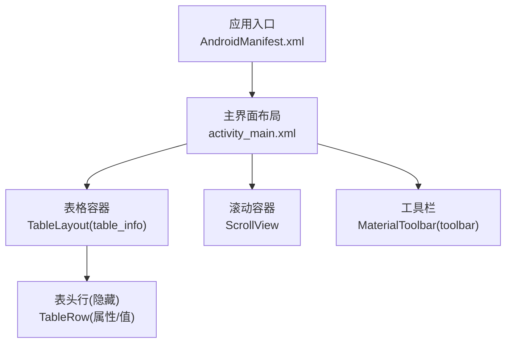
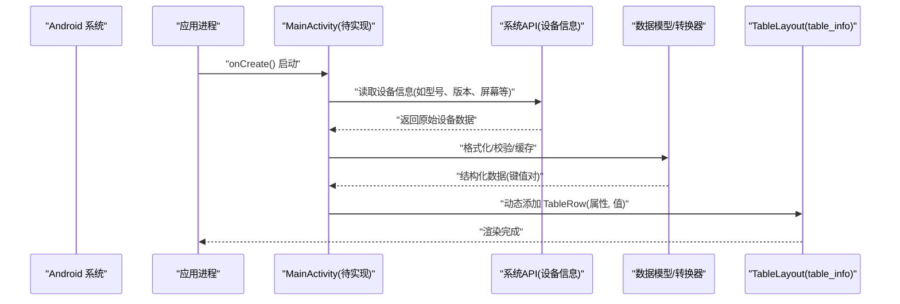
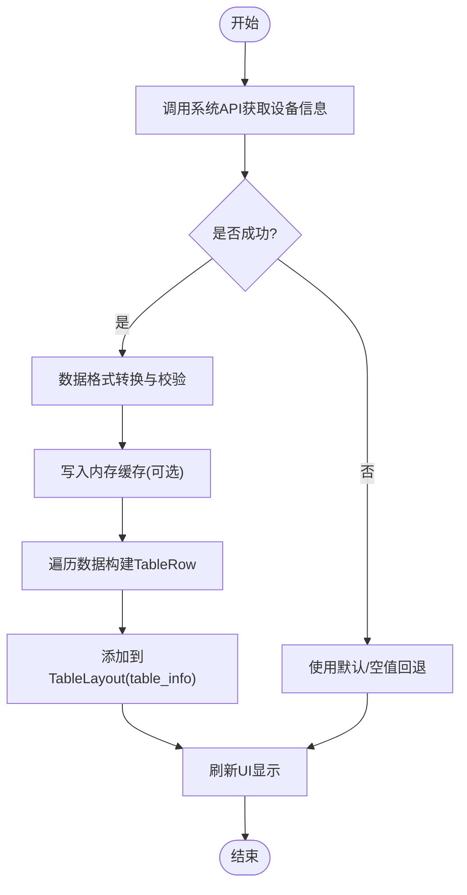
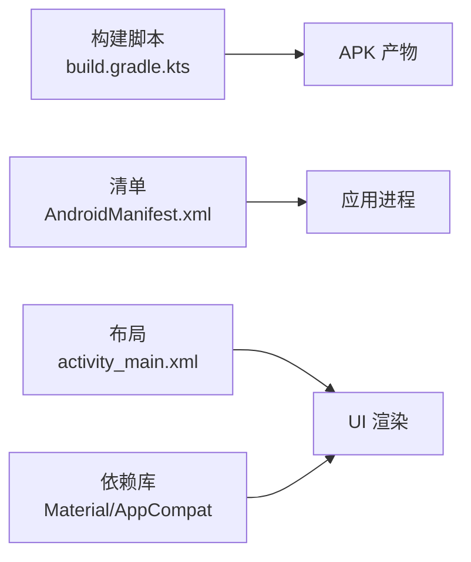

# 数据绑定机制

<cite>
**本文引用的文件**
- [AndroidManifest.xml](file://app/src/main/AndroidManifest.xml)
- [activity_main.xml](file://app/src/main/res/layout/activity_main.xml)
- [build.gradle.kts](file://app/build.gradle.kts)
- [settings.gradle.kts](file://settings.gradle.kts)
- [strings.xml](file://app/src/main/res/values/strings.xml)
</cite>

## 目录
1. [简介](#简介)
2. [项目结构](#项目结构)
3. [核心组件](#核心组件)
4. [架构总览](#架构总览)
5. [详细组件分析](#详细组件分析)
6. [依赖关系分析](#依赖关系分析)
7. [性能考虑](#性能考虑)
8. [故障排查指南](#故障排查指南)
9. [结论](#结论)
10. [附录](#附录)

## 简介
本文件围绕 Android 应用“设备信息展示”的数据绑定与 UI 更新机制进行系统化说明。重点包括：
- 设备信息与 UI 组件之间的数据绑定实现方式（以 TableLayout 动态行为核心）
- 从系统 API 获取设备信息到 UI 展示的完整数据流
- 数据格式转换与处理流程，确保不同类型设备信息的正确显示
- 数据缓存策略与内存管理优化建议
- 错误处理与异常回退机制
- 面向初学者的渐进式说明与面向资深开发者的技术深度

## 项目结构
该工程为标准的 Android 应用模块，包含清单、布局资源、构建脚本等关键文件。UI 层通过 TableLayout 承载设备信息列表，标题栏使用 MaterialToolbar，整体采用垂直线性布局并支持滚动。

图表来源
- [AndroidManifest.xml:5-21](file://app/src/main/AndroidManifest.xml#L5-L21)
- [activity_main.xml:1-61](file://app/src/main/res/layout/activity_main.xml#L1-L61)

章节来源
- [AndroidManifest.xml:5-21](file://app/src/main/AndroidManifest.xml#L5-L21)
- [activity_main.xml:1-61](file://app/src/main/res/layout/activity_main.xml#L1-L61)

## 核心组件
- 应用入口与启动
  - 清单中声明 MainActivity 为启动 Activity，并配置为 LAUNCHER 入口。
- 界面布局
  - 使用 MaterialToolbar 作为标题栏，设置居中标题与主题色背景。
  - 使用 ScrollView 包裹 TableLayout，保证内容可滚动。
  - TableLayout 定义了两列（属性、值），并通过 divider 分隔行。
- 资源与字符串
  - 应用名称通过 strings.xml 提供，便于本地化与统一维护。

章节来源
- [AndroidManifest.xml:14-20](file://app/src/main/AndroidManifest.xml#L14-L20)
- [activity_main.xml:10-18](file://app/src/main/res/layout/activity_main.xml#L10-L18)
- [activity_main.xml:20-32](file://app/src/main/res/layout/activity_main.xml#L20-L32)
- [activity_main.xml:34-58](file://app/src/main/res/layout/activity_main.xml#L34-L58)
- [strings.xml:1-3](file://app/src/main/res/values/strings.xml#L1-L3)

## 架构总览
下图展示了从系统 API 获取设备信息到 UI 渲染的端到端流程。由于当前仓库未包含 Java/Kotlin 源码，以下流程为基于布局与清单的结构化设计说明，用于指导后续代码实现。

图表来源
- [AndroidManifest.xml:14-20](file://app/src/main/AndroidManifest.xml#L14-L20)
- [activity_main.xml:26-32](file://app/src/main/res/layout/activity_main.xml#L26-L32)

## 详细组件分析

### 界面容器与数据绑定点
- TableLayout(table_info)
  - 作用：承载设备信息的键值对列表，第二列拉伸以适应不同长度值。
  - 绑定点：在运行时根据设备信息动态插入 TableRow，每行两个 TextView（属性名、属性值）。
- ScrollView
  - 作用：当设备信息较多时提供滚动能力，避免内容溢出。
- MaterialToolbar
  - 作用：显示应用标题，提升视觉一致性。

章节来源
- [activity_main.xml:20-32](file://app/src/main/res/layout/activity_main.xml#L20-L32)
- [activity_main.xml:26-32](file://app/src/main/res/layout/activity_main.xml#L26-L32)
- [activity_main.xml:10-18](file://app/src/main/res/layout/activity_main.xml#L10-L18)

### 动态表格行生成流程
以下为“从系统 API 到 UI 展示”的处理流程图，适用于后续代码实现参考：

图表来源
- [activity_main.xml:26-32](file://app/src/main/res/layout/activity_main.xml#L26-L32)

### 数据模型与转换
- 输入：来自系统 API 的设备信息（可能包含字符串、数值、布尔等类型）
- 处理：
  - 类型归一化：将不同来源的数据转换为统一的键值对结构（例如：属性名 -> 显示文本）
  - 格式化：对数值单位、时间戳、版本号等进行可读性处理
  - 校验：过滤空值或非法值，必要时使用回退文案
- 输出：可用于直接绑定到 UI 的列表项集合

说明：具体实现需结合业务需求定义数据结构与转换规则。

### 错误处理与回退机制
- 系统 API 不可用或权限不足：
  - 捕获异常，记录日志
  - 使用默认值或提示文案替代缺失字段
- 数据为空或格式异常：
  - 跳过该行或显示“未知/不可用”占位符
- UI 更新失败：
  - 重试一次；若仍失败，降级为静态提示

章节来源
- [activity_main.xml:26-32](file://app/src/main/res/layout/activity_main.xml#L26-L32)

### 缓存策略与内存管理
- 内存缓存
  - 使用轻量级缓存（如 Map）保存已解析的设备信息，避免重复查询
  - 生命周期与 Activity/Fragment 对齐，避免泄漏
- 磁盘缓存（可选）
  - 对于不常变化的设备信息，可持久化以减少冷启动开销
- 回收与释放
  - 及时释放临时对象与视图引用
  - 避免在高频回调中创建大量对象

## 依赖关系分析
- 构建与插件
  - 使用 Android Gradle Plugin 与 Kotlin DSL 配置编译选项、产物命名等
- 资源与库
  - 依赖 Material Components 与 AppCompat，提供现代 UI 组件
- 清单与入口
  - 清单声明 MainActivity 为启动入口，配合布局资源完成界面初始化

图表来源
- [build.gradle.kts:10-43](file://app/build.gradle.kts#L10-L43)
- [AndroidManifest.xml:5-21](file://app/src/main/AndroidManifest.xml#L5-L21)
- [activity_main.xml:10-18](file://app/src/main/res/layout/activity_main.xml#L10-L18)

章节来源
- [build.gradle.kts:10-43](file://app/build.gradle.kts#L10-L43)
- [settings.gradle.kts:17-23](file://settings.gradle.kts#L17-L23)
- [AndroidManifest.xml:5-21](file://app/src/main/AndroidManifest.xml#L5-L21)

## 性能考虑
- 列表渲染
  - 批量构建 TableRow 后一次性添加到 TableLayout，减少多次 invalidate
  - 避免在滚动过程中执行耗时操作
- 数据获取
  - 将系统 API 调用放在后台线程，避免阻塞主线程
  - 使用缓存降低重复查询成本
- 内存占用
  - 控制字符串与图片等资源大小
  - 及时释放不再使用的对象与监听器

## 故障排查指南
- 无法显示设备信息
  - 检查系统 API 调用是否抛出异常
  - 确认权限是否授予（如需）
  - 验证 TableLayout 是否正确引用与可见
- UI 无响应或卡顿
  - 检查是否在 UI 线程执行了耗时任务
  - 评估数据量过大导致的渲染压力，考虑分页或懒加载
- 数据不一致
  - 核对数据转换逻辑与格式化规则
  - 检查缓存是否过期或脏数据

## 结论
本项目提供了清晰的 UI 容器与入口配置，具备实现设备信息数据绑定与动态表格更新的坚实基础。建议在后续开发中：
- 明确数据模型与转换规则，确保多类型设备信息的稳定显示
- 引入缓存与异步处理，提升性能与用户体验
- 完善错误处理与回退机制，增强鲁棒性
- 遵循内存管理与资源优化最佳实践

## 附录
- 构建与发布
  - 通过 build.gradle.kts 自定义产物命名，便于版本追踪
- 资源管理
  - 使用 strings.xml 统一管理文案，便于扩展与本地化

章节来源
- [build.gradle.kts:45-71](file://app/build.gradle.kts#L45-L71)
- [strings.xml:1-3](file://app/src/main/res/values/strings.xml#L1-L3)