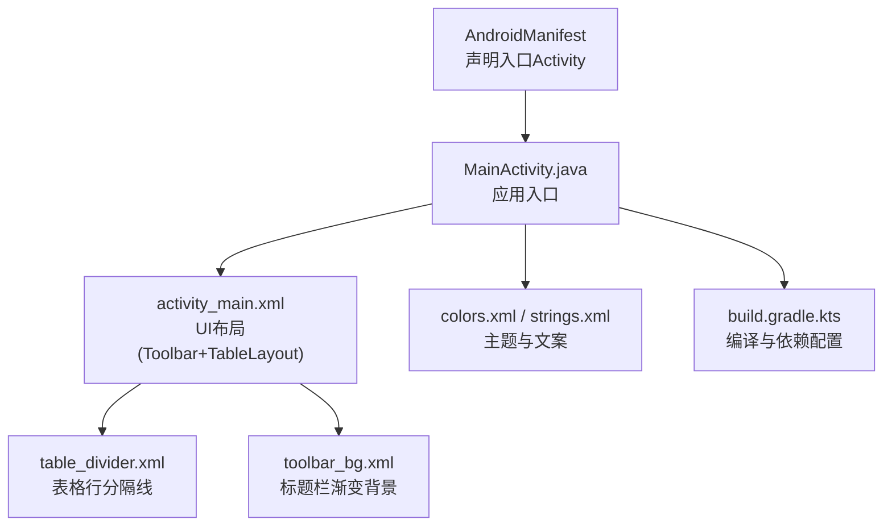
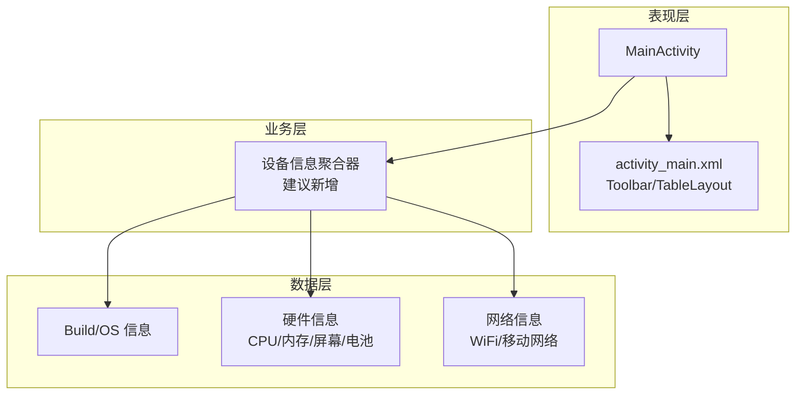
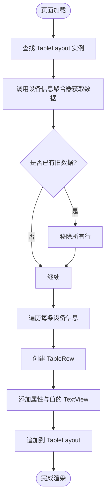
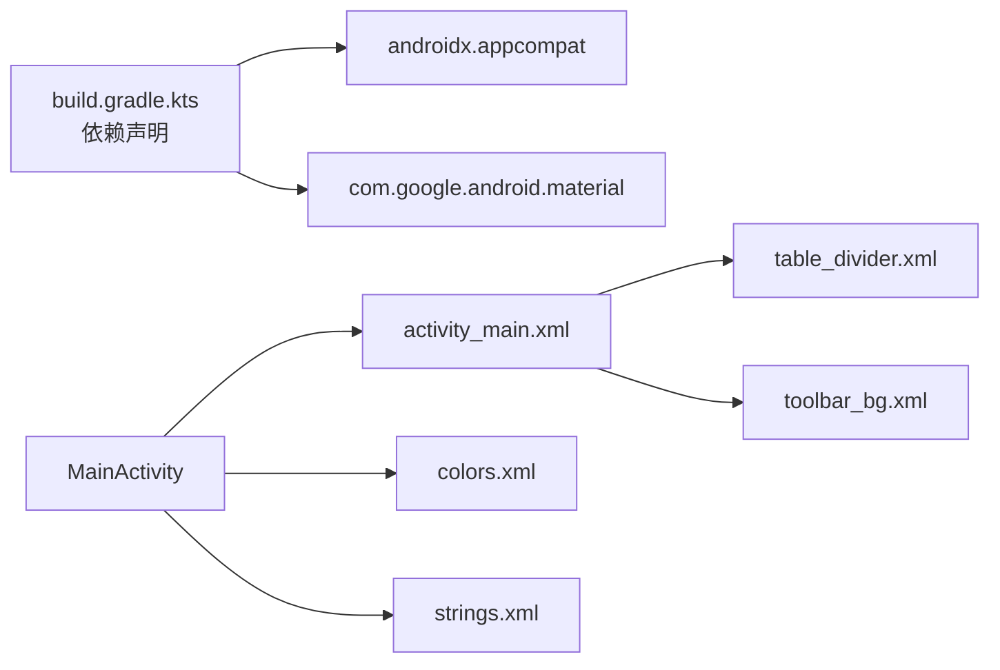

# 核心功能

<cite>
**本文引用的文件**
- [app/src/main/java/com/newland/deviceinformation/MainActivity.java](file://app/src/main/java/com/newland/deviceinformation/MainActivity.java)
- [app/src/main/res/layout/activity_main.xml](file://app/src/main/res/layout/activity_main.xml)
- [app/src/main/AndroidManifest.xml](file://app/src/main/AndroidManifest.xml)
- [app/build.gradle.kts](file://app/build.gradle.kts)
- [app/src/main/res/values/strings.xml](file://app/src/main/res/values/strings.xml)
- [app/src/main/res/values/colors.xml](file://app/src/main/res/values/colors.xml)
- [app/src/main/res/drawable/table_divider.xml](file://app/src/main/res/drawable/table_divider.xml)
- [app/src/main/res/drawable/toolbar_bg.xml](file://app/src/main/res/drawable/toolbar_bg.xml)
</cite>

## 目录
1. [简介](#简介)
2. [项目结构](#项目结构)
3. [核心组件](#核心组件)
4. [架构总览](#架构总览)
5. [详细组件分析](#详细组件分析)
6. [依赖关系分析](#依赖关系分析)
7. [性能考虑](#性能考虑)
8. [故障排查指南](#故障排查指南)
9. [结论](#结论)
10. [附录](#附录)

## 简介
本仓库是一个用于展示 Android 设备信息的轻量应用。当前代码库提供了应用入口、界面布局与资源定义，但尚未实现具体的设备信息获取逻辑（如系统信息读取、硬件规格检测、网络信息收集）以及 TableLayout 的动态内容更新。本文档基于现有源码，梳理应用结构与扩展点，并给出在 MainActivity 中实现设备信息采集与展示的推荐方案，帮助初学者快速上手，同时为有经验的开发者提供可落地的技术路径。

## 项目结构
- 应用包名：com.newland.deviceinformation
- 入口 Activity：MainActivity
- 主界面：activity_main.xml，包含 MaterialToolbar 与 ScrollView + TableLayout
- 资源：颜色、字符串、分隔线、标题栏背景等
- 构建配置：compileSdk/targetSdk/minSdk、依赖、输出命名策略

图表来源
- [app/src/main/AndroidManifest.xml:1-23](file://app/src/main/AndroidManifest.xml#L1-L23)
- [app/src/main/res/layout/activity_main.xml:1-62](file://app/src/main/res/layout/activity_main.xml#L1-L62)
- [app/src/main/res/drawable/table_divider.xml:1-6](file://app/src/main/res/drawable/table_divider.xml#L1-L6)
- [app/src/main/res/drawable/toolbar_bg.xml:1-9](file://app/src/main/res/drawable/toolbar_bg.xml#L1-L9)
- [app/src/main/res/values/colors.xml:1-10](file://app/src/main/res/values/colors.xml#L1-L10)
- [app/src/main/res/values/strings.xml:1-3](file://app/src/main/res/values/strings.xml#L1-L3)
- [app/build.gradle.kts:1-80](file://app/build.gradle.kts#L1-L80)

章节来源
- [app/src/main/AndroidManifest.xml:1-23](file://app/src/main/AndroidManifest.xml#L1-L23)
- [app/src/main/res/layout/activity_main.xml:1-62](file://app/src/main/res/layout/activity_main.xml#L1-L62)
- [app/build.gradle.kts:1-80](file://app/build.gradle.kts#L1-L80)

## 核心组件
- 应用入口与生命周期
  - 通过 AndroidManifest 将 MainActivity 注册为 LAUNCHER 入口，应用启动后由系统创建该 Activity。
- 用户界面
  - 使用 MaterialToolbar 作为标题栏，配合自定义渐变背景。
  - 使用 ScrollView 包裹 TableLayout，便于长列表滚动显示。
  - TableLayout 已预留表头行（隐藏），后续可在运行时动态插入 TableRow 以展示键值对形式的设备信息。
- 资源与样式
  - colors.xml 提供基础色板；strings.xml 提供应用名称；drawable 提供分隔线与背景。
- 构建与打包
  - build.gradle.kts 定义了 compileSdk/targetSdk/minSdk、依赖项与应用输出文件名规则。

章节来源
- [app/src/main/AndroidManifest.xml:14-20](file://app/src/main/AndroidManifest.xml#L14-L20)
- [app/src/main/res/layout/activity_main.xml:10-32](file://app/src/main/res/layout/activity_main.xml#L10-L32)
- [app/src/main/res/values/colors.xml:1-10](file://app/src/main/res/values/colors.xml#L1-L10)
- [app/src/main/res/values/strings.xml:1-3](file://app/src/main/res/values/strings.xml#L1-L3)
- [app/build.gradle.kts:10-43](file://app/build.gradle.kts#L10-L43)

## 架构总览
当前应用采用“单 Activity + 纯 UI 布局”的极简架构。待实现的设备信息模块应遵循以下职责划分：
- 数据层：负责从系统 API 读取设备信息（Build、TelephonyManager、WifiManager、ConnectivityManager、DisplayMetrics、BatteryManager 等）。
- 业务层：封装采集逻辑，统一返回结构化数据（键值对集合）。
- 表现层：在 MainActivity 中调用业务层，将结果逐行添加到 TableLayout。

图表来源
- [app/src/main/java/com/newland/deviceinformation/MainActivity.java:1-53](file://app/src/main/java/com/newland/deviceinformation/MainActivity.java#L1-L53)
- [app/src/main/res/layout/activity_main.xml:20-32](file://app/src/main/res/layout/activity_main.xml#L20-L32)

## 详细组件分析

### 界面组件：TableLayout 的使用与动态更新
- 布局要点
  - 外层 ScrollView 保证内容过多时可滚动。
  - TableLayout 设置 stretchColumns="1"，使第二列（值列）自适应宽度。
  - showDividers="middle" 与 table_divider.xml 配合，为每行添加分隔线。
  - 表头 TableRow 默认隐藏，可按需显示或移除。
- 动态更新机制（建议在 MainActivity 中实现）
  - 在 onCreate 中获取 TableLayout 引用。
  - 遍历设备信息键值对，为每个条目创建 TableRow，并在其中放置两个 TextView（属性、值）。
  - 将 TableRow 通过 addView 追加到 TableLayout。
  - 若需要刷新，先 removeAllViews 再重新填充。

图表来源
- [app/src/main/res/layout/activity_main.xml:20-32](file://app/src/main/res/layout/activity_main.xml#L20-L32)
- [app/src/main/res/drawable/table_divider.xml:1-6](file://app/src/main/res/drawable/table_divider.xml#L1-L6)

章节来源
- [app/src/main/res/layout/activity_main.xml:20-32](file://app/src/main/res/layout/activity_main.xml#L20-L32)

### 应用入口：MainActivity
- 角色定位
  - 作为应用的唯一入口，负责初始化 UI、触发数据采集、驱动 TableLayout 渲染。
- 与布局的关系
  - 通过 setContentView 加载 activity_main.xml。
  - 通过 findViewById 获取 TableLayout，用于动态插入行。
- 与资源的关系
  - 使用 colors.xml、strings.xml、toolbar_bg.xml 等资源进行样式与文案配置。
- 与构建配置的关系
  - 受 build.gradle.kts 中 minSdk/targetSdk/依赖影响，确保 API 可用性与 UI 组件支持。

章节来源
- [app/src/main/java/com/newland/deviceinformation/MainActivity.java:1-53](file://app/src/main/java/com/newland/deviceinformation/MainActivity.java#L1-L53)
- [app/src/main/res/layout/activity_main.xml:10-18](file://app/src/main/res/layout/activity_main.xml#L10-L18)
- [app/src/main/res/values/colors.xml:1-10](file://app/src/main/res/values/colors.xml#L1-L10)
- [app/src/main/res/values/strings.xml:1-3](file://app/src/main/res/values/strings.xml#L1-L3)
- [app/build.gradle.kts:10-43](file://app/build.gradle.kts#L10-L43)

### 配置与资源
- AndroidManifest
  - 声明 MainActivity 为 LAUNCHER 入口，设置 exported=true。
- 构建脚本
  - compileSdk/targetSdk/minSdk 指定目标平台能力。
  - 依赖 appcompat、material 等库，保障 UI 组件可用性。
  - 输出 APK 文件名包含版本、构建类型与时间戳。
- 资源
  - colors.xml：定义常用颜色。
  - strings.xml：应用名称。
  - drawable：表格分隔线、标题栏背景。

章节来源
- [app/src/main/AndroidManifest.xml:14-20](file://app/src/main/AndroidManifest.xml#L14-L20)
- [app/build.gradle.kts:10-43](file://app/build.gradle.kts#L10-L43)
- [app/src/main/res/values/colors.xml:1-10](file://app/src/main/res/values/colors.xml#L1-L10)
- [app/src/main/res/values/strings.xml:1-3](file://app/src/main/res/values/strings.xml#L1-L3)
- [app/src/main/res/drawable/table_divider.xml:1-6](file://app/src/main/res/drawable/table_divider.xml#L1-L6)
- [app/src/main/res/drawable/toolbar_bg.xml:1-9](file://app/src/main/res/drawable/toolbar_bg.xml#L1-L9)

## 依赖关系分析
- 外部依赖
  - androidx.appcompat、com.google.android.material：提供 Toolbar 等现代 UI 组件。
- 内部依赖
  - MainActivity 依赖 activity_main.xml 中的 TableLayout 进行数据展示。
  - 资源文件被 UI 与主题引用。

图表来源
- [app/build.gradle.kts:74-80](file://app/build.gradle.kts#L74-L80)
- [app/src/main/res/layout/activity_main.xml:10-32](file://app/src/main/res/layout/activity_main.xml#L10-L32)
- [app/src/main/res/drawable/table_divider.xml:1-6](file://app/src/main/res/drawable/table_divider.xml#L1-L6)
- [app/src/main/res/drawable/toolbar_bg.xml:1-9](file://app/src/main/res/drawable/toolbar_bg.xml#L1-L9)
- [app/src/main/res/values/colors.xml:1-10](file://app/src/main/res/values/colors.xml#L1-L10)
- [app/src/main/res/values/strings.xml:1-3](file://app/src/main/res/values/strings.xml#L1-L3)

章节来源
- [app/build.gradle.kts:74-80](file://app/build.gradle.kts#L74-L80)

## 性能考虑
- 列表渲染
  - 设备信息条目较多时，避免一次性创建大量视图导致卡顿。可采用分批添加或延迟渲染策略。
- I/O 与系统调用
  - 读取系统信息可能涉及跨进程或权限检查，应在后台线程执行，避免阻塞主线程。
- 内存占用
  - 及时释放不再使用的对象；避免在循环中创建不必要的中间对象。
- 滚动体验
  - 合理设置 TableLayout 高度与行高，减少重绘次数。

[本节为通用指导，不直接分析具体文件]

## 故障排查指南
- 常见问题
  - 权限不足：访问网络或电话状态需要相应权限（如 ACCESS_WIFI_STATE、ACCESS_NETWORK_STATE、READ_PHONE_STATE）。需在 Manifest 中声明并在运行时申请。
  - 空指针异常：未正确初始化 TableLayout 或未找到控件 ID。
  - 界面不刷新：重复添加行但未清理旧数据；或 UI 线程外更新界面。
  - 崩溃：在不支持的 API 级别调用高版本接口；或使用了未引入的依赖。
- 解决思路
  - 在 AndroidManifest 中声明所需权限，并在运行时请求敏感权限。
  - 在 UI 线程中更新 TableLayout；耗时操作放入后台线程。
  - 添加前调用 removeAllViews() 清空历史行。
  - 根据 minSdk/targetSdk 选择兼容 API，并进行版本判断。

章节来源
- [app/src/main/AndroidManifest.xml:14-20](file://app/src/main/AndroidManifest.xml#L14-L20)
- [app/src/main/res/layout/activity_main.xml:20-32](file://app/src/main/res/layout/activity_main.xml#L20-L32)
- [app/build.gradle.kts:10-43](file://app/build.gradle.kts#L10-L43)

## 结论
当前仓库提供了完整的 UI 骨架与资源配置，具备扩展为设备信息展示应用的坚实基础。下一步建议在 MainActivity 中实现设备信息采集与 TableLayout 的动态渲染，按“数据层—业务层—表现层”的职责划分逐步完善功能，并通过权限管理、线程调度与错误处理提升稳定性与用户体验。

[本节为总结性内容，不直接分析具体文件]

## 附录
- 建议的数据字段示例（非代码，仅说明）
  - 系统信息：设备型号、厂商、Android 版本、序列号、IMEI（需权限）、MAC 地址（受限）
  - 硬件规格：CPU 核数、内存大小、屏幕分辨率、电池健康度
  - 网络信息：WiFi SSID、IP 地址、网络类型（移动/WiFi）
- 建议的接口设计（概念性）
  - 设备信息聚合器：提供方法获取键值对集合，供 MainActivity 渲染
  - 权限检查：在采集前校验并提示用户授权
  - 错误处理：捕获异常并降级展示（如不可用时显示“未知”）

[本节为概念性说明，不直接分析具体文件]