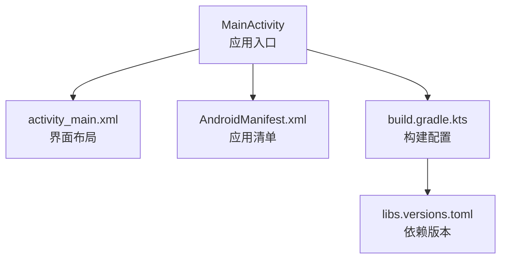
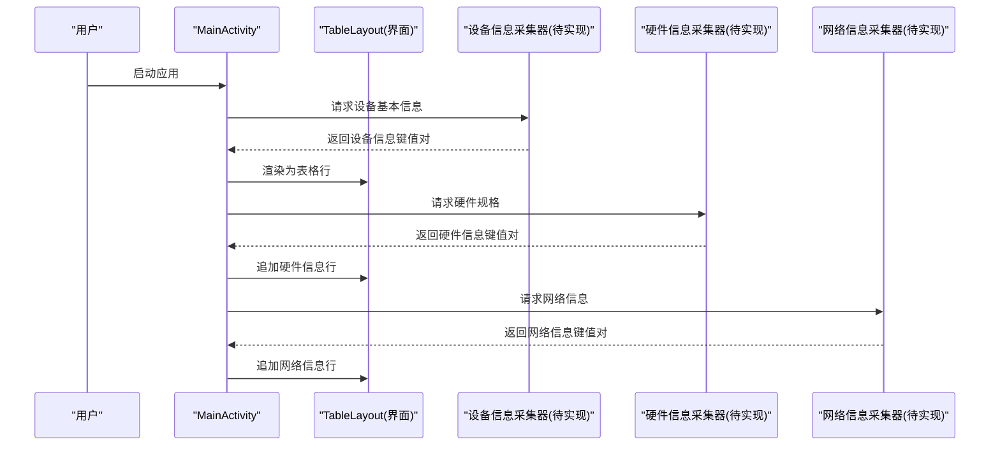
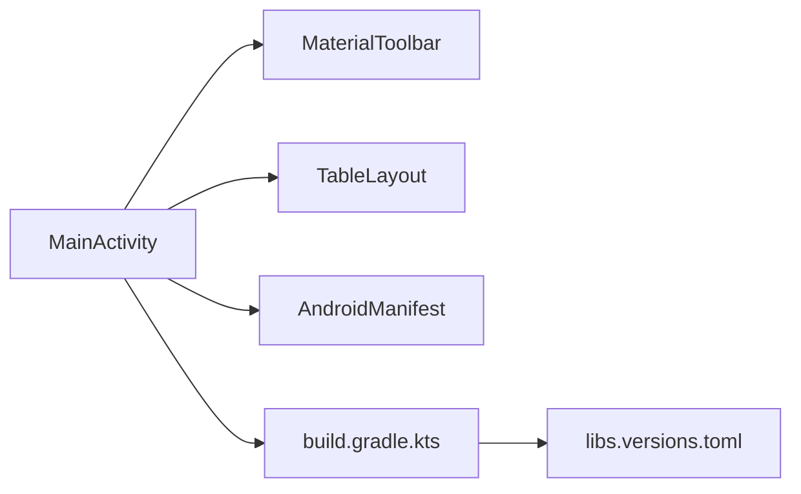

# 设备信息收集

<cite>
**本文引用的文件**
- [MainActivity.java](file://app/src/main/java/com/newland/deviceinformation/MainActivity.java)
- [AndroidManifest.xml](file://app/src/main/AndroidManifest.xml)
- [activity_main.xml](file://app/src/main/res/layout/activity_main.xml)
- [build.gradle.kts（应用模块）](file://app/build.gradle.kts)
- [libs.versions.toml](file://gradle/libs.versions.toml)
</cite>

## 目录
1. [简介](#简介)
2. [项目结构](#项目结构)
3. [核心组件](#核心组件)
4. [架构总览](#架构总览)
5. [详细组件分析](#详细组件分析)
6. [依赖分析](#依赖分析)
7. [性能考虑](#性能考虑)
8. [故障排查指南](#故障排查指南)
9. [结论](#结论)
10. [附录](#附录)

## 简介
本仓库是一个用于在 Android 设备上采集并展示系统信息的示例应用。当前工程已具备基础界面与构建配置，但尚未包含具体的设备信息采集逻辑实现。本文档围绕“设备信息收集”的目标，给出完整的实现方案与最佳实践，涵盖：
- 使用 Build 类获取设备基本信息（型号、制造商、Android 版本等）
- 硬件规格检测（处理器架构、内存大小、屏幕分辨率等）
- 网络信息收集（网络连接状态、运营商信息等）
- 权限配置要求与异常处理机制
- 面向初学者的逐步说明与面向资深开发者的技术细节

## 项目结构
- 应用入口与界面
  - MainActivity：应用主界面入口（当前文件内容为编译产物，未包含源码逻辑）
  - activity_main.xml：主界面布局，包含标题栏与一个可滚动的表格容器，用于后续动态展示设备信息
- 构建与依赖
  - app/build.gradle.kts：应用模块构建脚本，定义命名空间、SDK 版本、输出文件名策略与依赖
  - gradle/libs.versions.toml：统一版本管理，声明 AppCompat、Material 等库版本
  - AndroidManifest.xml：应用清单，声明 Activity 与导出配置
- 资源
  - values/colors.xml：颜色资源
  - values/strings.xml：字符串资源（应用名称）

图表来源
- [MainActivity.java:1-53](file://app/src/main/java/com/newland/deviceinformation/MainActivity.java#L1-L53)
- [activity_main.xml:1-62](file://app/src/main/res/layout/activity_main.xml#L1-L62)
- [AndroidManifest.xml:1-23](file://app/src/main/AndroidManifest.xml#L1-L23)
- [build.gradle.kts（应用模块）:1-80](file://app/build.gradle.kts#L1-L80)
- [libs.versions.toml:1-19](file://gradle/libs.versions.toml#L1-L19)

章节来源
- [MainActivity.java:1-53](file://app/src/main/java/com/newland/deviceinformation/MainActivity.java#L1-L53)
- [activity_main.xml:1-62](file://app/src/main/res/layout/activity_main.xml#L1-L62)
- [AndroidManifest.xml:1-23](file://app/src/main/AndroidManifest.xml#L1-L23)
- [build.gradle.kts（应用模块）:1-80](file://app/build.gradle.kts#L1-L80)
- [libs.versions.toml:1-19](file://gradle/libs.versions.toml#L1-L19)

## 核心组件
- 界面层
  - 标题栏：MaterialToolbar，用于显示应用标题
  - 数据展示区：ScrollView + TableLayout，用于动态插入设备信息行
- 构建与依赖
  - 使用 Material 组件与 AppCompat 支持库
  - 自定义 APK 输出命名规则（含版本号、构建类型、时间戳）

章节来源
- [activity_main.xml:1-62](file://app/src/main/res/layout/activity_main.xml#L1-L62)
- [build.gradle.kts（应用模块）:1-80](file://app/build.gradle.kts#L1-L80)
- [libs.versions.toml:1-19](file://gradle/libs.versions.toml#L1-L19)

## 架构总览
整体采用“单 Activity + 动态表格”的轻量架构。未来可在 MainActivity 中按功能域组织采集逻辑（如 DeviceInfoCollector、HardwareCollector、NetworkCollector），将结果写入 TableLayout 的行项中。

图表来源
- [MainActivity.java:1-53](file://app/src/main/java/com/newland/deviceinformation/MainActivity.java#L1-L53)
- [activity_main.xml:1-62](file://app/src/main/res/layout/activity_main.xml#L1-L62)

## 详细组件分析

### 界面与数据展示
- 标题栏：MaterialToolbar，居中显示应用名
- 数据区：TableLayout 作为表格容器，通过代码动态添加 TableRow 与 TextView 来展示键值对
- 滚动：外层 ScrollView 保证长列表可滚动查看

章节来源
- [activity_main.xml:1-62](file://app/src/main/res/layout/activity_main.xml#L1-L62)

### 构建与依赖
- 应用命名空间与 SDK：定义了 namespace、compileSdk、minSdk、targetSdk
- 输出命名：根据 flavor、versionCode、versionName、buildType 与时间戳生成 APK 文件名
- 依赖：AppCompat、Material 组件；测试依赖 JUnit、Espresso

章节来源
- [build.gradle.kts（应用模块）:1-80](file://app/build.gradle.kts#L1-L80)
- [libs.versions.toml:1-19](file://gradle/libs.versions.toml#L1-L19)

### 清单与入口
- 入口 Activity：MainActivity 被声明为 LAUNCHER 活动，exported=true
- 主题与图标：通过 theme 与 mipmap 资源引用

章节来源
- [AndroidManifest.xml:1-23](file://app/src/main/AndroidManifest.xml#L1-L23)

## 依赖分析
- 运行时依赖
  - androidx.appcompat：提供兼容性与主题能力
  - com.google.android.material：提供 Material 组件（如 Toolbar）
- 构建期依赖
  - AGP 插件与版本集中管理

图表来源
- [MainActivity.java:1-53](file://app/src/main/java/com/newland/deviceinformation/MainActivity.java#L1-L53)
- [activity_main.xml:1-62](file://app/src/main/res/layout/activity_main.xml#L1-L62)
- [AndroidManifest.xml:1-23](file://app/src/main/AndroidManifest.xml#L1-L23)
- [build.gradle.kts（应用模块）:1-80](file://app/build.gradle.kts#L1-L80)
- [libs.versions.toml:1-19](file://gradle/libs.versions.toml#L1-L19)

章节来源
- [build.gradle.kts（应用模块）:1-80](file://app/build.gradle.kts#L1-L80)
- [libs.versions.toml:1-19](file://gradle/libs.versions.toml#L1-L19)

## 性能考虑
- 批量读取与缓存
  - 设备与硬件信息多为静态或低频变化，建议在应用启动时一次性读取并缓存，避免重复 I/O
- 异步执行
  - 网络相关查询可能阻塞，应在后台线程执行，完成后在主线程更新 UI
- UI 渲染优化
  - 使用 TableLayout 动态添加行时，尽量合并多次刷新，减少重绘次数
- 资源占用
  - 避免在频繁回调中创建大量临时对象，注意字符串拼接与对象复用

[本节为通用指导，不直接分析具体文件]

## 故障排查指南
- 权限问题
  - 若需读取网络状态或运营商信息，需在 AndroidManifest 中声明相应权限，并在运行时申请（针对危险权限）
- 空值与异常
  - 部分 API 在不同厂商 ROM 上返回值可能为空或抛出异常，应做好 try-catch 与默认值兜底
- 兼容性
  - 不同 Android 版本的 API 可用性不同，需进行版本判断与降级处理
- 日志与调试
  - 建议记录关键步骤日志，便于定位问题；发布版本关闭冗余日志

[本节为通用指导，不直接分析具体文件]

## 结论
当前仓库提供了设备信息应用的界面骨架与构建配置，但未包含具体的采集逻辑。基于本文档的方案，可在 MainActivity 中按模块实现设备、硬件与网络信息的采集，并通过 TableLayout 动态展示。遵循权限、异常与性能的最佳实践，即可快速构建稳定可靠的设备信息收集功能。

[本节为总结性内容，不直接分析具体文件]

## 附录

### 一、设备基本信息采集（Build 类）
- 目标字段
  - 设备型号：Build.MODEL
  - 制造商：Build.MANUFACTURER
  - Android 版本：Build.VERSION.RELEASE / Build.VERSION.SDK_INT
  - 品牌：Build.BRAND
  - 产品名：Build.PRODUCT
  - 设备名：Build.DEVICE
  - 硬件名：Build.HARDWARE
  - 序列号：Build.SERIAL（部分系统限制访问）
- 调用要点
  - 所有字段均为只读，无需额外权限
  - 建议在应用启动时读取并缓存
- 复杂度
  - O(1) 读取，无 I/O 开销

章节来源
- [MainActivity.java:1-53](file://app/src/main/java/com/newland/deviceinformation/MainActivity.java#L1-L53)

### 二、硬件规格检测
- 处理器架构
  - 方式一：Build.SUPPORTED_ABIS（推荐，跨版本兼容）
  - 方式二：System.getProperty("os.arch")（仅参考）
- 内存大小
  - 可用内存：ActivityManager.getMemoryInfo().availMem
  - 总内存：ActivityManager.getMemoryInfo().totalMem
  - 单位换算：字节转 MB/GB
- CPU 信息
  - CPU 核数：Runtime.getRuntime().availableProcessors()
  - CPU 频率：读取 /proc/cpuinfo（需要文件系统权限，谨慎使用）
- 屏幕分辨率与密度
  - DisplayMetrics：widthPixels、heightPixels、densityDpi
  - 真实物理尺寸：结合 density 计算
- 存储容量
  - 内部存储：FileStatFs 或 StorageManager（API 29+）
  - 外部存储：Environment.getExternalStorageDirectory()（需谨慎处理权限与路径）
- 复杂度
  - 多数为 O(1)，文件系统读取可能带来 I/O 成本

章节来源
- [MainActivity.java:1-53](file://app/src/main/java/com/newland/deviceinformation/MainActivity.java#L1-L53)

### 三、网络信息收集
- 网络连接状态
  - ConnectivityManager.getActiveNetworkInfo()（API 29 起推荐使用 getActiveNetwork 与 NetworkCapabilities）
  - 判断是否联网、网络类型（WiFi/移动数据）
- 运营商信息
  - TelephonyManager.getSimOperatorName()/getNetworkOperatorName()
  - 需要 READ_PHONE_STATE 权限（危险权限，需运行时申请）
- 其他网络信息
  - WiFi SSID、BSSID：WifiManager.getConnectionInfo()（需 ACCESS_WIFI_STATE 权限）
- 复杂度
  - 网络查询可能耗时，务必异步执行

章节来源
- [AndroidManifest.xml:1-23](file://app/src/main/AndroidManifest.xml#L1-L23)
- [MainActivity.java:1-53](file://app/src/main/java/com/newland/deviceinformation/MainActivity.java#L1-L53)

### 四、权限配置要求
- 网络状态
  - android.permission.ACCESS_NETWORK_STATE（普通权限，清单声明即可）
- 运营商信息
  - android.permission.READ_PHONE_STATE（危险权限，需运行时申请）
- Wi-Fi 信息
  - android.permission.ACCESS_WIFI_STATE（普通权限）
- 存储信息
  - 读取内部/外部存储可能需要存储权限（视目标 SDK 与路径而定）

章节来源
- [AndroidManifest.xml:1-23](file://app/src/main/AndroidManifest.xml#L1-L23)

### 五、异常处理机制
- 空指针与空字符串
  - 对 Build 字段与系统服务返回值进行非空校验
- 权限拒绝
  - 捕获 SecurityException，提示用户授权或降级功能
- 版本差异
  - 使用 Build.VERSION.SDK_INT 进行分支处理，确保向后兼容
- 线程安全
  - 网络与 I/O 操作在后台线程执行，UI 更新切回主线程

章节来源
- [MainActivity.java:1-53](file://app/src/main/java/com/newland/deviceinformation/MainActivity.java#L1-L53)

### 六、界面集成与数据绑定
- 动态表格行
  - 为每个键值对创建 TableRow，内嵌两个 TextView（属性名、属性值）
  - 将行添加到 TableLayout 末尾
- 滚动与布局
  - 外层 ScrollView 包裹 TableLayout，保证长列表可滚动
- 主题与样式
  - 使用 MaterialToolbar 与统一配色提升一致性

章节来源
- [activity_main.xml:1-62](file://app/src/main/res/layout/activity_main.xml#L1-L62)

### 七、构建与输出命名
- 输出文件名
  - 格式：{baseName}-{versionCode}-{versionName}-{buildType}-{yyyyMMddHHmm}.apk
  - baseName 优先取 flavor 名，否则使用项目名
- 版本与构建类型
  - 从 defaultConfig 与 variant 中读取
- 依赖版本
  - 通过 libs.versions.toml 统一管理

章节来源
- [build.gradle.kts（应用模块）:1-80](file://app/build.gradle.kts#L1-L80)
- [libs.versions.toml:1-19](file://gradle/libs.versions.toml#L1-L19)