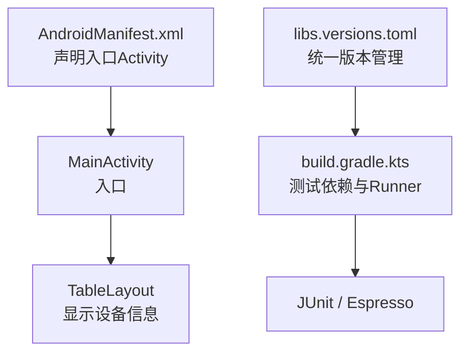
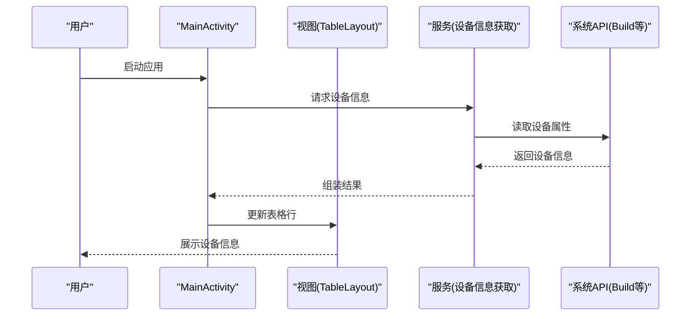
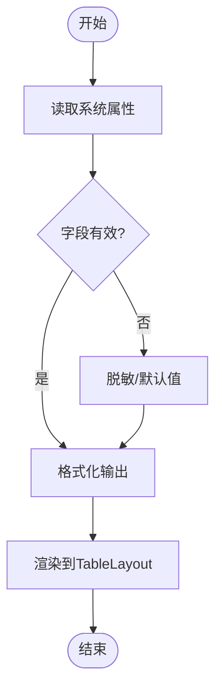
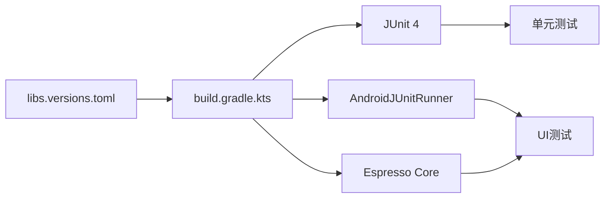

# 测试策略

<cite>
**本文引用的文件**
- [app/build.gradle.kts](file://app/build.gradle.kts)
- [gradle/libs.versions.toml](file://gradle/libs.versions.toml)
- [app/src/main/AndroidManifest.xml](file://app/src/main/AndroidManifest.xml)
- [app/src/main/res/layout/activity_main.xml](file://app/src/main/res/layout/activity_main.xml)
- [app/src/test/java/com/newland/deviceinformation/ExampleUnitTest.java](file://app/src/test/java/com/newland/deviceinformation/ExampleUnitTest.java)
- [app/src/androidTest/java/com/newland/deviceinformation/ExampleInstrumentedTest.java](file://app/src/androidTest/java/com/newland/deviceinformation/ExampleInstrumentedTest.java)
</cite>

## 目录
1. [简介](#简介)
2. [项目结构](#项目结构)
3. [核心组件](#核心组件)
4. [架构总览](#架构总览)
5. [详细组件分析](#详细组件分析)
6. [依赖分析](#依赖分析)
7. [性能考虑](#性能考虑)
8. [故障排查指南](#故障排查指南)
9. [结论](#结论)
10. [附录](#附录)

## 简介
本测试策略面向“设备信息”Android应用，目标是建立覆盖单元测试与UI测试的完整质量保障体系。文档将说明：
- 测试框架选型与配置（JUnit、Espresso、AndroidJUnitRunner）
- 测试用例设计方法（设备信息获取、UI交互、业务逻辑验证）
- 测试数据准备与隔离策略
- 覆盖率要求与自动化流程
- 具体示例与调试技巧

## 项目结构
当前仓库采用标准Android工程结构：
- 应用代码位于 app/src/main
- 单元测试位于 app/src/test
- UI（仪器化）测试位于 app/src/androidTest
- 构建脚本与依赖版本在 app/build.gradle.kts 与 gradle/libs.versions.toml 中管理
- 入口Activity为 MainActivity，界面使用 MaterialToolbar + ScrollView + TableLayout 展示信息

**图表来源**
- [app/src/main/AndroidManifest.xml:14-20](file://app/src/main/AndroidManifest.xml#L14-L20)
- [app/src/main/res/layout/activity_main.xml:10-32](file://app/src/main/res/layout/activity_main.xml#L10-L32)
- [app/build.gradle.kts:18-26](file://app/build.gradle.kts#L18-L26)
- [gradle/libs.versions.toml:1-17](file://gradle/libs.versions.toml#L1-L17)

**章节来源**
- [app/src/main/AndroidManifest.xml:14-20](file://app/src/main/AndroidManifest.xml#L14-L20)
- [app/src/main/res/layout/activity_main.xml:10-32](file://app/src/main/res/layout/activity_main.xml#L10-L32)
- [app/build.gradle.kts:18-26](file://app/build.gradle.kts#L18-L26)
- [gradle/libs.versions.toml:1-17](file://gradle/libs.versions.toml#L1-L17)

## 核心组件
- 入口Activity：用于承载界面并加载设备信息
- 界面容器：MaterialToolbar 作为标题栏；ScrollView + TableLayout 用于展示属性-值对
- 测试基础设施：
  - 单元测试：JUnit 4（通过 testImplementation）
  - UI测试：AndroidJUnitRunner + Espresso（通过 androidTestImplementation）
  - 测试Runner：androidx.test.runner.AndroidJUnitRunner（在 defaultConfig 中配置）

**章节来源**
- [app/src/main/res/layout/activity_main.xml:10-32](file://app/src/main/res/layout/activity_main.xml#L10-L32)
- [app/build.gradle.kts:18-26](file://app/build.gradle.kts#L18-L26)
- [gradle/libs.versions.toml:1-17](file://gradle/libs.versions.toml#L1-L17)

## 架构总览
从测试视角看，系统由三层组成：
- 表现层：Activity 与布局，负责渲染设备信息
- 业务层：设备信息获取与格式化（建议抽取为独立类或接口，便于单测）
- 数据层：Android 系统API（Build、TelephonyManager 等），提供设备信息

**图表来源**
- [app/src/main/AndroidManifest.xml:14-20](file://app/src/main/AndroidManifest.xml#L14-L20)
- [app/src/main/res/layout/activity_main.xml:20-32](file://app/src/main/res/layout/activity_main.xml#L20-L32)

## 详细组件分析

### 单元测试策略（JUnit）
目标：验证设备信息获取的业务逻辑，不依赖Android运行时。

- 测试范围
  - 设备信息解析与格式化（如版本号、型号、厂商、系统版本等）
  - 空值/异常分支处理（权限缺失、字段为空、格式错误）
  - 规则校验（如版本号正则匹配、IMEI/序列号脱敏规则）

- 测试框架与配置
  - 使用 JUnit 4（testImplementation）
  - 无需Android环境，可在本地JVM快速执行

- 测试数据准备
  - 构造模拟输入（字符串、Map、对象）
  - 使用参数化测试覆盖多组边界值
  - 针对敏感字段进行脱敏断言（仅断言掩码后结果）

- 示例要点（以路径引用代替代码）
  - 新建测试类：参考 [ExampleUnitTest.java](file://app/src/test/java/com/newland/deviceinformation/ExampleUnitTest.java)
  - 断言工具：使用 assertEquals、assertNotNull、assertTrue 等
  - 参数化：使用 @ParameterizedTest 或 @RunWith(Parameterized.class)

- 最佳实践
  - 单一职责：每个测试只验证一个行为
  - 可重复性：避免依赖外部状态（网络、时间、随机数）
  - 命名规范：should_当_期望（例如 should_format_version_correctly）

**章节来源**
- [app/src/test/java/com/newland/deviceinformation/ExampleUnitTest.java](file://app/src/test/java/com/newland/deviceinformation/ExampleUnitTest.java)

### UI测试策略（Espresso + AndroidJUnitRunner）
目标：验证界面是否正确展示设备信息，以及关键交互是否生效。

- 测试范围
  - 启动后页面元素可见性（Toolbar标题、TableLayout存在）
  - 表格内容包含预期键名（如“型号”、“系统版本”等）
  - 点击刷新按钮（如有）后数据更新
  - 横竖屏切换后布局稳定

- 测试框架与配置
  - Runner：androidx.test.runner.AndroidJUnitRunner（已在 defaultConfig 配置）
  - 依赖：Espresso Core（androidTestImplementation）

- 测试数据准备
  - 使用真实设备或模拟器运行
  - 如需控制设备信息，可通过自定义ROM或Mock系统API（高级场景）

- 示例要点（以路径引用代替代码）
  - 新建UI测试类：参考 [ExampleInstrumentedTest.java](file://app/src/androidTest/java/com/newland/deviceinformation/ExampleInstrumentedTest.java)
  - 定位控件：使用 onView(withId(...))、onView(withText(...))
  - 断言：check(matches(isDisplayed()))、check(matches(hasChildCount(n)))

- 最佳实践
  - 等待异步完成：使用 IdlingResource 或 waitForIdle()
  - 避免硬编码文本：优先使用资源ID或常量
  - 幂等性：测试可重复执行，不依赖上次状态

**章节来源**
- [app/src/androidTest/java/com/newland/deviceinformation/ExampleInstrumentedTest.java](file://app/src/androidTest/java/com/newland/deviceinformation/ExampleInstrumentedTest.java)
- [app/build.gradle.kts:18-26](file://app/build.gradle.kts#L18-L26)

### 设备信息获取功能测试
- 关注点
  - 必要字段是否存在且非空（如 Build.MODEL、Build.VERSION.RELEASE）
  - 敏感字段是否脱敏（如 IMEI、序列号）
  - 兼容不同Android版本（API级别差异）

- 测试设计
  - 单测：对解析/格式化方法进行白盒测试
  - UI测试：断言表格行中包含预期键名与有效值
  - 兼容性：在不同API级别设备上运行UI测试

- 流程图（算法/逻辑）

**图表来源**
- [app/src/main/res/layout/activity_main.xml:20-32](file://app/src/main/res/layout/activity_main.xml#L20-L32)

### UI组件交互测试
- 目标
  - 验证 Toolbar 标题显示正确
  - 验证 TableLayout 行数与列宽合理
  - 验证滚动行为正常

- 关键点
  - 使用 withId 定位控件
  - 使用 hasDescendant、hasChildCount 等复合匹配器
  - 使用 scrollTo() 确保元素可见后再断言

**章节来源**
- [app/src/main/res/layout/activity_main.xml:10-32](file://app/src/main/res/layout/activity_main.xml#L10-L32)

### 业务逻辑验证
- 建议将设备信息获取封装为独立类/接口，以便：
  - 单测时注入Mock实现
  - UI测试聚焦于视图与交互
- 验证点
  - 空值保护
  - 异常捕获与降级
  - 日志埋点（可选）

**章节来源**
- [app/src/main/res/layout/activity_main.xml:20-32](file://app/src/main/res/layout/activity_main.xml#L20-L32)

## 依赖分析
- 测试依赖
  - JUnit 4：用于本地单元测试
  - AndroidJUnitRunner：用于仪器化测试调度
  - Espresso Core：用于UI交互与断言
- 版本统一管理：通过 libs.versions.toml 集中管理

**图表来源**
- [app/build.gradle.kts:74-80](file://app/build.gradle.kts#L74-L80)
- [gradle/libs.versions.toml:1-17](file://gradle/libs.versions.toml#L1-L17)

**章节来源**
- [app/build.gradle.kts:74-80](file://app/build.gradle.kts#L74-L80)
- [gradle/libs.versions.toml:1-17](file://gradle/libs.versions.toml#L1-L17)

## 性能考虑
- 单测优先：尽量用本地JVM单测覆盖业务逻辑，减少UI测试数量
- UI测试精简：仅覆盖关键路径与回归用例
- 并行执行：利用Gradle并行任务加速测试
- 缓存与预热：避免每次测试都冷启动App（必要时使用测试夹具）

[本节为通用指导，不直接分析具体文件]

## 故障排查指南
- 常见问题
  - 找不到测试Runner：检查 defaultConfig 中的 testInstrumentationRunner
  - UI测试不稳定：增加等待或使用 IdlingResource
  - 权限问题：在清单中声明所需权限或在测试中动态申请
  - 设备信息为空：确认设备/模拟器支持对应API

- 调试技巧
  - 打印日志：在测试中输出关键变量
  - 截图：失败时自动截图保存
  - 逐步执行：在IDE中打断点调试UI测试

**章节来源**
- [app/build.gradle.kts:18-26](file://app/build.gradle.kts#L18-L26)

## 结论
本测试策略围绕“设备信息”应用的核心能力，构建了从单测到UI测试的完整闭环。通过清晰的职责划分、合理的测试数据设计与稳定的自动化流程，可有效提升代码质量与发布信心。建议在后续迭代中持续完善覆盖率与回归用例，并结合CI流水线实现自动化门禁。

[本节为总结，不直接分析具体文件]

## 附录

### 覆盖率要求
- 单测覆盖率：核心业务逻辑 ≥ 80%
- UI测试覆盖率：关键路径 100%，其余按风险优先级补充
- 报告生成：集成JaCoCo（单测）、Espresso截图（UI）

### 自动化测试流程
- 触发时机：提交代码、合并请求、定时任务
- 执行顺序：单测 → UI测试（分模块/分设备）
- 结果上报：失败通知、覆盖率报告归档

### 具体测试示例（以路径引用）
- 单测模板：参考 [ExampleUnitTest.java](file://app/src/test/java/com/newland/deviceinformation/ExampleUnitTest.java)
- UI测试模板：参考 [ExampleInstrumentedTest.java](file://app/src/androidTest/java/com/newland/deviceinformation/ExampleInstrumentedTest.java)
- 界面元素定位：参考布局 [activity_main.xml](file://app/src/main/res/layout/activity_main.xml)

**章节来源**
- [app/src/test/java/com/newland/deviceinformation/ExampleUnitTest.java](file://app/src/test/java/com/newland/deviceinformation/ExampleUnitTest.java)
- [app/src/androidTest/java/com/newland/deviceinformation/ExampleInstrumentedTest.java](file://app/src/androidTest/java/com/newland/deviceinformation/ExampleInstrumentedTest.java)
- [app/src/main/res/layout/activity_main.xml:10-32](file://app/src/main/res/layout/activity_main.xml#L10-L32)