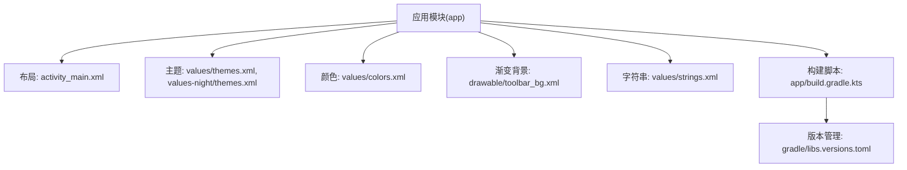
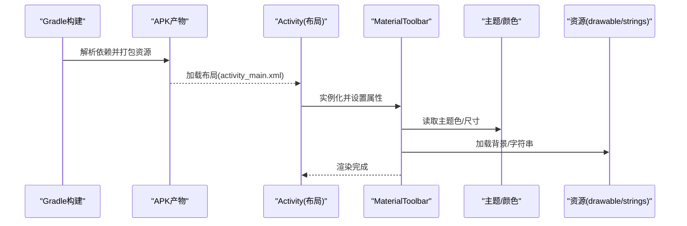
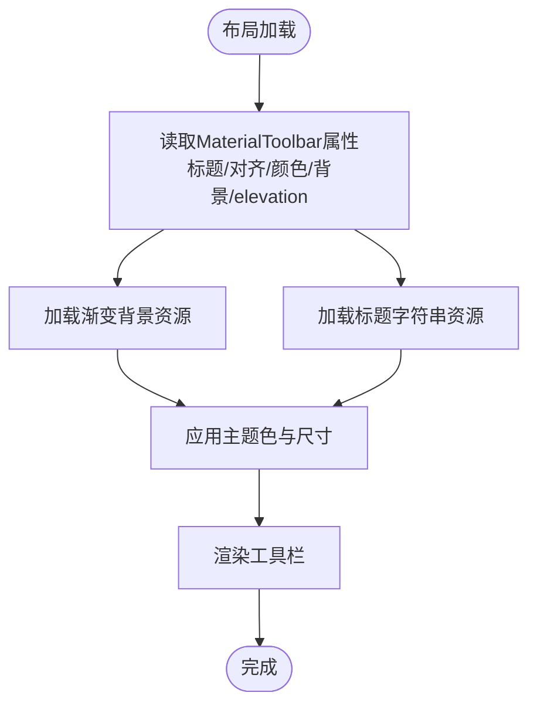
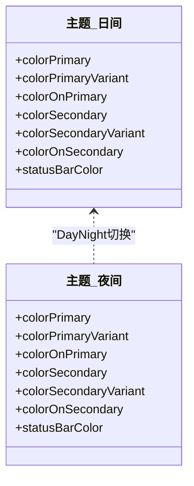
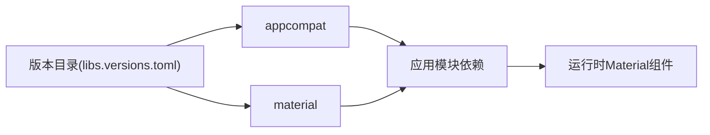
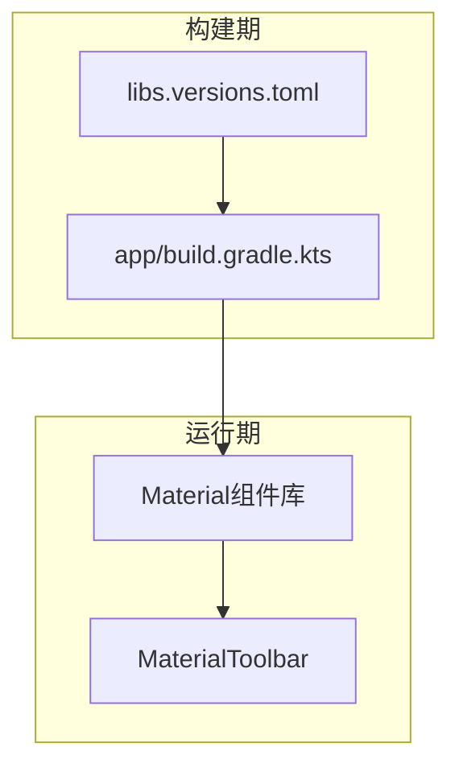

# Material Design组件

<cite>
**本文引用的文件**
- [app/build.gradle.kts](file://app/build.gradle.kts)
- [gradle/libs.versions.toml](file://gradle/libs.versions.toml)
- [app/src/main/res/layout/activity_main.xml](file://app/src/main/res/layout/activity_main.xml)
- [app/src/main/res/drawable/toolbar_bg.xml](file://app/src/main/res/drawable/toolbar_bg.xml)
- [app/src/main/res/values/themes.xml](file://app/src/main/res/values/themes.xml)
- [app/src/main/res/values-night/themes.xml](file://app/src/main/res/values-night/themes.xml)
- [app/src/main/res/values/colors.xml](file://app/src/main/res/values/colors.xml)
- [app/src/main/res/values/strings.xml](file://app/src/main/res/values/strings.xml)
</cite>

## 目录
1. [简介](#简介)
2. [项目结构](#项目结构)
3. [核心组件](#核心组件)
4. [架构总览](#架构总览)
5. [详细组件分析](#详细组件分析)
6. [依赖关系分析](#依赖关系分析)
7. [性能考虑](#性能考虑)
8. [故障排查指南](#故障排查指南)
9. [结论](#结论)
10. [附录](#附录)

## 简介
本文件围绕Material Design在Android工程中的集成与使用，重点说明MaterialToolbar的配置与定制（标题、背景、阴影等），并给出主题适配、颜色系统、字体与间距规范、可访问性与国际化配置建议，以及在不同Android版本上的兼容性注意事项。本文所有实现细节均基于当前仓库中的资源与构建配置进行梳理。

## 项目结构
本项目采用标准的Android模块结构，Material Components通过Gradle依赖引入，界面布局中使用MaterialToolbar作为顶部导航栏，并通过主题与drawable资源完成外观定制。

图表来源
- [app/src/main/res/layout/activity_main.xml:10-18](file://app/src/main/res/layout/activity_main.xml#L10-L18)
- [app/src/main/res/values/themes.xml:3-15](file://app/src/main/res/values/themes.xml#L3-L15)
- [app/src/main/res/values-night/themes.xml:3-15](file://app/src/main/res/values-night/themes.xml#L3-L15)
- [app/src/main/res/values/colors.xml:3-9](file://app/src/main/res/values/colors.xml#L3-L9)
- [app/src/main/res/drawable/toolbar_bg.xml:1-9](file://app/src/main/res/drawable/toolbar_bg.xml#L1-L9)
- [app/build.gradle.kts:74-80](file://app/build.gradle.kts#L74-L80)
- [gradle/libs.versions.toml:1-19](file://gradle/libs.versions.toml#L1-L19)

章节来源
- [app/src/main/res/layout/activity_main.xml:1-62](file://app/src/main/res/layout/activity_main.xml#L1-L62)
- [app/build.gradle.kts:1-80](file://app/build.gradle.kts#L1-L80)
- [gradle/libs.versions.toml:1-19](file://gradle/libs.versions.toml#L1-L19)

## 核心组件
- MaterialToolbar：用于承载应用标题、返回按钮、菜单等，支持自定义背景、阴影、标题样式与对齐方式。
- 主题系统：通过Theme.MaterialComponents.DayNight系列提供明暗模式支持，统一控制颜色、状态栏等全局样式。
- 资源体系：颜色、渐变背景、字符串等资源集中管理，便于多语言与多主题扩展。

章节来源
- [app/src/main/res/layout/activity_main.xml:10-18](file://app/src/main/res/layout/activity_main.xml#L10-L18)
- [app/src/main/res/values/themes.xml:3-15](file://app/src/main/res/values/themes.xml#L3-L15)
- [app/src/main/res/values-night/themes.xml:3-15](file://app/src/main/res/values-night/themes.xml#L3-L15)
- [app/src/main/res/values/colors.xml:3-9](file://app/src/main/res/values/colors.xml#L3-L9)
- [app/src/main/res/values/strings.xml:1-3](file://app/src/main/res/values/strings.xml#L1-L3)

## 架构总览
下图展示了从构建到运行的关键路径：构建脚本声明Material依赖，布局文件中声明MaterialToolbar，运行时由主题与资源驱动其外观与行为。

图表来源
- [app/build.gradle.kts:74-80](file://app/build.gradle.kts#L74-L80)
- [gradle/libs.versions.toml:1-19](file://gradle/libs.versions.toml#L1-L19)
- [app/src/main/res/layout/activity_main.xml:10-18](file://app/src/main/res/layout/activity_main.xml#L10-L18)
- [app/src/main/res/values/themes.xml:3-15](file://app/src/main/res/values/themes.xml#L3-L15)
- [app/src/main/res/drawable/toolbar_bg.xml:1-9](file://app/src/main/res/drawable/toolbar_bg.xml#L1-L9)
- [app/src/main/res/values/strings.xml:1-3](file://app/src/main/res/values/strings.xml#L1-L3)

## 详细组件分析

### MaterialToolbar 配置与使用
- 标题设置
  - 通过布局属性设置标题文本与对齐方式，标题文本来自字符串资源，确保可本地化。
  - 标题文字颜色可通过属性覆盖，保证与背景对比度满足可读性要求。
- 背景定制
  - 使用自定义渐变背景资源，实现深蓝到深紫的垂直渐变，提升视觉层次。
- 阴影效果
  - 通过设置elevation为4dp，使工具栏具备轻微投影，增强层级感。
- 高度与系统窗口适配
  - 高度引用ActionBar标准尺寸，配合fitsSystemWindows确保与系统状态栏正确衔接。

图表来源
- [app/src/main/res/layout/activity_main.xml:10-18](file://app/src/main/res/layout/activity_main.xml#L10-L18)
- [app/src/main/res/drawable/toolbar_bg.xml:1-9](file://app/src/main/res/drawable/toolbar_bg.xml#L1-L9)
- [app/src/main/res/values/strings.xml:1-3](file://app/src/main/res/values/strings.xml#L1-L3)

章节来源
- [app/src/main/res/layout/activity_main.xml:10-18](file://app/src/main/res/layout/activity_main.xml#L10-L18)
- [app/src/main/res/drawable/toolbar_bg.xml:1-9](file://app/src/main/res/drawable/toolbar_bg.xml#L1-L9)
- [app/src/main/res/values/strings.xml:1-3](file://app/src/main/res/values/strings.xml#L1-L3)

### 主题与样式自定义
- 主题基线
  - 日间模式使用NoActionBar主题，夜间模式使用DarkActionBar主题，以适配不同场景。
- 颜色系统
  - 定义主色、次色及其变体，并在主题中映射到colorPrimary、colorSecondary等属性，保证全局一致性。
  - 状态栏颜色在日间模式下固定为深色，夜间模式跟随主题变体。
- 明暗模式切换
  - 通过values与values-night两套主题资源，自动根据系统设置切换配色。

图表来源
- [app/src/main/res/values/themes.xml:3-15](file://app/src/main/res/values/themes.xml#L3-L15)
- [app/src/main/res/values-night/themes.xml:3-15](file://app/src/main/res/values-night/themes.xml#L3-L15)
- [app/src/main/res/values/colors.xml:3-9](file://app/src/main/res/values/colors.xml#L3-L9)

章节来源
- [app/src/main/res/values/themes.xml:3-15](file://app/src/main/res/values/themes.xml#L3-L15)
- [app/src/main/res/values-night/themes.xml:3-15](file://app/src/main/res/values-night/themes.xml#L3-L15)
- [app/src/main/res/values/colors.xml:3-9](file://app/src/main/res/values/colors.xml#L3-L9)

### Material Components 库集成与版本管理
- 依赖声明
  - 在应用模块的构建脚本中引入appcompat与material依赖。
- 版本集中管理
  - 通过Gradle版本目录统一管理AGP、AppCompat、Material等依赖版本，便于升级与维护。
- 编译目标
  - 指定最小SDK与目标SDK，确保Material组件在目标设备上可用。

图表来源
- [gradle/libs.versions.toml:1-19](file://gradle/libs.versions.toml#L1-L19)
- [app/build.gradle.kts:74-80](file://app/build.gradle.kts#L74-L80)

章节来源
- [gradle/libs.versions.toml:1-19](file://gradle/libs.versions.toml#L1-L19)
- [app/build.gradle.kts:18-26](file://app/build.gradle.kts#L18-L26)
- [app/build.gradle.kts:74-80](file://app/build.gradle.kts#L74-L80)

### Material Design 规范应用指南
- 颜色系统
  - 使用主色与次色构建品牌识别，注意明暗模式下的对比度与可读性。
- 字体规范
  - 遵循Material Typography，合理设置标题、正文、辅助文字的字号与字重，保证信息层级清晰。
- 间距标准
  - 使用8dp网格系统，保持元素间留白一致，提升整体节奏感与可扫描性。
- 阴影与层级
  - 通过elevation表达层级关系，避免过度堆叠导致视觉混乱。

[本节为通用指导，不直接分析具体文件]

### 可访问性与国际化
- 可访问性
  - 为交互控件添加内容描述，确保屏幕阅读器能准确朗读。
  - 保证前景与背景对比度符合WCAG建议，提升可读性。
- 国际化
  - 将用户可见文案抽取至字符串资源，按语言环境提供翻译文件，便于多语言切换。

章节来源
- [app/src/main/res/values/strings.xml:1-3](file://app/src/main/res/values/strings.xml#L1-L3)

### 跨版本兼容性要点
- 最低API级别
  - 当前最小SDK为24，Material组件在该版本及以上稳定可用。
- 主题差异
  - 日间与夜间主题分别适配，避免UI不一致。
- 状态栏与系统窗口
  - 使用fitsSystemWindows与主题中的状态栏颜色，确保在不同Android版本上显示一致。

章节来源
- [app/build.gradle.kts:18-26](file://app/build.gradle.kts#L18-L26)
- [app/src/main/res/layout/activity_main.xml:6-7](file://app/src/main/res/layout/activity_main.xml#L6-L7)
- [app/src/main/res/values/themes.xml:12-14](file://app/src/main/res/values/themes.xml#L12-L14)
- [app/src/main/res/values-night/themes.xml:12-14](file://app/src/main/res/values-night/themes.xml#L12-L14)

## 依赖关系分析
- 构建期依赖
  - AGP、AppCompat、Material通过版本目录集中管理，降低耦合。
- 运行期依赖
  - 应用运行时依赖Material组件提供的视图与主题能力。

图表来源
- [gradle/libs.versions.toml:1-19](file://gradle/libs.versions.toml#L1-L19)
- [app/build.gradle.kts:74-80](file://app/build.gradle.kts#L74-L80)

章节来源
- [gradle/libs.versions.toml:1-19](file://gradle/libs.versions.toml#L1-L19)
- [app/build.gradle.kts:74-80](file://app/build.gradle.kts#L74-L80)

## 性能考虑
- 减少不必要的重绘
  - 背景渐变与阴影已足够表达层级，避免叠加过多装饰。
- 资源复用
  - 颜色与主题集中管理，减少重复定义与内存占用。
- 布局优化
  - 使用合适的容器与权重分配，避免过度嵌套导致的测量开销。

[本节为通用指导，不直接分析具体文件]

## 故障排查指南
- 标题不显示或颜色异常
  - 检查标题文本是否指向有效的字符串资源；确认标题文字颜色与背景对比度。
- 背景未生效
  - 确认渐变背景资源路径正确，且未被其他背景覆盖。
- 阴影不明显
  - 检查elevation值与父容器是否允许绘制阴影；在低版本设备上可能表现不同。
- 主题切换无效
  - 确认使用了DayNight主题，并确保values与values-night资源存在对应项。
- 状态栏颜色异常
  - 检查主题中状态栏颜色配置是否与预期一致。

章节来源
- [app/src/main/res/layout/activity_main.xml:10-18](file://app/src/main/res/layout/activity_main.xml#L10-L18)
- [app/src/main/res/drawable/toolbar_bg.xml:1-9](file://app/src/main/res/drawable/toolbar_bg.xml#L1-L9)
- [app/src/main/res/values/themes.xml:12-14](file://app/src/main/res/values/themes.xml#L12-L14)
- [app/src/main/res/values-night/themes.xml:12-14](file://app/src/main/res/values-night/themes.xml#L12-L14)

## 结论
本项目通过MaterialComponents与主题系统实现了统一的Material Design风格。MaterialToolbar在布局中承担标题与导航职责，结合渐变背景与阴影提升了视觉层次。通过集中化的版本管理与资源组织，项目在可维护性与可扩展性方面具备良好的基础。后续可在可访问性与国际化方面进一步完善，以提升用户体验。

## 附录
- 常用MaterialToolbar属性参考（基于当前实现）
  - 标题与对齐：标题文本、居中对齐、标题文字颜色
  - 背景与阴影：自定义渐变背景、elevation
  - 高度与系统适配：ActionBar标准高度、fitsSystemWindows
- 主题与颜色
  - 主色、次色及其变体在日间与夜间模式下的映射
  - 状态栏颜色在不同模式下的配置

[本节为补充说明，不直接分析具体文件]