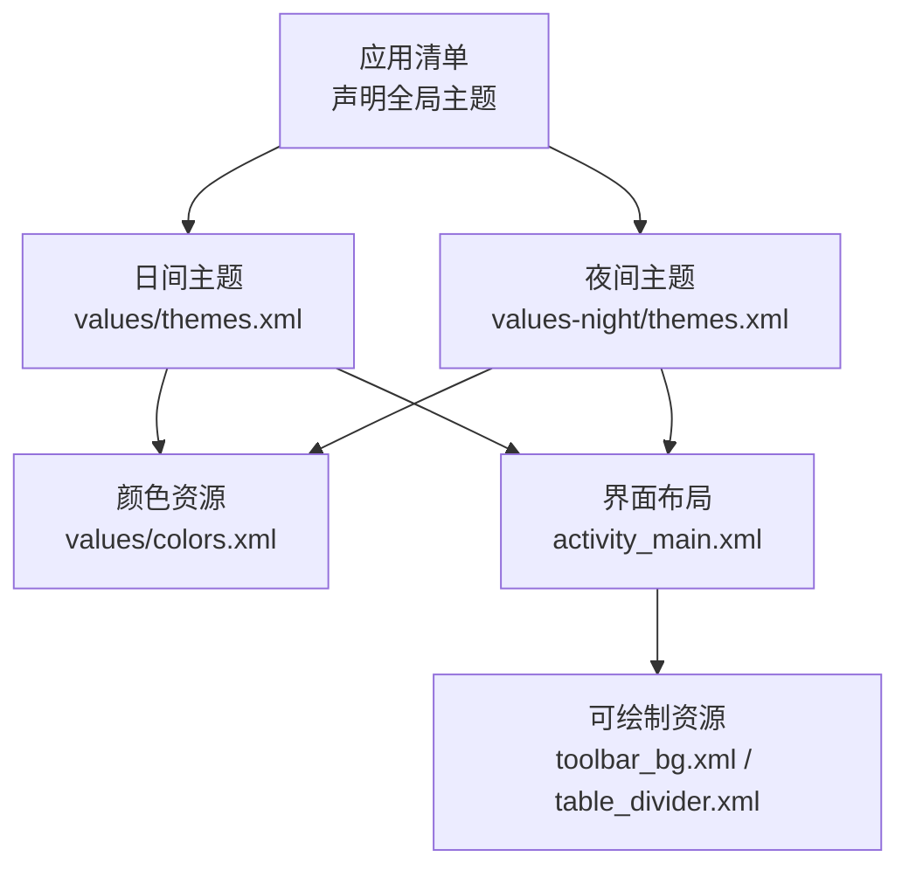
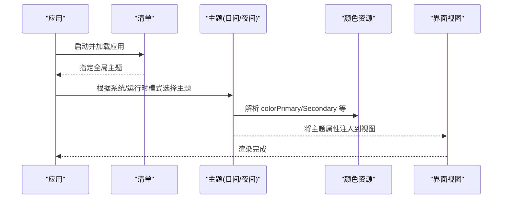
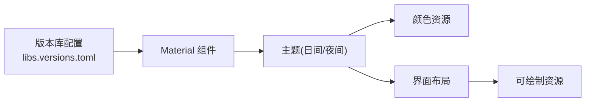
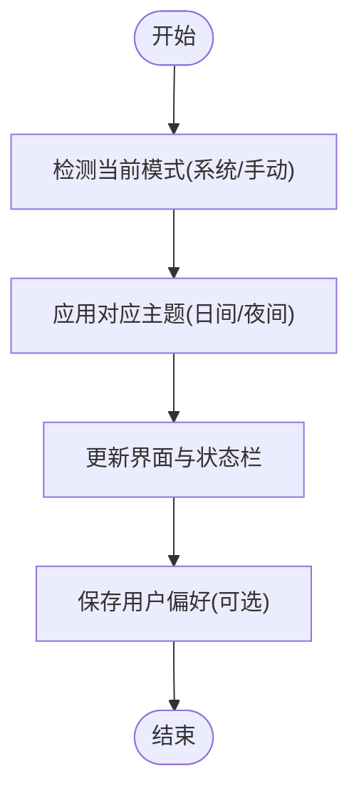

# 主题与样式

<cite>
**本文引用的文件**
- [应用清单](file://app/src/main/AndroidManifest.xml)
- [日间主题](file://app/src/main/res/values/themes.xml)
- [夜间主题](file://app/src/main/res/values-night/themes.xml)
- [颜色资源](file://app/src/main/res/values/colors.xml)
- [主界面布局](file://app/src/main/res/layout/activity_main.xml)
- [工具栏背景](file://app/src/main/res/drawable/toolbar_bg.xml)
- [表格分隔线](file://app/src/main/res/drawable/table_divider.xml)
- [版本库配置](file://gradle/libs.versions.toml)
</cite>

## 目录
1. [简介](#简介)
2. [项目结构](#项目结构)
3. [核心组件](#核心组件)
4. [架构总览](#架构总览)
5. [详细组件分析](#详细组件分析)
6. [依赖关系分析](#依赖关系分析)
7. [性能考虑](#性能考虑)
8. [故障排查指南](#故障排查指南)
9. [结论](#结论)
10. [附录](#附录)

## 简介
本文件围绕 Material Theme 的主题与样式系统，系统化说明该项目的主题配置、自定义方法、日间/夜间模式切换机制、颜色资源组织与管理策略、主题属性继承与覆盖规则、自定义样式最佳实践（字体、间距、圆角等视觉一致性），以及主题切换的动态实现方案与性能优化建议。同时提供在不同设备上显示差异的解决思路与排障指引。

## 项目结构
本项目采用 Android 标准资源目录组织方式：
- 应用入口通过清单声明全局主题，使所有 Activity 默认继承该主题。
- 使用 values 与 values-night 两套主题资源，分别对应日间与夜间模式。
- 颜色资源集中管理于 colors.xml，供主题与 UI 复用。
- 界面布局引用主题属性与可绘制资源，保证视觉一致性与可维护性。

图表来源
- [应用清单:5-13](file://app/src/main/AndroidManifest.xml#L5-L13)
- [日间主题:1-16](file://app/src/main/res/values/themes.xml#L1-L16)
- [夜间主题:1-16](file://app/src/main/res/values-night/themes.xml#L1-L16)
- [颜色资源:1-10](file://app/src/main/res/values/colors.xml#L1-L10)
- [主界面布局:1-62](file://app/src/main/res/layout/activity_main.xml#L1-L62)
- [工具栏背景:1-9](file://app/src/main/res/drawable/toolbar_bg.xml#L1-L9)
- [表格分隔线:1-6](file://app/src/main/res/drawable/table_divider.xml#L1-L6)

章节来源
- [应用清单:5-13](file://app/src/main/AndroidManifest.xml#L5-L13)
- [日间主题:1-16](file://app/src/main/res/values/themes.xml#L1-L16)
- [夜间主题:1-16](file://app/src/main/res/values-night/themes.xml#L1-L16)
- [颜色资源:1-10](file://app/src/main/res/values/colors.xml#L1-L10)
- [主界面布局:1-62](file://app/src/main/res/layout/activity_main.xml#L1-L62)
- [工具栏背景:1-9](file://app/src/main/res/drawable/toolbar_bg.xml#L1-L9)
- [表格分隔线:1-6](file://app/src/main/res/drawable/table_divider.xml#L1-L6)

## 核心组件
- 主题基类与变体
  - 日间模式基于 DayNight 无操作栏主题，便于统一控制状态栏与导航栏行为。
  - 夜间模式基于 DayNight 深色操作栏主题，适配暗色背景下的对比度需求。
- 颜色体系
  - 主色与主色变体用于强调与状态反馈。
  - 辅助色与辅助色变体用于次要元素与交互态。
  - On 系列颜色用于前景文本与图标，确保可读性。
- 状态栏配色
  - 日间模式使用固定深蓝色；夜间模式通过主题属性引用主色变体，保持明暗对比一致。
- 界面元素
  - 标题栏使用渐变背景，突出品牌感。
  - 表格分隔线使用浅色细线，提升信息层次。

章节来源
- [日间主题:1-16](file://app/src/main/res/values/themes.xml#L1-L16)
- [夜间主题:1-16](file://app/src/main/res/values-night/themes.xml#L1-L16)
- [颜色资源:1-10](file://app/src/main/res/values/colors.xml#L1-L10)
- [主界面布局:1-62](file://app/src/main/res/layout/activity_main.xml#L1-L62)
- [工具栏背景:1-9](file://app/src/main/res/drawable/toolbar_bg.xml#L1-L9)
- [表格分隔线:1-6](file://app/src/main/res/drawable/table_divider.xml#L1-L6)

## 架构总览
主题系统由“清单声明 -> 主题选择 -> 颜色解析 -> 视图渲染”构成。Material Components 的 DayNight 主题根据系统或运行时配置自动选择日间或夜间资源目录，从而完成主题切换。

图表来源
- [应用清单:5-13](file://app/src/main/AndroidManifest.xml#L5-L13)
- [日间主题:1-16](file://app/src/main/res/values/themes.xml#L1-L16)
- [夜间主题:1-16](file://app/src/main/res/values-night/themes.xml#L1-L16)
- [颜色资源:1-10](file://app/src/main/res/values/colors.xml#L1-L10)

## 详细组件分析

### 主题配置与继承机制
- 继承关系
  - 应用主题继承自 MaterialComponents 的 DayNight 基主题，获得完整的日间/夜间能力。
  - 日间主题使用 NoActionBar 基主题，便于自定义标题栏。
  - 夜间主题使用 DarkActionBar 基主题，适配深色背景下的控件外观。
- 属性覆盖
  - 通过 item 项覆盖 colorPrimary、colorSecondary 及其变体与 On 系列颜色。
  - 状态栏颜色在日间为固定值，夜间通过属性引用主色变体，确保对比度。
- 资源目录
  - values 目录提供日间主题与颜色。
  - values-night 目录提供夜间主题，颜色仍复用同一份 colors.xml，通过不同主题映射实现明暗切换。

章节来源
- [日间主题:1-16](file://app/src/main/res/values/themes.xml#L1-L16)
- [夜间主题:1-16](file://app/src/main/res/values-night/themes.xml#L1-L16)
- [颜色资源:1-10](file://app/src/main/res/values/colors.xml#L1-L10)

### 颜色资源的组织结构与管理策略
- 颜色命名
  - 使用语义化命名（如主色、辅助色）与色阶（如 200/500/700）组合，便于在不同模式下灵活映射。
- 复用原则
  - 主题中仅引用颜色资源名，不直接写死十六进制值，便于统一管理与替换。
- 明暗适配
  - 日间与夜间通过不同的主题映射到相同颜色资源的不同色阶，保证对比度与可读性。

章节来源
- [颜色资源:1-10](file://app/src/main/res/values/colors.xml#L1-L10)
- [日间主题:1-16](file://app/src/main/res/values/themes.xml#L1-L16)
- [夜间主题:1-16](file://app/src/main/res/values-night/themes.xml#L1-L16)

### 主题属性的继承与样式覆盖规则
- 继承链
  - 应用主题 -> MaterialComponents DayNight 基主题 -> 平台默认主题。
- 覆盖优先级
  - 具体主题中的 item 会覆盖基主题的同名属性。
  - 视图层可通过 style 或属性再次覆盖，但应优先使用主题属性以保证一致性。
- 状态栏与导航栏
  - 通过主题属性设置状态栏颜色；如需更精细控制，可在代码中动态调整。

章节来源
- [日间主题:1-16](file://app/src/main/res/values/themes.xml#L1-L16)
- [夜间主题:1-16](file://app/src/main/res/values-night/themes.xml#L1-L16)

### 自定义样式的最佳实践
- 字体
  - 建议使用系统字体族或通过主题扩展字体资源；避免在布局中硬编码字号与字重。
- 间距
  - 使用统一的 spacing 资源（如 4dp/8dp/12dp/16dp），并通过主题或样式复用。
- 圆角与阴影
  - 使用 shape 与 elevation 统一管理；避免在多处重复定义。
- 可访问性
  - 确保 On 系列颜色与背景对比度符合 WCAG 建议；在夜间模式尤其注意。

[本节为通用指导，不直接分析具体文件]

### 主题切换的动态实现方案
- 自动切换
  - 基于系统设置（跟随系统）时，DayNight 主题会自动切换。
- 手动切换
  - 可在运行时通过设置应用内主题模式并重建 Activity 实现即时切换。
  - 切换后需确保状态栏、导航栏与界面元素重新渲染以应用新主题。
- 持久化
  - 将用户选择的主题模式保存到本地存储，应用启动时读取并应用。

[本节为通用指导，不直接分析具体文件]

### 不同设备上的显示差异与解决
- 状态栏与导航栏
  - 不同厂商对状态栏半透明、沉浸式体验的实现存在差异，建议在清单与主题中明确设置相关属性。
- 屏幕密度与尺寸
  - 使用 dp/sp 单位与响应式布局，避免硬编码像素值。
- 深色模式支持
  - 确保所有可绘制资源在深色背景下具备足够的对比度；必要时提供 night 版本的 drawable。

[本节为通用指导，不直接分析具体文件]

## 依赖关系分析
- 构建与依赖
  - 通过版本库配置文件集中管理 Material Components 与 AppCompat 版本，确保主题能力稳定。
- 主题与资源
  - 主题依赖颜色资源；界面布局依赖主题属性与可绘制资源。

图表来源
- [版本库配置:1-17](file://gradle/libs.versions.toml#L1-L17)
- [日间主题:1-16](file://app/src/main/res/values/themes.xml#L1-L16)
- [夜间主题:1-16](file://app/src/main/res/values-night/themes.xml#L1-L16)
- [颜色资源:1-10](file://app/src/main/res/values/colors.xml#L1-L10)
- [主界面布局:1-62](file://app/src/main/res/layout/activity_main.xml#L1-L62)
- [工具栏背景:1-9](file://app/src/main/res/drawable/toolbar_bg.xml#L1-L9)
- [表格分隔线:1-6](file://app/src/main/res/drawable/table_divider.xml#L1-L6)

章节来源
- [版本库配置:1-17](file://gradle/libs.versions.toml#L1-L17)
- [日间主题:1-16](file://app/src/main/res/values/themes.xml#L1-L16)
- [夜间主题:1-16](file://app/src/main/res/values-night/themes.xml#L1-L16)
- [颜色资源:1-10](file://app/src/main/res/values/colors.xml#L1-L10)
- [主界面布局:1-62](file://app/src/main/res/layout/activity_main.xml#L1-L62)
- [工具栏背景:1-9](file://app/src/main/res/drawable/toolbar_bg.xml#L1-L9)
- [表格分隔线:1-6](file://app/src/main/res/drawable/table_divider.xml#L1-L6)

## 性能考虑
- 主题切换开销
  - 频繁切换主题会导致视图重建与重绘，建议批量更新与延迟切换。
- 资源加载
  - 避免在主题中引入过大或复杂的可绘制资源；优先使用矢量图。
- 状态栏与导航栏
  - 减少不必要的透明度与渐变计算，降低渲染压力。
- 内存与 GC
  - 避免在主题或样式中创建大量对象；使用静态资源与复用样式。

[本节为通用指导，不直接分析具体文件]

## 故障排查指南
- 主题未生效
  - 检查清单是否声明了全局主题；确认日间/夜间主题文件是否存在且命名正确。
- 颜色不一致
  - 检查主题中是否正确引用颜色资源；避免在布局中硬编码颜色。
- 状态栏颜色异常
  - 确认日间/夜间主题的状态栏颜色设置；必要时在代码中动态调整。
- 深色模式对比度不足
  - 调整 On 系列颜色与背景色的对比度；提供 night 版本的 drawable。

章节来源
- [应用清单:5-13](file://app/src/main/AndroidManifest.xml#L5-L13)
- [日间主题:1-16](file://app/src/main/res/values/themes.xml#L1-L16)
- [夜间主题:1-16](file://app/src/main/res/values-night/themes.xml#L1-L16)
- [颜色资源:1-10](file://app/src/main/res/values/colors.xml#L1-L10)
- [主界面布局:1-62](file://app/src/main/res/layout/activity_main.xml#L1-L62)

## 结论
本项目通过 Material Components 的 DayNight 主题实现了简洁而强大的主题系统。颜色资源集中管理、主题属性合理覆盖、界面元素与主题解耦，使得日间与夜间模式切换自然流畅。遵循本文的最佳实践与性能建议，可进一步提升主题的一致性与可维护性，并在多设备上提供稳定的视觉体验。

[本节为总结性内容，不直接分析具体文件]

## 附录
- 关键流程示意（主题切换）

[本图为概念性流程图，不直接映射具体源码文件]