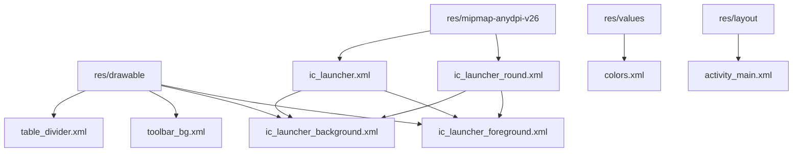
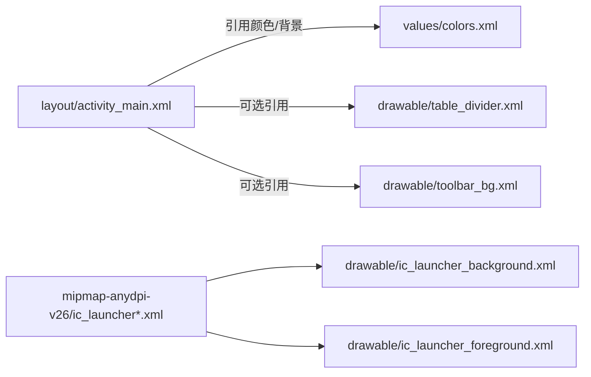
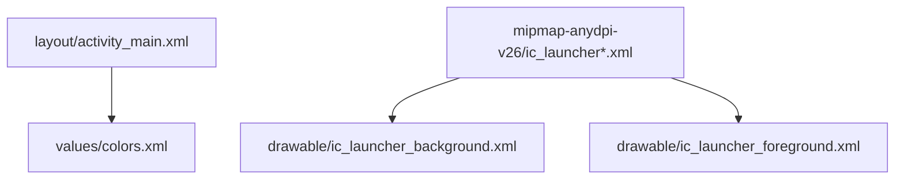

# 可绘制资源

<cite>
**本文引用的文件**
- [table_divider.xml](file://app/src/main/res/drawable/table_divider.xml)
- [toolbar_bg.xml](file://app/src/main/res/drawable/toolbar_bg.xml)
- [ic_launcher_background.xml](file://app/src/main/res/drawable/ic_launcher_background.xml)
- [ic_launcher_foreground.xml](file://app/src/main/res/drawable/ic_launcher_foreground.xml)
- [ic_launcher.xml](file://app/src/main/res/mipmap-anydpi-v26/ic_launcher.xml)
- [ic_launcher_round.xml](file://app/src/main/res/mipmap-anydpi-v26/ic_launcher_round.xml)
- [colors.xml](file://app/src/main/res/values/colors.xml)
- [activity_main.xml](file://app/src/main/res/layout/activity_main.xml)
</cite>

## 目录
1. [简介](#简介)
2. [项目结构](#项目结构)
3. [核心组件](#核心组件)
4. [架构总览](#架构总览)
5. [详细组件分析](#详细组件分析)
6. [依赖关系分析](#依赖关系分析)
7. [性能与优化](#性能与优化)
8. [故障排查指南](#故障排查指南)
9. [结论](#结论)
10. [附录](#附录)

## 简介
本文件面向“可绘制资源管理”，聚焦 VectorDrawable 与 ShapeDrawable 的使用，涵盖渐变背景、分割线等自定义图形的实现；记录图标资源的组织方式与命名规范（含多分辨率适配策略）；总结矢量图的性能优势与位图压缩方法；给出自定义 Drawable 的创建流程与使用场景；提供版本管理与维护最佳实践；并解决跨平台显示一致性与内存占用优化问题。

## 项目结构
本项目在 res 目录下按类型组织可绘制资源：
- drawable：存放矢量与形状资源（如表格分割线、工具栏渐变背景、应用图标矢量层）。
- mipmap-anydpi-v26：Android 8.0+ 自适应图标入口，组合背景与前景矢量层。
- values：集中颜色定义，便于主题与资源复用。
- layout：界面布局中可直接引用上述资源。

图表来源
- [table_divider.xml:1-6](file://app/src/main/res/drawable/table_divider.xml#L1-L6)
- [toolbar_bg.xml:1-9](file://app/src/main/res/drawable/toolbar_bg.xml#L1-L9)
- [ic_launcher_background.xml:1-171](file://app/src/main/res/drawable/ic_launcher_background.xml#L1-L171)
- [ic_launcher_foreground.xml:1-30](file://app/src/main/res/drawable/ic_launcher_foreground.xml#L1-L30)
- [ic_launcher.xml:1-6](file://app/src/main/res/mipmap-anydpi-v26/ic_launcher.xml#L1-L6)
- [ic_launcher_round.xml:1-6](file://app/src/main/res/mipmap-anydpi-v26/ic_launcher_round.xml#L1-L6)
- [colors.xml:1-10](file://app/src/main/res/values/colors.xml#L1-L10)
- [activity_main.xml:35-61](file://app/src/main/res/layout/activity_main.xml#L35-L61)

章节来源
- [table_divider.xml:1-6](file://app/src/main/res/drawable/table_divider.xml#L1-L6)
- [toolbar_bg.xml:1-9](file://app/src/main/res/drawable/toolbar_bg.xml#L1-L9)
- [ic_launcher_background.xml:1-171](file://app/src/main/res/drawable/ic_launcher_background.xml#L1-L171)
- [ic_launcher_foreground.xml:1-30](file://app/src/main/res/drawable/ic_launcher_foreground.xml#L1-L30)
- [ic_launcher.xml:1-6](file://app/src/main/res/mipmap-anydpi-v26/ic_launcher.xml#L1-L6)
- [ic_launcher_round.xml:1-6](file://app/src/main/res/mipmap-anydpi-v26/ic_launcher_round.xml#L1-L6)
- [colors.xml:1-10](file://app/src/main/res/values/colors.xml#L1-L10)
- [activity_main.xml:35-61](file://app/src/main/res/layout/activity_main.xml#L35-L61)

## 核心组件
- ShapeDrawable（XML 形状）
  - 分割线：通过 shape + solid 色块 + size 高度实现细线分隔。
  - 渐变背景：通过 shape + gradient 实现线性渐变背景。
- VectorDrawable（矢量）
  - 应用图标背景：以 vector + path 构建网格背景。
  - 应用图标前景：以 vector + path + aapt 渐变填充实现复杂图形。
- 自适应图标
  - mipmap-anydpi-v26 下的入口 XML 将背景与前景组合为自适应图标，支持圆角与单色模式。

章节来源
- [table_divider.xml:1-6](file://app/src/main/res/drawable/table_divider.xml#L1-L6)
- [toolbar_bg.xml:1-9](file://app/src/main/res/drawable/toolbar_bg.xml#L1-L9)
- [ic_launcher_background.xml:1-171](file://app/src/main/res/drawable/ic_launcher_background.xml#L1-L171)
- [ic_launcher_foreground.xml:1-30](file://app/src/main/res/drawable/ic_launcher_foreground.xml#L1-L30)
- [ic_launcher.xml:1-6](file://app/src/main/res/mipmap-anydpi-v26/ic_launcher.xml#L1-L6)
- [ic_launcher_round.xml:1-6](file://app/src/main/res/mipmap-anydpi-v26/ic_launcher_round.xml#L1-L6)

## 架构总览
下图展示了可绘制资源在项目中的组织与引用关系：布局通过背景或可见性控制间接使用颜色；图标通过自适应图标入口组合矢量层；颜色资源集中管理，便于主题切换与一致性维护。

图表来源
- [activity_main.xml:35-61](file://app/src/main/res/layout/activity_main.xml#L35-L61)
- [colors.xml:1-10](file://app/src/main/res/values/colors.xml#L1-L10)
- [table_divider.xml:1-6](file://app/src/main/res/drawable/table_divider.xml#L1-L6)
- [toolbar_bg.xml:1-9](file://app/src/main/res/drawable/toolbar_bg.xml#L1-L9)
- [ic_launcher.xml:1-6](file://app/src/main/res/mipmap-anydpi-v26/ic_launcher.xml#L1-L6)
- [ic_launcher_round.xml:1-6](file://app/src/main/res/mipmap-anydpi-v26/ic_launcher_round.xml#L1-L6)
- [ic_launcher_background.xml:1-171](file://app/src/main/res/drawable/ic_launcher_background.xml#L1-L171)
- [ic_launcher_foreground.xml:1-30](file://app/src/main/res/drawable/ic_launcher_foreground.xml#L1-L30)

## 详细组件分析

### 分割线（ShapeDrawable）
- 作用：用于表格行之间的视觉分隔。
- 实现要点：shape + solid + size 高度，宽度默认占满父容器。
- 使用建议：
  - 统一高度（如 1dp），避免在不同密度下出现粗细不一致。
  - 颜色建议使用 values 中定义的颜色名，便于主题切换。
- 复杂度：O(1)，渲染开销极低。

章节来源
- [table_divider.xml:1-6](file://app/src/main/res/drawable/table_divider.xml#L1-L6)
- [colors.xml:1-10](file://app/src/main/res/values/colors.xml#L1-L10)

### 工具栏渐变背景（ShapeDrawable）
- 作用：为标题栏提供从深蓝到深紫的垂直渐变背景。
- 实现要点：shape + gradient，设置 startColor、endColor、angle。
- 使用建议：
  - 角度 270 表示从上到下渐变，符合常见 UI 习惯。
  - 颜色值建议迁移至 colors.xml，统一管理。
- 复杂度：O(1)，GPU 友好。

章节来源
- [toolbar_bg.xml:1-9](file://app/src/main/res/drawable/toolbar_bg.xml#L1-L9)
- [colors.xml:1-10](file://app/src/main/res/values/colors.xml#L1-L10)

### 应用图标背景（VectorDrawable）
- 作用：作为自适应图标的背景层，呈现网格效果。
- 实现要点：vector + 多个 path，分别绘制背景矩形与网格线条。
- 性能注意：
  - 路径数量较多时，可适当合并路径或使用更简洁的几何描述。
  - 保持 viewport 与实际像素比例合理，减少缩放失真。
- 复杂度：随 path 数量线性增长，但整体仍轻量。

章节来源
- [ic_launcher_background.xml:1-171](file://app/src/main/res/drawable/ic_launcher_background.xml#L1-L171)

### 应用图标前景（VectorDrawable + aapt 渐变）
- 作用：作为自适应图标的前景层，包含带渐变的图形元素。
- 实现要点：vector + path + aapt:attr 内嵌 gradient，实现渐变填充。
- 兼容性：aapt 渐变在较新系统上表现良好，需注意低版本回退策略（见后文）。
- 复杂度：受路径与渐变节点数影响，通常可控。

章节来源
- [ic_launcher_foreground.xml:1-30](file://app/src/main/res/drawable/ic_launcher_foreground.xml#L1-L30)

### 自适应图标入口（mipmap-anydpi-v26）
- 作用：将背景与前景组合为自适应图标，支持圆角与单色模式。
- 实现要点：adaptive-icon 指定 background、foreground、monochrome。
- 多分辨率适配：
  - 矢量层天然适配不同密度，无需多套位图。
  - 如需位图兜底，可在对应 mipmap-* 目录提供位图资源。

章节来源
- [ic_launcher.xml:1-6](file://app/src/main/res/mipmap-anydpi-v26/ic_launcher.xml#L1-L6)
- [ic_launcher_round.xml:1-6](file://app/src/main/res/mipmap-anydpi-v26/ic_launcher_round.xml#L1-L6)

### 布局中的资源使用
- 布局示例中直接使用了颜色值作为背景，并可替换为 drawable 资源（如 toolbar_bg）。
- 建议在布局中优先引用 values 中的颜色名，提升可维护性。

章节来源
- [activity_main.xml:35-61](file://app/src/main/res/layout/activity_main.xml#L35-L61)
- [colors.xml:1-10](file://app/src/main/res/values/colors.xml#L1-L10)

## 依赖关系分析
- 图标资源依赖：
  - ic_launcher.xml / ic_launcher_round.xml 依赖 ic_launcher_background.xml 与 ic_launcher_foreground.xml。
- 颜色资源依赖：
  - 各 drawable 与布局可通过 colors.xml 统一引用颜色，降低耦合。
- 布局与资源：
  - activity_main.xml 可直接引用颜色或 drawable，形成松耦合的资源消费端。

图表来源
- [activity_main.xml:35-61](file://app/src/main/res/layout/activity_main.xml#L35-L61)
- [colors.xml:1-10](file://app/src/main/res/values/colors.xml#L1-L10)
- [ic_launcher.xml:1-6](file://app/src/main/res/mipmap-anydpi-v26/ic_launcher.xml#L1-L6)
- [ic_launcher_round.xml:1-6](file://app/src/main/res/mipmap-anydpi-v26/ic_launcher_round.xml#L1-L6)
- [ic_launcher_background.xml:1-171](file://app/src/main/res/drawable/ic_launcher_background.xml#L1-L171)
- [ic_launcher_foreground.xml:1-30](file://app/src/main/res/drawable/ic_launcher_foreground.xml#L1-L30)

章节来源
- [ic_launcher.xml:1-6](file://app/src/main/res/mipmap-anydpi-v26/ic_launcher.xml#L1-L6)
- [ic_launcher_round.xml:1-6](file://app/src/main/res/mipmap-anydpi-v26/ic_launcher_round.xml#L1-L6)
- [ic_launcher_background.xml:1-171](file://app/src/main/res/drawable/ic_launcher_background.xml#L1-L171)
- [ic_launcher_foreground.xml:1-30](file://app/src/main/res/drawable/ic_launcher_foreground.xml#L1-L30)
- [colors.xml:1-10](file://app/src/main/res/values/colors.xml#L1-L10)
- [activity_main.xml:35-61](file://app/src/main/res/layout/activity_main.xml#L35-L61)

## 性能与优化
- 矢量图性能优势
  - 矢量图（VectorDrawable）在运行时由 GPU 渲染，体积小、清晰度好，适合图标与简单图形。
  - 复杂路径过多会增加解析与绘制成本，应精简 path 数量与命令。
- 位图压缩与存储
  - 对必须使用的位图资源，采用 PNG（无损）或 WebP（有损/无损）格式，启用压缩以减少 APK 体积。
  - 为不同密度提供合适尺寸，避免运行时过度缩放。
- 内存占用优化
  - 大图按需加载，避免一次性加载所有资源。
  - 使用 vector 替代重复位图，减少内存峰值。
  - 对频繁绘制的背景/分割线，尽量使用轻量 shape/vector。
- 跨平台显示一致性
  - 矢量图在不同厂商 ROM 上的渲染差异较小；若出现异常，可提供位图兜底或在特定 API 级别使用兼容方案。
  - 颜色与渐变建议使用 values 统一管理，避免硬编码导致主题不一致。

[本节为通用指导，不直接分析具体文件]

## 故障排查指南
- 分割线不可见或过粗
  - 检查 shape 的 height 是否过小或被覆盖；确认父容器高度与 padding。
  - 参考：[table_divider.xml:1-6](file://app/src/main/res/drawable/table_divider.xml#L1-L6)
- 渐变方向不符合预期
  - 调整 gradient 的 angle；确保 startColor 与 endColor 顺序正确。
  - 参考：[toolbar_bg.xml:1-9](file://app/src/main/res/drawable/toolbar_bg.xml#L1-L9)
- 图标前景渐变显示异常
  - 检查 aapt 渐变属性是否正确；必要时提供位图兜底或降级方案。
  - 参考：[ic_launcher_foreground.xml:1-30](file://app/src/main/res/drawable/ic_launcher_foreground.xml#L1-L30)
- 自适应图标背景/前景错位
  - 检查 adaptive-icon 的 background/foreground 引用是否正确。
  - 参考：[ic_launcher.xml:1-6](file://app/src/main/res/mipmap-anydpi-v26/ic_launcher.xml#L1-L6), [ic_launcher_round.xml:1-6](file://app/src/main/res/mipmap-anydpi-v26/ic_launcher_round.xml#L1-L6)
- 颜色主题不一致
  - 将硬编码颜色迁移至 colors.xml，并通过主题引用。
  - 参考：[colors.xml:1-10](file://app/src/main/res/values/colors.xml#L1-L10)

章节来源
- [table_divider.xml:1-6](file://app/src/main/res/drawable/table_divider.xml#L1-L6)
- [toolbar_bg.xml:1-9](file://app/src/main/res/drawable/toolbar_bg.xml#L1-L9)
- [ic_launcher_foreground.xml:1-30](file://app/src/main/res/drawable/ic_launcher_foreground.xml#L1-L30)
- [ic_launcher.xml:1-6](file://app/src/main/res/mipmap-anydpi-v26/ic_launcher.xml#L1-L6)
- [ic_launcher_round.xml:1-6](file://app/src/main/res/mipmap-anydpi-v26/ic_launcher_round.xml#L1-L6)
- [colors.xml:1-10](file://app/src/main/res/values/colors.xml#L1-L10)

## 结论
本项目已采用矢量与形状资源构建常用 UI 元素，具备较好的可维护性与扩展性。建议继续推进以下优化：
- 将颜色与渐变参数统一到 values，增强主题化能力。
- 精简矢量路径，减少不必要的 path 数量。
- 为关键位图引入压缩格式，结合矢量优先策略降低 APK 体积与内存占用。
- 建立资源命名规范与版本管理流程，保障团队协作与长期维护。

[本节为总结性内容，不直接分析具体文件]

## 附录

### 资源命名与组织结构规范
- 命名约定
  - 分割线：table_divider.xml
  - 背景：toolbar_bg.xml
  - 图标背景：ic_launcher_background.xml
  - 图标前景：ic_launcher_foreground.xml
- 目录组织
  - drawable：通用矢量与形状资源。
  - mipmap-anydpi-v26：自适应图标入口。
  - values：颜色与主题常量。
  - layout：界面布局，引用上述资源。

章节来源
- [table_divider.xml:1-6](file://app/src/main/res/drawable/table_divider.xml#L1-L6)
- [toolbar_bg.xml:1-9](file://app/src/main/res/drawable/toolbar_bg.xml#L1-L9)
- [ic_launcher_background.xml:1-171](file://app/src/main/res/drawable/ic_launcher_background.xml#L1-L171)
- [ic_launcher_foreground.xml:1-30](file://app/src/main/res/drawable/ic_launcher_foreground.xml#L1-L30)
- [ic_launcher.xml:1-6](file://app/src/main/res/mipmap-anydpi-v26/ic_launcher.xml#L1-L6)
- [ic_launcher_round.xml:1-6](file://app/src/main/res/mipmap-anydpi-v26/ic_launcher_round.xml#L1-L6)
- [colors.xml:1-10](file://app/src/main/res/values/colors.xml#L1-L10)

### 多分辨率适配策略
- 矢量优先：图标与简单图形优先使用 VectorDrawable，天然适配不同密度。
- 位图兜底：在 mipmap-hdpi/mdpi/xhdpi/xxhdpi/xxxhdpi 提供位图资源，用于不支持矢量的旧设备或极端场景。
- 自适应图标：通过 mipmap-anydpi-v26 的 adaptive-icon 组合背景与前景，自动适配圆角与单色模式。

章节来源
- [ic_launcher.xml:1-6](file://app/src/main/res/mipmap-anydpi-v26/ic_launcher.xml#L1-L6)
- [ic_launcher_round.xml:1-6](file://app/src/main/res/mipmap-anydpi-v26/ic_launcher_round.xml#L1-L6)

### 自定义 Drawable 创建流程与使用场景
- 适用场景
  - 需要动态绘制或状态切换的图形（如进度条、指示器）。
  - 复杂交互效果（按压态、禁用态）且希望避免多张位图。
- 基本流程
  - 继承 Drawable 或现有子类（如 GradientDrawable）。
  - 重写 onDraw、getIntrinsicWidth/Height、setAlpha 等方法。
  - 在布局或代码中通过 setImageDrawable 或 setBackground 引用。
- 注意事项
  - 避免在 onDraw 中进行昂贵计算，必要时缓存结果。
  - 合理使用硬件加速与抗锯齿，保证流畅度。

[本节为通用指导，不直接分析具体文件]

### 版本管理与维护最佳实践
- 版本管理
  - 将颜色、渐变参数集中在 values 中，便于批量修改与回滚。
  - 对矢量资源进行变更评审，关注路径复杂度与渲染性能。
- 维护建议
  - 定期清理未使用的资源，减少 APK 体积。
  - 使用静态分析工具检测资源引用与潜在冲突。
  - 为关键资源添加注释，说明用途与设计意图。

[本节为通用指导，不直接分析具体文件]