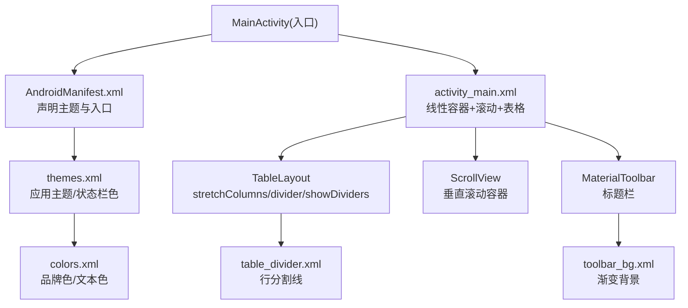
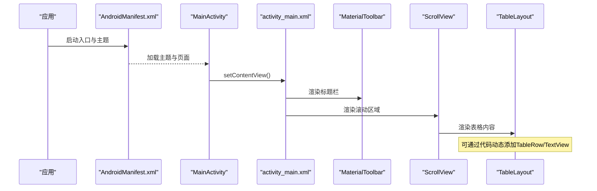
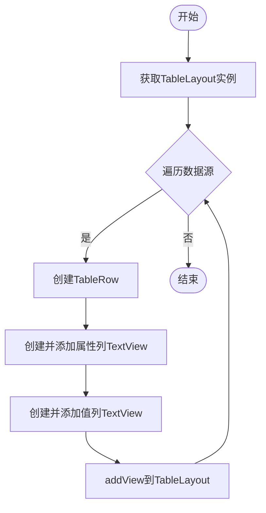
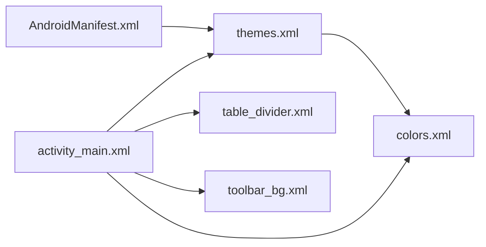

# 布局设计

<cite>
**本文引用的文件**
- [activity_main.xml](file://app/src/main/res/layout/activity_main.xml)
- [AndroidManifest.xml](file://app/src/main/AndroidManifest.xml)
- [themes.xml](file://app/src/main/res/values/themes.xml)
- [colors.xml](file://app/src/main/res/values/colors.xml)
- [table_divider.xml](file://app/src/main/res/drawable/table_divider.xml)
- [toolbar_bg.xml](file://app/src/main/res/drawable/toolbar_bg.xml)
- [strings.xml](file://app/src/main/res/values/strings.xml)
</cite>

## 目录
1. [简介](#简介)
2. [项目结构](#项目结构)
3. [核心组件](#核心组件)
4. [架构总览](#架构总览)
5. [详细组件分析](#详细组件分析)
6. [依赖关系分析](#依赖关系分析)
7. [性能与内存优化](#性能与内存优化)
8. [常见问题与排错](#常见问题与排错)
9. [结论](#结论)
10. [附录：XML参考路径](#附录xml参考路径)

## 简介
本文件面向Android应用布局设计与实现，围绕LinearLayout、ScrollView、TableLayout等核心布局组件的使用方法与最佳实践展开。文档结合本项目中的实际XML资源，解释响应式布局的实现原理（权重分配、适配不同屏幕尺寸的策略），记录TableLayout的列配置、行结构设计以及动态内容添加方法；同时提供ScrollView的性能优化技巧与内存管理策略，并给出具体XML代码示例路径与布局调试技巧，帮助解决常见布局问题与兼容性挑战。

## 项目结构
本项目采用标准的Android资源组织方式：
- 界面布局集中在 res/layout 下，主界面使用 LinearLayout + ScrollView + TableLayout 组合。
- 主题与颜色在 res/values 中定义，便于统一风格与夜间模式切换。
- 可绘制资源（渐变背景、分割线）位于 res/drawable。
- 清单文件声明了应用主题与入口Activity。

图表来源
- [AndroidManifest.xml:1-23](file://app/src/main/AndroidManifest.xml#L1-L23)
- [themes.xml:1-16](file://app/src/main/res/values/themes.xml#L1-L16)
- [colors.xml:1-10](file://app/src/main/res/values/colors.xml#L1-L10)
- [activity_main.xml:1-62](file://app/src/main/res/layout/activity_main.xml#L1-L62)
- [table_divider.xml:1-6](file://app/src/main/res/drawable/table_divider.xml#L1-L6)
- [toolbar_bg.xml:1-9](file://app/src/main/res/drawable/toolbar_bg.xml#L1-L9)

章节来源
- [AndroidManifest.xml:1-23](file://app/src/main/AndroidManifest.xml#L1-L23)
- [activity_main.xml:1-62](file://app/src/main/res/layout/activity_main.xml#L1-L62)

## 核心组件
- LinearLayout
  - 作为根容器，设置垂直方向排列，配合子视图的 layout_weight 实现弹性高度分配。
  - 通过 fitsSystemWindows 确保内容不被系统窗口遮挡。
- ScrollView
  - 包裹可滚动的内容区域，内部放置 TableLayout，使长列表在不同屏幕尺寸下均可滚动查看。
  - 注意避免嵌套复杂布局导致测量开销增大。
- TableLayout
  - 使用 stretchColumns 控制列拉伸行为，配合 showDividers 与自定义 divider 实现行列分隔。
  - TableRow 用于组织每行数据，单元格内可使用 TextView 展示属性名与值。
- MaterialToolbar
  - 作为标题栏，支持居中标题、自定义背景与阴影，提升视觉层次。

章节来源
- [activity_main.xml:1-62](file://app/src/main/res/layout/activity_main.xml#L1-L62)
- [table_divider.xml:1-6](file://app/src/main/res/drawable/table_divider.xml#L1-L6)
- [toolbar_bg.xml:1-9](file://app/src/main/res/drawable/toolbar_bg.xml#L1-L9)

## 架构总览
整体界面由“标题栏 + 滚动表格”构成：
- 顶部 MaterialToolbar 显示应用名称与样式。
- 下方 ScrollView 承载 TableLayout，TableLayout 通过 stretchColumns 自适应宽度，showDividers 与 table_divider 提供行分隔。
- 表头行预留（当前隐藏），便于后续扩展为固定表头或动态生成。

图表来源
- [AndroidManifest.xml:1-23](file://app/src/main/AndroidManifest.xml#L1-L23)
- [activity_main.xml:1-62](file://app/src/main/res/layout/activity_main.xml#L1-L62)

## 详细组件分析

### LinearLayout 与响应式布局
- 垂直方向排列，子视图通过 layout_height="0dp" + layout_weight 实现等高分配，保证在不同屏幕尺寸下的均衡布局。
- 使用 match_parent 填充可用空间，结合父容器的 padding 控制边距。
- 权重分配策略：
  - 将需要占据剩余空间的视图 weight 设为非零值，按比例分配。
  - 避免过度嵌套与过多权重计算，保持层级扁平化。

章节来源
- [activity_main.xml:1-62](file://app/src/main/res/layout/activity_main.xml#L1-L62)

### ScrollView 性能与内存管理
- 仅包裹必要内容，避免在 ScrollView 内放置大型图片或多层嵌套布局。
- 对长列表建议使用 RecyclerView 替代 TableLayout 以获得更好的复用与性能。
- 减少不必要的 invalidate 与重绘，避免在滚动过程中进行昂贵操作。
- 合理使用 padding 与 margin，避免过大间距导致额外测量。

章节来源
- [activity_main.xml:20-32](file://app/src/main/res/layout/activity_main.xml#L20-L32)

### TableLayout 列配置与行结构设计
- 列配置
  - stretchColumns 指定可拉伸列，使内容在宽屏上更充分利用空间。
  - showDividers 与 divider 提供行分隔线，增强可读性。
- 行结构设计
  - 使用 TableRow 组织每行，单元格内放置 TextView 或其他控件。
  - 表头行可单独设置背景与可见性，便于后续启用。
- 动态内容添加
  - 在运行时通过 findViewById 获取 TableLayout，循环创建 TableRow 与 TextView，并 addView 到 TableLayout。
  - 建议批量添加后一次性刷新，减少多次重绘。

图表来源
- [activity_main.xml:26-59](file://app/src/main/res/layout/activity_main.xml#L26-L59)

### MaterialToolbar 与主题
- 标题栏使用 MaterialComponents 主题，支持深色/浅色模式自动适配。
- 通过 toolbar_bg 渐变背景与 elevation 提升层次感。
- 主题中定义 colorPrimary、colorOnPrimary 等，统一全局色彩。

章节来源
- [activity_main.xml:10-18](file://app/src/main/res/layout/activity_main.xml#L10-L18)
- [themes.xml:1-16](file://app/src/main/res/values/themes.xml#L1-L16)
- [colors.xml:1-10](file://app/src/main/res/values/colors.xml#L1-L10)
- [toolbar_bg.xml:1-9](file://app/src/main/res/drawable/toolbar_bg.xml#L1-L9)

## 依赖关系分析
- AndroidManifest 声明应用主题与入口Activity，影响全局UI风格。
- activity_main 依赖 themes、colors、drawable 资源，形成完整的视觉体系。
- TableLayout 依赖 divider 资源，提供一致的行列分隔样式。

图表来源
- [AndroidManifest.xml:1-23](file://app/src/main/AndroidManifest.xml#L1-L23)
- [activity_main.xml:1-62](file://app/src/main/res/layout/activity_main.xml#L1-L62)
- [themes.xml:1-16](file://app/src/main/res/values/themes.xml#L1-L16)
- [colors.xml:1-10](file://app/src/main/res/values/colors.xml#L1-L10)
- [table_divider.xml:1-6](file://app/src/main/res/drawable/table_divider.xml#L1-L6)
- [toolbar_bg.xml:1-9](file://app/src/main/res/drawable/toolbar_bg.xml#L1-L9)

章节来源
- [AndroidManifest.xml:1-23](file://app/src/main/AndroidManifest.xml#L1-L23)
- [activity_main.xml:1-62](file://app/src/main/res/layout/activity_main.xml#L1-L62)

## 性能与内存优化
- 列表与滚动
  - 若数据量大，优先使用 RecyclerView 替代 TableLayout，利用ViewHolder复用机制降低内存占用与绘制开销。
  - 避免在 ScrollView 中放置过大的图片或复杂子视图。
- 布局测量与绘制
  - 减少嵌套层级，尽量扁平化布局树。
  - 合理使用 wrap_content 与 match_parent，避免不必要的测量。
- 资源与主题
  - 使用主题与颜色资源统一管理，减少硬编码，便于维护与适配。
  - 使用矢量图或合适密度的位图，降低内存压力。
- 动态更新
  - 批量添加子视图后再触发刷新，减少多次重绘。
  - 避免在滚动回调中进行耗时操作。

[本节为通用指导，不直接分析具体文件]

## 常见问题与排错
- 内容被状态栏遮挡
  - 检查根布局是否设置 fitsSystemWindows，或在代码中处理系统窗口 insets。
- 表格列宽异常
  - 确认 stretchColumns 配置是否正确，单元格宽度设置为 0dp 并使用 layout_weight 分配比例。
- 行分隔线不显示
  - 检查 showDividers 与 divider 资源引用是否正确。
- 滚动卡顿
  - 评估 TableLayout 复杂度，考虑替换为 RecyclerView。
  - 避免在滚动过程中进行网络请求或大量计算。
- 主题不一致
  - 确保 AndroidManifest 中应用的主题正确，并在 values-night 中提供夜间主题。

章节来源
- [activity_main.xml:1-62](file://app/src/main/res/layout/activity_main.xml#L1-L62)
- [AndroidManifest.xml:1-23](file://app/src/main/AndroidManifest.xml#L1-L23)
- [themes.xml:1-16](file://app/src/main/res/values/themes.xml#L1-L16)

## 结论
本项目以 LinearLayout + ScrollView + TableLayout 的组合实现了简洁易用的设备信息展示界面。通过 stretchColumns、showDividers 与自定义 divider 提升了表格的可读性与一致性；MaterialToolbar 与主题资源保证了统一的视觉风格。对于大规模数据场景，建议迁移至 RecyclerView 以获得更好的性能与内存表现。同时，遵循权重分配与布局扁平化原则，可有效提升响应式适配能力与滚动流畅度。

[本节为总结性内容，不直接分析具体文件]

## 附录：XML参考路径
- 主布局与滚动表格
  - [activity_main.xml](file://app/src/main/res/layout/activity_main.xml)
- 主题与颜色
  - [themes.xml](file://app/src/main/res/values/themes.xml)
  - [colors.xml](file://app/src/main/res/values/colors.xml)
- 可绘制资源
  - [table_divider.xml](file://app/src/main/res/drawable/table_divider.xml)
  - [toolbar_bg.xml](file://app/src/main/res/drawable/toolbar_bg.xml)
- 应用清单
  - [AndroidManifest.xml](file://app/src/main/AndroidManifest.xml)
- 字符串资源
  - [strings.xml](file://app/src/main/res/values/strings.xml)