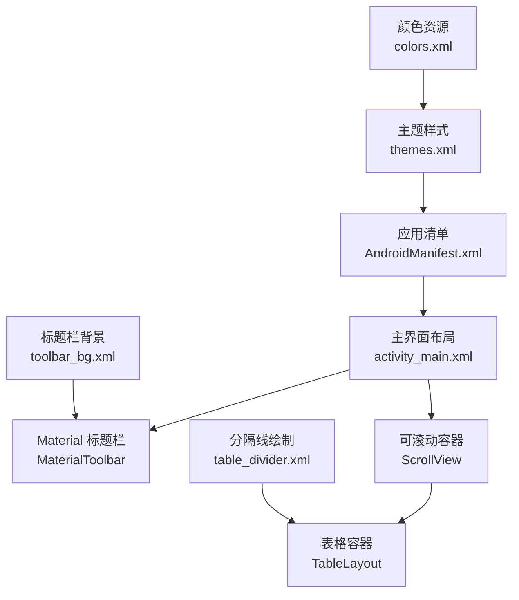
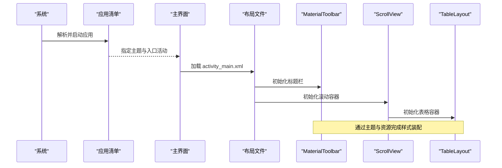
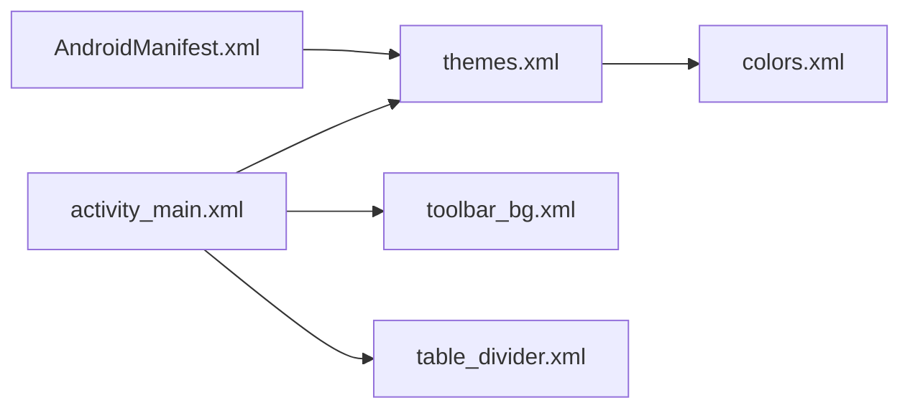

# 用户界面组件

<cite>
**本文引用的文件**
- [AndroidManifest.xml](file://app/src/main/AndroidManifest.xml)
- [activity_main.xml](file://app/src/main/res/layout/activity_main.xml)
- [themes.xml](file://app/src/main/res/values/themes.xml)
- [colors.xml](file://app/src/main/res/values/colors.xml)
- [table_divider.xml](file://app/src/main/res/drawable/table_divider.xml)
- [toolbar_bg.xml](file://app/src/main/res/drawable/toolbar_bg.xml)
</cite>

## 目录
1. [简介](#简介)
2. [项目结构](#项目结构)
3. [核心组件](#核心组件)
4. [架构总览](#架构总览)
5. [详细组件分析](#详细组件分析)
6. [依赖关系分析](#依赖关系分析)
7. [性能考虑](#性能考虑)
8. [故障排查指南](#故障排查指南)
9. [结论](#结论)
10. [附录](#附录)

## 简介
本文件面向本项目中的用户界面组件，重点说明 Material Design 风格的标题栏与表格展示组件的视觉外观、行为模式与交互方式。文档覆盖以下方面：
- 组件属性、事件、插槽与自定义选项
- 响应式设计与无障碍访问合规建议
- 组件状态、动画与过渡效果
- 样式自定义与主题支持
- 跨设备兼容性与性能优化
- 组件组合模式与与其他 UI 元素的集成方式

## 项目结构
本项目采用 Android 标准工程结构，UI 资源集中在 res 目录下，布局使用 XML 定义，主题与颜色通过 values 管理，应用入口在清单文件中声明。

图表来源
- [AndroidManifest.xml:5-13](file://app/src/main/AndroidManifest.xml#L5-L13)
- [activity_main.xml:10-32](file://app/src/main/res/layout/activity_main.xml#L10-L32)
- [themes.xml:1-16](file://app/src/main/res/values/themes.xml#L1-L16)
- [colors.xml:1-10](file://app/src/main/res/values/colors.xml#L1-L10)
- [table_divider.xml:1-6](file://app/src/main/res/drawable/table_divider.xml#L1-L6)
- [toolbar_bg.xml:1-9](file://app/src/main/res/drawable/toolbar_bg.xml#L1-L9)

章节来源
- [AndroidManifest.xml:5-20](file://app/src/main/AndroidManifest.xml#L5-L20)
- [activity_main.xml:1-62](file://app/src/main/res/layout/activity_main.xml#L1-L62)
- [themes.xml:1-16](file://app/src/main/res/values/themes.xml#L1-L16)
- [colors.xml:1-10](file://app/src/main/res/values/colors.xml#L1-L10)
- [table_divider.xml:1-6](file://app/src/main/res/drawable/table_divider.xml#L1-L6)
- [toolbar_bg.xml:1-9](file://app/src/main/res/drawable/toolbar_bg.xml#L1-L9)

## 核心组件
- MaterialToolbar（标题栏）
  - 作用：提供应用标题、导航与操作项承载区域，具备阴影与渐变背景。
  - 关键属性：标题居中、标题文字颜色、高度跟随主题、背景为渐变形状、设置阴影提升层级。
  - 事件：可通过代码绑定点击事件以处理返回、菜单或自定义动作。
  - 插槽：可添加左侧导航图标、右侧操作项等（由 Activity/Fragment 动态注入）。
  - 自定义：通过主题与 Drawable 控制背景与颜色；可通过主题切换日间/夜间模式。
- TableLayout（表格）
  - 作用：以行列形式组织信息展示，适合设备信息的键值对呈现。
  - 关键属性：列拉伸、行分隔线、显示分隔线位置。
  - 事件：可在 TableRow 内子视图上注册点击、长按等交互。
  - 插槽：每行由若干 TextView 组成，用于“属性”和“值”两列。
  - 自定义：通过 Drawable 定义分隔线样式；可通过权重分配实现自适应宽度。
- ScrollView（滚动容器）
  - 作用：当内容超出屏幕时提供垂直滚动能力，保证小屏设备可读性。
  - 关键属性：高度按比例分配、内边距统一。
  - 事件：滚动监听可用于懒加载或统计。
  - 自定义：可通过滚动条样式与回弹效果进行微调。

章节来源
- [activity_main.xml:10-32](file://app/src/main/res/layout/activity_main.xml#L10-L32)
- [table_divider.xml:1-6](file://app/src/main/res/drawable/table_divider.xml#L1-L6)
- [toolbar_bg.xml:1-9](file://app/src/main/res/drawable/toolbar_bg.xml#L1-L9)

## 架构总览
下图展示了从应用启动到界面渲染的关键路径：清单声明主题与入口活动，布局中嵌入 MaterialToolbar 与 TableLayout，并通过资源文件统一主题与颜色。

图表来源
- [AndroidManifest.xml:5-13](file://app/src/main/AndroidManifest.xml#L5-L13)
- [activity_main.xml:10-32](file://app/src/main/res/layout/activity_main.xml#L10-L32)

## 详细组件分析

### MaterialToolbar（标题栏）
- 视觉外观
  - 背景：使用渐变形状，从深蓝到深紫，营造品牌感。
  - 阴影：设置 elevation 提升层级，增强层次对比。
  - 标题：居中对齐，文字颜色为白色，确保高对比度。
- 行为与交互
  - 默认行为：承载应用标题与可选的操作项。
  - 交互扩展：可绑定点击事件以实现返回、搜索或更多操作。
- 属性与定制
  - 标题相关：标题文本、是否居中、文字颜色。
  - 尺寸相关：高度跟随主题 actionBarSize。
  - 背景相关：通过 Drawable 设置渐变背景。
- 主题与无障碍
  - 主题：继承 MaterialComponents 主题，支持 DayNight 自动切换。
  - 无障碍：标题文本应具语义化；如需图标按钮，需设置 contentDescription。
- 示例参考
  - 布局中使用 MaterialToolbar 并配置标题与背景。
  - 主题中定义主色与状态栏颜色。

章节来源
- [activity_main.xml:10-18](file://app/src/main/res/layout/activity_main.xml#L10-L18)
- [toolbar_bg.xml:1-9](file://app/src/main/res/drawable/toolbar_bg.xml#L1-L9)
- [themes.xml:1-16](file://app/src/main/res/values/themes.xml#L1-L16)

### TableLayout（表格）
- 视觉外观
  - 分隔线：使用自定义 Drawable 作为行分隔线，颜色浅灰，高度 1dp。
  - 表头：预留 TableRow 用于显示“属性”与“值”，当前隐藏。
- 数据与布局
  - 列宽：第二列设置为 stretchColumns，使“值”列自适应填充剩余空间。
  - 分隔线：showDividers 设置为 middle，divider 引用 table_divider。
- 交互与事件
  - 行内控件：可在 TextView 上注册点击、长按等事件以触发详情或复制等操作。
  - 滚动：外层 ScrollView 保证长列表的可滚动性。
- 主题与无障碍
  - 颜色：通过 colors.xml 统一管理，便于深色模式适配。
  - 无障碍：为可交互元素设置合适的描述；保持足够的对比度。
- 示例参考
  - 使用 TableLayout 与 TableRow 构建键值对展示。
  - 通过 drawable 资源定义分隔线样式。

章节来源
- [activity_main.xml:20-59](file://app/src/main/res/layout/activity_main.xml#L20-L59)
- [table_divider.xml:1-6](file://app/src/main/res/drawable/table_divider.xml#L1-L6)

### ScrollView（滚动容器）
- 作用与行为
  - 当内容高度超过屏幕时启用滚动，避免内容被截断。
  - 高度按权重分配，确保标题栏固定、内容区自适应。
- 性能与体验
  - 合理设置 padding，避免内容与边缘过于贴近。
  - 对于大数据量场景，建议使用 RecyclerView 替代 TableLayout 以获得更好的滚动性能。
- 示例参考
  - 包裹 TableLayout，设置 layout_weight 与 padding。

章节来源
- [activity_main.xml:20-24](file://app/src/main/res/layout/activity_main.xml#L20-L24)

### 主题与颜色（Theme & Colors）
- 主题
  - 基于 MaterialComponents.DayNight.NoActionBar，禁用原生 ActionBar，使用自定义 MaterialToolbar。
  - 定义主色、次色及其变体，以及状态栏颜色。
- 颜色
  - 提供紫色与青色系列颜色，以及黑白基础色，供主题与控件引用。
- 夜间模式
  - DayNight 主题自动根据系统设置切换，无需额外逻辑。
- 示例参考
  - 在清单中应用主题；在布局中通过主题获取 actionBarSize。

章节来源
- [themes.xml:1-16](file://app/src/main/res/values/themes.xml#L1-L16)
- [colors.xml:1-10](file://app/src/main/res/values/colors.xml#L1-L10)
- [AndroidManifest.xml:5-13](file://app/src/main/AndroidManifest.xml#L5-L13)

## 依赖关系分析
- 布局依赖资源
  - MaterialToolbar 依赖 toolbar_bg.xml 作为背景。
  - TableLayout 依赖 table_divider.xml 作为行分隔线。
- 主题依赖颜色
  - themes.xml 引用 colors.xml 中的主色与次色。
- 清单依赖主题
  - AndroidManifest.xml 指定应用主题，影响全局 UI 风格。

图表来源
- [AndroidManifest.xml:5-13](file://app/src/main/AndroidManifest.xml#L5-L13)
- [themes.xml:1-16](file://app/src/main/res/values/themes.xml#L1-L16)
- [colors.xml:1-10](file://app/src/main/res/values/colors.xml#L1-L10)
- [activity_main.xml:10-32](file://app/src/main/res/layout/activity_main.xml#L10-L32)
- [toolbar_bg.xml:1-9](file://app/src/main/res/drawable/toolbar_bg.xml#L1-L9)
- [table_divider.xml:1-6](file://app/src/main/res/drawable/table_divider.xml#L1-L6)

章节来源
- [AndroidManifest.xml:5-13](file://app/src/main/AndroidManifest.xml#L5-L13)
- [themes.xml:1-16](file://app/src/main/res/values/themes.xml#L1-L16)
- [colors.xml:1-10](file://app/src/main/res/values/colors.xml#L1-L10)
- [activity_main.xml:10-32](file://app/src/main/res/layout/activity_main.xml#L10-L32)

## 性能考虑
- 列表性能
  - TableLayout 适合少量数据；若设备信息条目较多，建议迁移至 RecyclerView 以提升滚动性能与内存占用。
- 绘制优化
  - 减少不必要的嵌套与重复绘制；分隔线使用轻量 Drawable。
- 主题切换
  - DayNight 主题切换开销较小；避免在频繁切换时执行重计算。
- 滚动体验
  - 合理使用 ScrollView 与权重分配，避免过度测量；必要时启用硬件加速。

[本节为通用指导，不直接分析具体文件]

## 故障排查指南
- 标题栏背景不生效
  - 检查 toolbar_bg.xml 是否正确引用并在 MaterialToolbar 中设置 background。
  - 确认主题未覆盖背景颜色。
- 表格分隔线不显示
  - 确认 showDividers 设置为 middle，且 divider 指向 table_divider.xml。
  - 检查 Drawable 的尺寸与颜色是否符合预期。
- 主题颜色异常
  - 核对 colors.xml 中颜色值格式正确。
  - 确认 themes.xml 中 colorPrimary 等属性已正确引用。
- 夜间模式未生效
  - 确认主题继承自 DayNight 系列。
  - 检查系统设置与设备版本兼容性。

章节来源
- [activity_main.xml:10-32](file://app/src/main/res/layout/activity_main.xml#L10-L32)
- [table_divider.xml:1-6](file://app/src/main/res/drawable/table_divider.xml#L1-L6)
- [themes.xml:1-16](file://app/src/main/res/values/themes.xml#L1-L16)
- [colors.xml:1-10](file://app/src/main/res/values/colors.xml#L1-L10)

## 结论
本项目通过 MaterialToolbar 与 TableLayout 构建了简洁清晰的设备信息展示界面。借助主题与资源文件，实现了统一的视觉风格与良好的可维护性。建议在数据量增长时评估迁移至更高效的列表组件，并持续完善无障碍与响应式适配，以提升用户体验与可访问性。

[本节为总结性内容，不直接分析具体文件]

## 附录
- 响应式设计建议
  - 使用 wrap_content 与权重分配，确保在不同屏幕尺寸下的良好布局。
  - 针对平板与大屏设备，考虑将表格改为双列或多列布局。
- 无障碍访问合规
  - 为可交互元素提供 contentDescription。
  - 保持文本与背景的高对比度，遵循 WCAG 建议。
- 组件组合模式
  - 将 MaterialToolbar 与 TableLayout 结合，形成“标题 + 内容”的经典结构。
  - 通过 ScrollView 包裹复杂内容，保证滚动体验。
- 与其他 UI 元素集成
  - 可在 Toolbar 中添加操作项，如刷新、分享、设置等。
  - 可在表格行中集成图标、按钮等交互元素。

[本节为概念性指导，不直接分析具体文件]