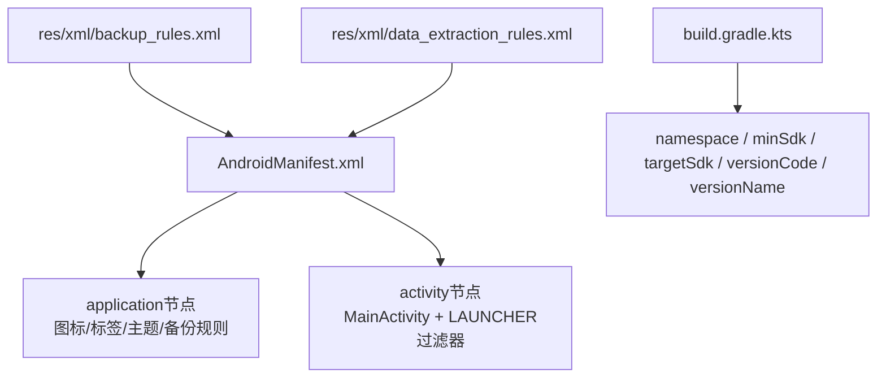
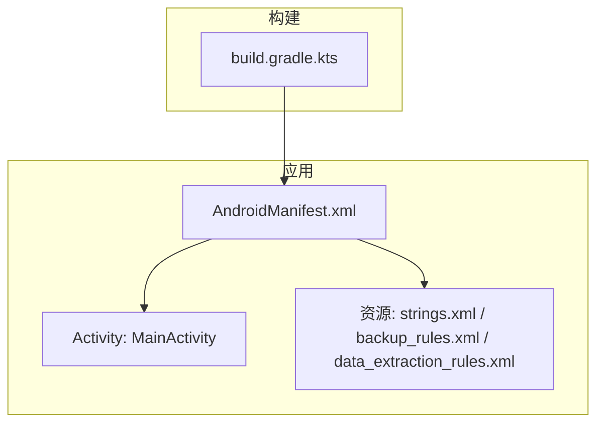
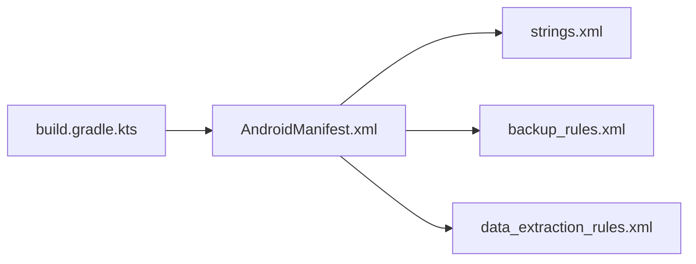
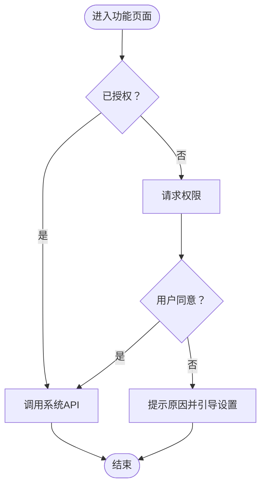

# Android清单配置

<cite>
**本文引用的文件**
- [AndroidManifest.xml](file://app/src/main/AndroidManifest.xml)
- [build.gradle.kts（应用模块）](file://app/build.gradle.kts)
- [strings.xml](file://app/src/main/res/values/strings.xml)
- [backup_rules.xml](file://app/src/main/res/xml/backup_rules.xml)
- [data_extraction_rules.xml](file://app/src/main/res/xml/data_extraction_rules.xml)
</cite>

## 目录
1. [简介](#简介)
2. [项目结构](#项目结构)
3. [核心组件](#核心组件)
4. [架构总览](#架构总览)
5. [详细组件分析](#详细组件分析)
6. [依赖关系分析](#依赖关系分析)
7. [性能与优化建议](#性能与优化建议)
8. [故障排查指南](#故障排查指南)
9. [结论](#结论)
10. [附录：权限与最佳实践速查](#附录：权限与最佳实践速查)

## 简介
本文件为Android清单文件的综合配置文档，聚焦于AndroidManifest.xml的作用、结构与最佳实践。结合本项目实际清单与构建配置，说明应用元数据声明、权限配置、Activity注册、Intent过滤器设置等关键内容；并补充动态权限申请、运行时权限处理、多进程配置、清单优化与常见错误排查方法，帮助读者在设备信息类应用中安全、规范地使用系统能力。

## 项目结构
当前工程为单模块Android应用，清单位于应用模块的main目录下，包含一个入口Activity与基础备份/数据提取规则引用。构建脚本定义了命名空间、编译目标、版本信息与输出文件名策略。

图表来源
- [AndroidManifest.xml:5-21](file://app/src/main/AndroidManifest.xml#L5-L21)
- [build.gradle.kts:10-26](file://app/build.gradle.kts#L10-L26)
- [backup_rules.xml](file://app/src/main/res/xml/backup_rules.xml)
- [data_extraction_rules.xml](file://app/src/main/res/xml/data_extraction_rules.xml)

章节来源
- [AndroidManifest.xml:1-23](file://app/src/main/AndroidManifest.xml#L1-L23)
- [build.gradle.kts:10-26](file://app/build.gradle.kts#L10-L26)

## 核心组件
- 应用级声明
  - 应用图标、标签、主题、是否支持RTL、备份与数据提取规则引用等。
- 组件声明
  - Activity：入口Activity，声明exported属性与启动过滤器。
- Intent过滤器
  - 定义MAIN动作与LAUNCHER分类，使应用出现在启动器中。
- 构建期配置
  - 通过Gradle配置命名空间、最小/目标SDK版本、版本号等，影响清单生成与兼容性。

章节来源
- [AndroidManifest.xml:5-21](file://app/src/main/AndroidManifest.xml#L5-L21)
- [build.gradle.kts:10-26](file://app/build.gradle.kts#L10-L26)

## 架构总览
清单是Android系统的“应用契约”，描述应用的基本信息与对外暴露的组件。本项目的清单仅声明了应用外观与一个可被系统启动器调用的Activity，并通过Gradle管理版本与兼容范围。

图表来源
- [AndroidManifest.xml:5-21](file://app/src/main/AndroidManifest.xml#L5-L21)
- [build.gradle.kts:10-26](file://app/build.gradle.kts#L10-L26)
- [strings.xml:1-3](file://app/src/main/res/values/strings.xml#L1-L3)

## 详细组件分析

### 应用节点（application）
- 作用：声明应用级别的全局配置，包括图标、标签、主题、是否允许备份、数据提取规则等。
- 关键点
  - allowBackup：控制是否允许系统备份。
  - dataExtractionRules/fullBackupContent：指向XML规则，用于Android 12+的数据提取与完整备份。
  - supportsRtl：是否支持从右到左布局。
  - theme：应用默认主题。
- 安全建议
  - 谨慎开启allowBackup，避免敏感数据随备份泄露。
  - 明确配置数据提取规则，遵循最小化原则。

章节来源
- [AndroidManifest.xml:5-13](file://app/src/main/AndroidManifest.xml#L5-L13)
- [backup_rules.xml](file://app/src/main/res/xml/backup_rules.xml)
- [data_extraction_rules.xml](file://app/src/main/res/xml/data_extraction_rules.xml)

### Activity与Intent过滤器
- 作用：声明可被系统或外部组件启动的界面，并通过Intent过滤器声明其能响应的动作与类别。
- 本项目配置
  - 入口Activity：MainActivity，设置为exported=true，以便被系统启动器调用。
  - 过滤器：action=MAIN，category=LAUNCHER，表示该Activity作为应用入口。
- 最佳实践
  - 非入口Activity应设置exported=false，除非确实需要被其他应用调用。
  - 使用明确的action/category，避免过度开放。
  - 对需要跨进程通信的组件，严格校验来源与权限。

章节来源
- [AndroidManifest.xml:14-20](file://app/src/main/AndroidManifest.xml#L14-L20)

### 构建期配置对清单的影响
- namespace：替代包名，影响清单中的包标识。
- minSdk/targetSdk：决定应用运行与API可用范围，影响权限与行为差异。
- versionCode/versionName：应用版本标识，影响更新与分发。
- 输出文件名策略：便于追踪构建产物。

章节来源
- [build.gradle.kts:10-26](file://app/build.gradle.kts#L10-L26)
- [build.gradle.kts:45-72](file://app/build.gradle.kts#L45-L72)

## 依赖关系分析
- 清单与资源
  - 清单引用字符串资源与应用图标，确保UI显示一致。
- 清单与构建脚本
  - 构建脚本提供命名空间与版本信息，间接影响清单生成的包名与兼容性。
- 清单与备份规则
  - 清单通过XML规则文件声明备份与数据提取策略，实现合规的数据保护。

图表来源
- [AndroidManifest.xml:5-21](file://app/src/main/AndroidManifest.xml#L5-L21)
- [build.gradle.kts:10-26](file://app/build.gradle.kts#L10-L26)
- [strings.xml:1-3](file://app/src/main/res/values/strings.xml#L1-L3)

章节来源
- [AndroidManifest.xml:5-21](file://app/src/main/AndroidManifest.xml#L5-L21)
- [build.gradle.kts:10-26](file://app/build.gradle.kts#L10-L26)

## 性能与优化建议
- 精简清单
  - 仅声明必要的组件与权限，减少攻击面。
  - 非入口Activity默认exported=false。
- 合理设置备份
  - 根据业务需求决定是否允许备份，必要时排除敏感数据。
- 明确导出边界
  - 对可能被外部调用的组件，显式声明权限与白名单。
- 版本与兼容性
  - 保持targetSdk与最新稳定版本同步，利用系统新特性与安全改进。
- 构建产物管理
  - 使用带时间戳的版本命名，便于定位问题与回滚。

[本节为通用指导，不直接分析具体文件]

## 故障排查指南
- 无法启动或无图标
  - 检查入口Activity是否正确声明MAIN/LAUNCHER过滤器。
  - 确认exported属性与过滤器匹配。
- 权限相关崩溃
  - 若后续添加设备信息查询功能，需在清单声明对应权限，并在运行时申请。
  - 针对Android 11+分区存储与隐私变更，注意读取设备信息的限制。
- 备份异常
  - 检查backup_rules与data_extraction_rules路径与语法。
  - 确认allowBackup与实际策略一致。
- 构建失败
  - 核对minSdk/targetSdk与依赖库的最低要求。
  - 检查命名空间是否与包名一致。

章节来源
- [AndroidManifest.xml:14-20](file://app/src/main/AndroidManifest.xml#L14-L20)
- [build.gradle.kts:10-26](file://app/build.gradle.kts#L10-L26)

## 结论
本项目的清单简洁清晰，仅声明了应用外观与入口Activity。对于设备信息查询类应用，建议在后续开发中按需添加权限声明与运行时申请逻辑，遵循最小权限原则，完善备份与数据提取策略，确保安全性与合规性。

[本节为总结，不直接分析具体文件]

## 附录：权限与最佳实践速查
- 设备信息查询常用权限（示例）
  - READ_PHONE_STATE：读取电话状态（如IMEI、SIM状态），需运行时申请。
  - ACCESS_FINE_LOCATION/ACCESS_COARSE_LOCATION：获取位置信息，需运行时申请。
  - BLUETOOTH_CONNECT/BLUETOOTH_SCAN：蓝牙连接与扫描，需运行时申请。
  - CAMERA：访问摄像头，需运行时申请。
  - READ_EXTERNAL_STORAGE/READ_MEDIA_IMAGES等：读取媒体或存储，按系统版本选择合适API。
- 运行时权限流程（概念图）

- 多进程配置（概念）
  - 在清单中为组件指定process属性，可实现隔离与独立生命周期。
  - 适用于后台服务、插件化或第三方SDK隔离场景。
- 清单安全要点
  - 最小权限原则：只申请必要权限。
  - 显式导出：仅对外暴露必要组件，并配合权限校验。
  - 备份与数据提取：明确策略，避免敏感数据外泄。
  - 版本对齐：targetSdk与依赖库版本保持一致，减少兼容性问题。

[本节为通用指导，不直接分析具体文件]