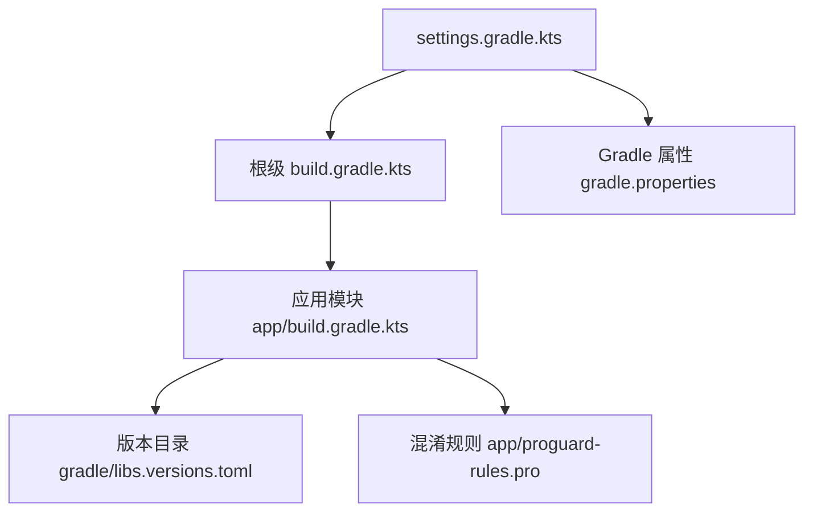
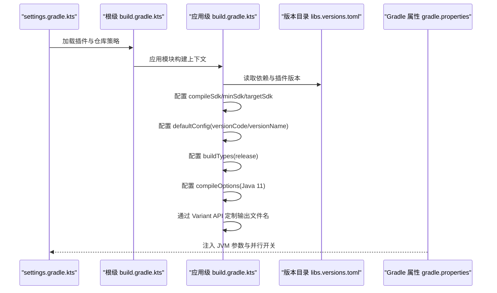
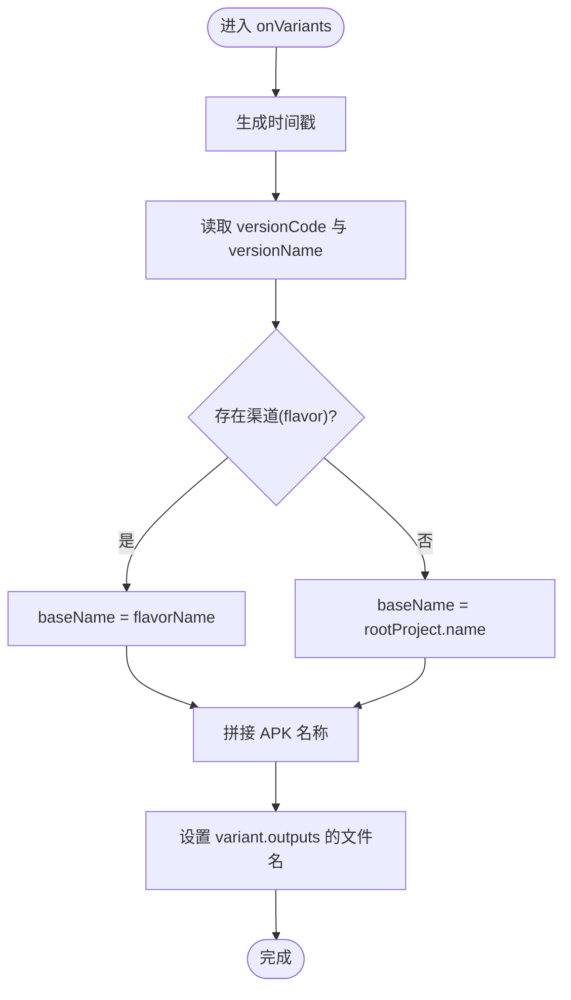
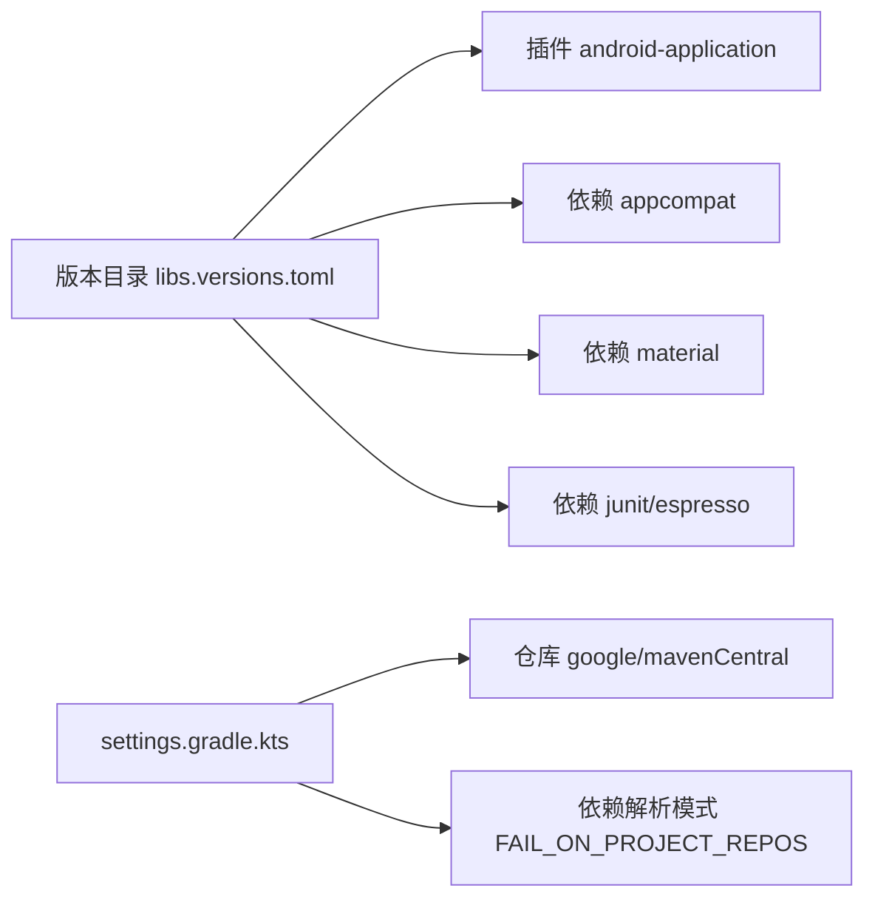

# Gradle构建配置

<cite>
**本文引用的文件**
- [应用级构建脚本](file://app/build.gradle.kts)
- [根级构建脚本](file://build.gradle.kts)
- [Gradle 属性](file://gradle.properties)
- [项目设置](file://settings.gradle.kts)
- [版本目录](file://gradle/libs.versions.toml)
- [混淆规则](file://app/proguard-rules.pro)
</cite>

## 目录
1. [简介](#简介)
2. [项目结构](#项目结构)
3. [核心组件](#核心组件)
4. [架构总览](#架构总览)
5. [详细组件分析](#详细组件分析)
6. [依赖关系分析](#依赖关系分析)
7. [性能与优化](#性能与优化)
8. [常见问题排查](#常见问题排查)
9. [结论](#结论)
10. [附录](#附录)

## 简介
本文件面向 Android 项目的 Gradle 构建配置，聚焦于应用级 build.gradle.kts 的各项配置选项与最佳实践。内容涵盖编译 SDK、目标/最小 SDK、版本号管理、构建类型（debug/release）、编译选项、输出文件名定制、Android Gradle Plugin（AGP）参数说明、多渠道打包思路、自定义构建逻辑实现方法，以及常见构建问题与性能优化建议。

## 项目结构
本项目采用单模块（app）的 Android 工程结构：
- 根级构建脚本用于声明全局插件与仓库策略
- settings.gradle.kts 定义插件管理与依赖解析模式
- gradle/libs.versions.toml 集中管理依赖与插件版本
- app/build.gradle.kts 为应用模块的构建配置入口
- gradle.properties 提供 JVM 参数等全局构建环境配置

图表来源
- [项目设置:1-27](file://settings.gradle.kts#L1-L27)
- [根级构建脚本:1-4](file://build.gradle.kts#L1-L4)
- [应用级构建脚本:1-80](file://app/build.gradle.kts#L1-L80)
- [版本目录:1-19](file://gradle/libs.versions.toml#L1-L19)
- [Gradle 属性:1-13](file://gradle.properties#L1-L13)

章节来源
- [项目设置:1-27](file://settings.gradle.kts#L1-L27)
- [根级构建脚本:1-4](file://build.gradle.kts#L1-L4)
- [应用级构建脚本:1-80](file://app/build.gradle.kts#L1-L80)
- [版本目录:1-19](file://gradle/libs.versions.toml#L1-L19)
- [Gradle 属性:1-13](file://gradle.properties#L1-L13)

## 核心组件
- 应用命名空间与插件：在应用级构建脚本中声明 Android 应用插件与命名空间
- 编译与运行 SDK：compileSdk、minSdk、targetSdk 控制编译与兼容范围
- 版本管理：versionCode、versionName 统一在 defaultConfig 中维护
- 构建类型：release 类型启用混淆与优化规则
- 编译选项：Java 源与目标兼容性设置为 Java 11
- 输出命名：通过 Variant API 动态生成包含渠道、版本、构建类型与时间戳的 APK 文件名
- 依赖管理：使用版本目录集中声明依赖与插件版本
- 仓库与插件管理：settings 中限定仓库来源并启用工具链解析约定

章节来源
- [应用级构建脚本:6-43](file://app/build.gradle.kts#L6-L43)
- [应用级构建脚本:45-72](file://app/build.gradle.kts#L45-L72)
- [版本目录:1-19](file://gradle/libs.versions.toml#L1-L19)
- [项目设置:1-27](file://settings.gradle.kts#L1-L27)

## 架构总览
下图展示了 Gradle 构建过程中关键文件的协作关系与数据流向：

图表来源
- [项目设置:1-27](file://settings.gradle.kts#L1-L27)
- [根级构建脚本:1-4](file://build.gradle.kts#L1-L4)
- [应用级构建脚本:6-72](file://app/build.gradle.kts#L6-L72)
- [版本目录:1-19](file://gradle/libs.versions.toml#L1-L19)
- [Gradle 属性:1-13](file://gradle.properties#L1-L13)

## 详细组件分析

### 编译 SDK、目标 SDK 与最小 SDK
- compileSdk：指定编译使用的 Android SDK 版本，确保 API 可用性与构建产物一致性
- minSdk：最低支持的 Android 系统版本，影响运行时 API 可用性检查
- targetSdk：目标 Android 版本，影响行为变更与权限模型适配

建议
- 保持 compileSdk 与 targetSdk 一致或相近，减少兼容性问题
- minSdk 根据业务需求设定，避免过高的门槛导致用户覆盖不足

章节来源
- [应用级构建脚本:10-26](file://app/build.gradle.kts#L10-L26)

### 版本号管理（versionCode 与 versionName）
- versionCode：内部递增整数，用于区分发布版本
- versionName：对外展示的版本字符串，便于用户识别

建议
- 将版本信息集中在 defaultConfig 中统一管理
- 结合 CI/CD 流水线自动递增 versionCode，保证唯一性

章节来源
- [应用级构建脚本:18-26](file://app/build.gradle.kts#L18-L26)

### 构建类型（debug 与 release）
- debug：默认开启调试符号与未压缩资源，便于开发调试
- release：可启用代码混淆与资源压缩，提升安全性与包体大小

当前配置
- release 类型已启用混淆与优化规则，引用默认优化规则与项目自定义规则

建议
- 在 release 中按需启用 shrinkResources、minifyEnabled
- 针对第三方库添加必要的 keep 规则，避免反射或注解失效

章节来源
- [应用级构建脚本:29-37](file://app/build.gradle.kts#L29-L37)
- [混淆规则:1-21](file://app/proguard-rules.pro#L1-L21)

### 编译选项（Java 兼容性）
- sourceCompatibility/targetCompatibility：统一 Java 语言特性与字节码版本
- 当前设置为 Java 11，确保与 AGP 及依赖库的兼容性

建议
- 根据依赖库要求选择合适的 Java 版本
- 若引入 Kotlin Multiplatform 或特定库，需评估升级 Java 版本的收益与风险

章节来源
- [应用级构建脚本:39-42](file://app/build.gradle.kts#L39-L42)

### 输出文件命名规则定制
- 通过 androidComponents.onVariants 钩子，获取每个变体的构建类型与渠道名
- 动态拼接 baseName（优先使用 flavorName，否则使用项目名）、versionCode、versionName、buildTypeName 与时间戳
- 最终输出 APK 名称格式化为大写，便于归档与识别

流程图（基于实际实现）：

图表来源
- [应用级构建脚本:45-72](file://app/build.gradle.kts#L45-L72)

章节来源
- [应用级构建脚本:45-72](file://app/build.gradle.kts#L45-L72)

### 多渠道打包配置（flavor）
- 当前工程未定义 productFlavors，但输出命名逻辑已预留 flavorName 分支
- 如需多渠道，可在 android 闭包下定义 flavors，并为不同渠道设置独立 applicationId、versionCode、签名等

示例步骤（概念性说明）
- 在 android 块中添加 productFlavors
- 为每个 flavor 配置 applicationIdSuffix、versionCode、resValue 等差异化资源
- 复用现有输出命名逻辑，自动包含 flavor 到文件名

章节来源
- [应用级构建脚本:54-63](file://app/build.gradle.kts#L54-L63)

### 自定义构建逻辑实现方法
- 使用 androidComponents.onVariants 钩子进行变体级别的定制（如输出命名、资源处理）
- 通过 VariantOutputImpl 访问具体输出对象，设置文件名或其他元数据
- 结合 Gradle Task API 扩展构建流程（例如自定义任务、增量编译优化）

注意
- 谨慎使用内部 API（如 VariantOutputImpl），关注 AGP 版本升级带来的兼容变化
- 建议在测试环境中验证自定义逻辑的正确性与稳定性

章节来源
- [应用级构建脚本:45-72](file://app/build.gradle.kts#L45-L72)

### Android Gradle Plugin（AGP）参数与最佳实践
- AGP 版本由版本目录统一管理，便于跨模块一致升级
- 推荐实践
  - 使用 Version Catalog 集中管理依赖与插件版本
  - 明确声明 compileSdk、minSdk、targetSdk，避免隐式继承导致的差异
  - 合理配置构建类型与混淆规则，平衡安全与可维护性
  - 使用 settings 中的 dependencyResolutionManagement 限制各子项目自行声明仓库，提升可复现性

章节来源
- [版本目录:1-19](file://gradle/libs.versions.toml#L1-L19)
- [项目设置:17-23](file://settings.gradle.kts#L17-L23)

## 依赖关系分析
- 插件与版本：android-application 插件通过版本目录引入，确保版本一致性
- 依赖项：appcompat、material、junit、espresso 等通过版本目录集中管理
- 仓库策略：settings 中限定 google()、mavenCentral()，并在 pluginManagement 中仅允许 Android 相关组名

图表来源
- [版本目录:1-19](file://gradle/libs.versions.toml#L1-L19)
- [项目设置:1-27](file://settings.gradle.kts#L1-L27)

章节来源
- [版本目录:1-19](file://gradle/libs.versions.toml#L1-L19)
- [项目设置:1-27](file://settings.gradle.kts#L1-L27)

## 性能与优化
- 构建缓存与并行
  - 可通过 gradle.properties 启用 org.gradle.parallel=true（当前已注释）
  - 合理使用构建缓存与守护进程，缩短冷启动与增量构建时间
- JVM 参数
  - 调整 org.gradle.jvmargs 以增大堆内存，避免 OOM（当前已配置 -Xmx2048m）
- 依赖与资源
  - 使用版本目录集中管理依赖，减少重复下载与冲突
  - 在 release 中启用资源压缩与混淆，减小包体并提高安全性
- 增量编译
  - 保持 compileSdk/targetSdk 稳定，避免频繁升级带来的全量重建
  - 避免在 onVariants 中进行耗时操作，必要时拆分任务或使用缓存

[本节为通用指导，不直接分析具体文件]

## 常见问题排查
- 构建失败：找不到依赖或仓库
  - 检查 settings.gradle.kts 中的仓库配置是否正确
  - 确认版本目录中的依赖是否存在且版本有效
- 混淆后崩溃
  - 检查 proguard-rules.pro 是否保留必要类与方法
  - 针对反射、注解、序列化框架添加 keep 规则
- 输出文件名不符合预期
  - 确认 onVariants 中 flavorName 与 buildTypeName 取值正确
  - 检查 VariantOutputImpl 的使用是否与当前 AGP 版本兼容
- 构建速度慢
  - 尝试启用并行构建与构建缓存
  - 减少不必要的资源与依赖，清理未使用库

章节来源
- [混淆规则:1-21](file://app/proguard-rules.pro#L1-L21)
- [应用级构建脚本:45-72](file://app/build.gradle.kts#L45-L72)
- [项目设置:1-27](file://settings.gradle.kts#L1-L27)

## 结论
本项目的 Gradle 构建配置遵循现代 Android 工程的最佳实践：通过版本目录集中管理依赖与插件版本，明确声明编译与目标 SDK，使用构建类型与混淆保障发布质量，并通过 Variant API 灵活定制输出命名。建议在后续迭代中逐步完善多渠道支持、持续集成自动化与性能监控，进一步提升构建效率与可维护性。

[本节为总结性内容，不直接分析具体文件]

## 附录
- 常用命令
  - 构建 Debug：./gradlew assembleDebug
  - 构建 Release：./gradlew assembleRelease
  - 查看依赖树：./gradlew app:dependencies
- 参考路径
  - 应用级构建脚本：[应用级构建脚本:6-72](file://app/build.gradle.kts#L6-L72)
  - 版本目录：[版本目录:1-19](file://gradle/libs.versions.toml#L1-L19)
  - 项目设置：[项目设置:1-27](file://settings.gradle.kts#L1-L27)
  - Gradle 属性：[Gradle 属性:1-13](file://gradle.properties#L1-L13)
  - 混淆规则：[混淆规则:1-21](file://app/proguard-rules.pro#L1-L21)