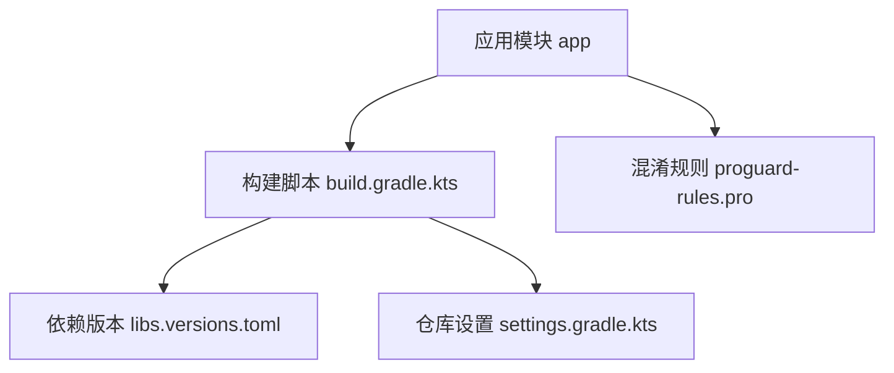
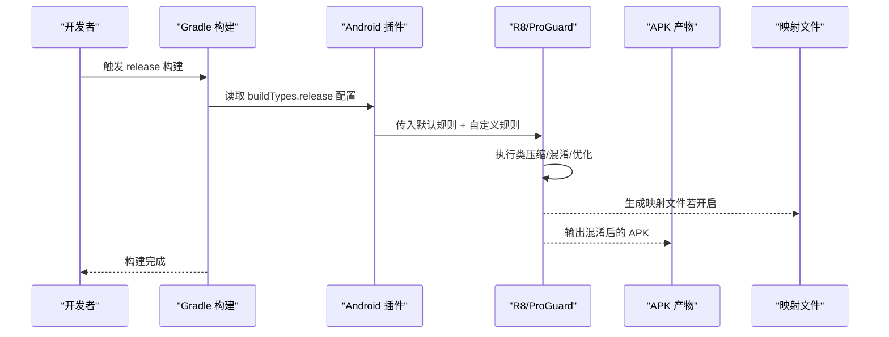
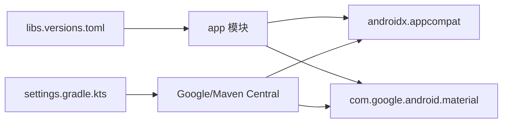
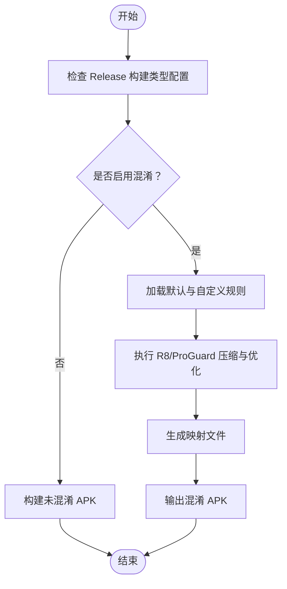

# 代码混淆配置

<cite>
**本文引用的文件**
- [app/proguard-rules.pro](file://app/proguard-rules.pro)
- [app/build.gradle.kts](file://app/build.gradle.kts)
- [gradle/libs.versions.toml](file://gradle/libs.versions.toml)
- [settings.gradle.kts](file://settings.gradle.kts)
</cite>

## 目录
1. [简介](#简介)
2. [项目结构](#项目结构)
3. [核心组件](#核心组件)
4. [架构总览](#架构总览)
5. [详细组件分析](#详细组件分析)
6. [依赖分析](#依赖分析)
7. [性能考虑](#性能考虑)
8. [故障排查指南](#故障排查指南)
9. [结论](#结论)
10. [附录](#附录)

## 简介
本文件围绕 Android 应用的代码混淆与发布配置，聚焦于 ProGuard/R8 的启用、规则编写与调试符号管理。结合当前仓库中的构建脚本与混淆规则，说明 Release 构建类型的混淆开关、优化选项、第三方库排除与反射支持方法，并给出调试符号生成、崩溃堆栈映射以及发布包优化的实践建议与常见问题诊断方法。

## 项目结构
- 应用模块位于 app 目录，包含源代码、资源与构建配置。
- 混淆规则文件位于 app/proguard-rules.pro。
- 构建类型与混淆开关在 app/build.gradle.kts 中配置。
- 依赖版本集中管理在 gradle/libs.versions.toml。
- 多模块/插件仓库来源在 settings.gradle.kts。

图表来源
- [app/build.gradle.kts:29-36](file://app/build.gradle.kts#L29-L36)
- [app/proguard-rules.pro:1-21](file://app/proguard-rules.pro#L1-L21)
- [gradle/libs.versions.toml:1-19](file://gradle/libs.versions.toml#L1-L19)
- [settings.gradle.kts:1-27](file://settings.gradle.kts#L1-L27)

章节来源
- [app/build.gradle.kts:10-43](file://app/build.gradle.kts#L10-L43)
- [app/proguard-rules.pro:1-21](file://app/proguard-rules.pro#L1-L21)
- [gradle/libs.versions.toml:1-19](file://gradle/libs.versions.toml#L1-L19)
- [settings.gradle.kts:1-27](file://settings.gradle.kts#L1-L27)

## 核心组件
- 构建类型与混淆开关：Release 构建类型中定义了是否启用混淆（minifyEnabled）以及引入的默认与自定义混淆规则。
- 混淆规则文件：proguard-rules.pro 提供项目级规则入口，包含注释示例（如保留行号信息、隐藏源文件名等）。
- 依赖管理：通过版本目录统一管理第三方库版本，便于后续为特定库添加混淆排除或保留规则。

章节来源
- [app/build.gradle.kts:29-36](file://app/build.gradle.kts#L29-L36)
- [app/proguard-rules.pro:1-21](file://app/proguard-rules.pro#L1-L21)
- [gradle/libs.versions.toml:1-19](file://gradle/libs.versions.toml#L1-L19)

## 架构总览
下图展示了从 Gradle 构建到 ProGuard/R8 的规则加载与执行流程，以及调试符号与映射文件的生成关系。

图表来源
- [app/build.gradle.kts:29-36](file://app/build.gradle.kts#L29-L36)
- [app/proguard-rules.pro:15-21](file://app/proguard-rules.pro#L15-L21)

## 详细组件分析

### 构建类型与混淆开关（Release）
- 在 Release 构建类型中，可通过 isMinifyEnabled 控制是否启用混淆。当前仓库中该值为 false，表示未启用混淆。
- 通过 proguardFiles 指定要使用的规则集合：默认优化规则文件与项目自定义规则文件。
- 当需要启用混淆时，可将 isMinifyEnabled 设置为 true；同时确保自定义规则覆盖所有必要的保留项。

章节来源
- [app/build.gradle.kts:29-36](file://app/build.gradle.kts#L29-L36)

### 混淆规则文件（proguard-rules.pro）
- 该文件是项目级规则的入口，用于添加针对本项目代码的保留、忽略、优化等规则。
- 文件中提供了常见场景的注释示例：
  - 保留行号信息以辅助调试（SourceFile, LineNumberTable）。
  - 隐藏原始源文件名（renamesourcefileattribute）。
  - WebView JavaScript 接口的成员保留示例。
- 实际使用时，根据业务需求取消相应注释并补充具体类名或包名。

章节来源
- [app/proguard-rules.pro:8-21](file://app/proguard-rules.pro#L8-L21)

### 调试符号与崩溃堆栈映射
- 保留行号信息：在 proguard-rules.pro 中保留 SourceFile 和 LineNumberTable 属性，有助于将崩溃堆栈还原到源码位置。
- 隐藏源文件名：在保留行号的同时，可使用 renamesourcefileattribute 隐藏真实源文件名，兼顾可调试性与安全性。
- 映射文件：启用混淆后，构建系统会生成映射文件，用于将混淆后的类/方法名映射回原始名称，配合崩溃日志进行定位。

章节来源
- [app/proguard-rules.pro:15-21](file://app/proguard-rules.pro#L15-L21)

### 第三方库的混淆排除与反射支持
- 当第三方库使用反射、动态加载或需要保持 API 稳定时，需在 proguard-rules.pro 中添加相应的保留规则，避免被压缩或混淆破坏功能。
- 常见做法包括：
  - 保留特定类的字段与方法（例如 JSON 序列化、注解处理器生成的类）。
  - 保留接口实现或回调方法签名。
  - 对特定包或类禁用优化（如 -dontoptimize）。
- 由于当前仓库未包含具体的第三方库混淆规则，建议在引入新依赖后，根据其文档与运行期行为补充对应保留规则。

章节来源
- [app/proguard-rules.pro:8-13](file://app/proguard-rules.pro#L8-L13)
- [gradle/libs.versions.toml:9-14](file://gradle/libs.versions.toml#L9-L14)

### 资源文件保护
- 资源文件通常不需要混淆，但需确保不被误删。若使用资源 ID 反射访问，应添加相应保留规则。
- 对于通过字符串路径或资源名动态访问的资源，可在规则中保留相关命名约定或类成员。

章节来源
- [app/proguard-rules.pro:8-13](file://app/proguard-rules.pro#L8-L13)

### 发布包优化
- 默认优化规则由 getDefaultProguardFile("proguard-android-optimize.txt") 提供，包含常见的压缩与优化策略。
- 可根据项目规模与稳定性调整优化级别，必要时关闭部分优化以避免兼容性问题。

章节来源
- [app/build.gradle.kts:32-35](file://app/build.gradle.kts#L32-L35)

## 依赖分析
- 依赖版本集中在 gradle/libs.versions.toml，便于统一管理与升级。
- 当前依赖主要为 AndroidX AppCompat 与 Material 组件，这些库通常自带混淆规则，但仍需关注其文档中对反射或动态特性的要求。
- 仓库来源在 settings.gradle.kts 中声明，确保依赖可正常解析。

图表来源
- [gradle/libs.versions.toml:9-14](file://gradle/libs.versions.toml#L9-L14)
- [settings.gradle.kts:17-22](file://settings.gradle.kts#L17-L22)

章节来源
- [gradle/libs.versions.toml:1-19](file://gradle/libs.versions.toml#L1-19)
- [settings.gradle.kts:1-27](file://settings.gradle.kts#L1-27)

## 性能考虑
- 启用混淆前，建议先在 Debug 或测试环境验证功能正确性，再逐步在 Release 中启用。
- 若构建时间过长，可评估优化级别与规则复杂度，必要时减少不必要的保留规则。
- 对大型项目，建议分模块启用混淆，优先对核心模块进行优化，降低风险与构建成本。
- 合理管理第三方库的保留规则，避免过度保留导致打包体积增大或优化效果下降。

[本节为通用指导，不直接分析具体文件]

## 故障排查指南
- 构建失败或运行时异常：
  - 检查 Release 构建类型中 isMinifyEnabled 与 proguardFiles 配置是否正确。
  - 核对 proguard-rules.pro 中的保留规则是否覆盖了反射、动态加载、JSON 序列化等关键路径。
- 崩溃堆栈无法定位：
  - 确认已保留行号信息（SourceFile, LineNumberTable），并生成映射文件。
  - 使用映射文件将混淆后的堆栈还原至源码位置。
- 第三方库问题：
  - 查阅库文档，确认是否需要额外保留规则或禁用优化。
  - 逐步缩小范围，定位引发问题的类或方法，针对性添加保留规则。

章节来源
- [app/build.gradle.kts:29-36](file://app/build.gradle.kts#L29-L36)
- [app/proguard-rules.pro:15-21](file://app/proguard-rules.pro#L15-L21)

## 结论
当前仓库已具备混淆规则文件与构建类型入口，但 Release 构建类型未启用混淆。建议在实际发布前启用混淆，并根据项目与第三方库特性完善保留规则与调试符号配置，以获得更好的安全性与更小的包体。同时，建立规范的规则维护流程与回归测试，确保混淆带来的收益不会牺牲稳定性。

[本节为总结性内容，不直接分析具体文件]

## 附录

### 常用混淆规则要点（基于仓库上下文）
- 类与方法保留：
  - 对反射访问的类与成员进行保留，避免运行时找不到方法或字段。
  - 对接口实现、回调、监听器进行保留，确保事件机制正常工作。
- 资源与命名约定：
  - 若通过字符串或资源名动态访问资源，需保留相关命名约定或类成员。
- 调试与映射：
  - 保留行号信息并生成映射文件，便于崩溃定位。
  - 可选择隐藏源文件名以提升安全性。

章节来源
- [app/proguard-rules.pro:8-21](file://app/proguard-rules.pro#L8-L21)

### 构建与发布流程示意

图表来源
- [app/build.gradle.kts:29-36](file://app/build.gradle.kts#L29-L36)
- [app/proguard-rules.pro:15-21](file://app/proguard-rules.pro#L15-L21)