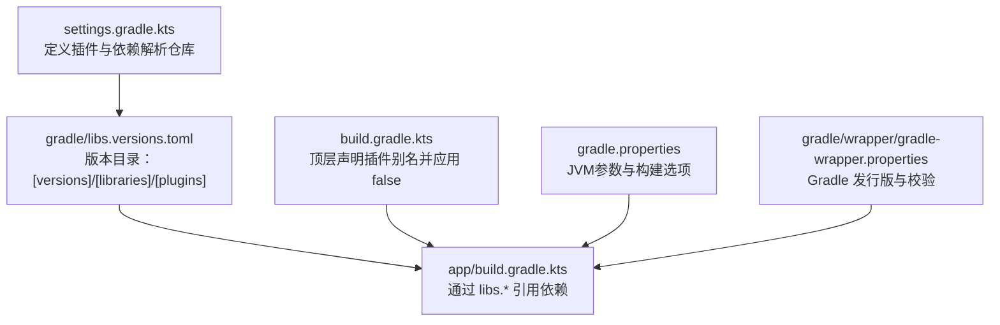
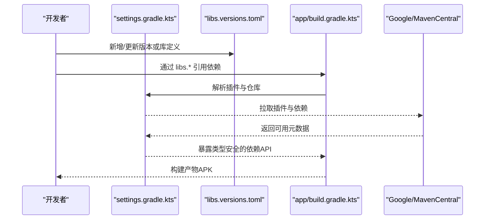
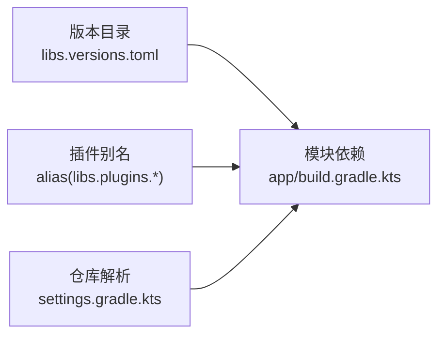

# 依赖版本管理

<cite>
**本文引用的文件**
- [gradle/libs.versions.toml](file://gradle/libs.versions.toml)
- [gradle.properties](file://gradle.properties)
- [settings.gradle.kts](file://settings.gradle.kts)
- [build.gradle.kts](file://build.gradle.kts)
- [app/build.gradle.kts](file://app/build.gradle.kts)
- [gradle/wrapper/gradle-wrapper.properties](file://gradle/wrapper/gradle-wrapper.properties)
</cite>

## 目录
1. [简介](#简介)
2. [项目结构](#项目结构)
3. [核心组件](#核心组件)
4. [架构总览](#架构总览)
5. [详细组件分析](#详细组件分析)
6. [依赖关系分析](#依赖关系分析)
7. [性能与构建优化](#性能与构建优化)
8. [安全、许可证与更新策略](#安全许可证与更新策略)
9. [常见问题与排错](#常见问题与排错)
10. [结论](#结论)

## 简介
本文件面向使用 Gradle Version Catalog（版本目录）的 Android 项目，系统化说明如何通过 gradle/libs.versions.toml 统一管理第三方库与插件版本，如何在模块中引用这些依赖，以及如何通过 gradle.properties 等全局配置优化构建环境。文档同时提供添加新依赖、升级现有依赖、处理冲突以及安全扫描、许可证管理与更新策略的实践建议。

## 项目结构
本项目采用单模块（:app）结构，依赖版本集中管理在根目录下的版本目录文件中，并通过 settings 与顶层 build 脚本统一约束仓库与插件来源。

图表来源
- [settings.gradle.kts:1-27](file://settings.gradle.kts#L1-L27)
- [gradle/libs.versions.toml:1-19](file://gradle/libs.versions.toml#L1-L19)
- [app/build.gradle.kts:6-8](file://app/build.gradle.kts#L6-L8)
- [build.gradle.kts:1-4](file://build.gradle.kts#L1-L4)
- [gradle.properties:1-13](file://gradle.properties#L1-L13)
- [gradle/wrapper/gradle-wrapper.properties:1-9](file://gradle/wrapper/gradle-wrapper.properties#L1-L9)

章节来源
- [settings.gradle.kts:1-27](file://settings.gradle.kts#L1-L27)
- [gradle/libs.versions.toml:1-19](file://gradle/libs.versions.toml#L1-L19)
- [build.gradle.kts:1-4](file://build.gradle.kts#L1-L4)
- [app/build.gradle.kts:6-8](file://app/build.gradle.kts#L6-L8)
- [gradle.properties:1-13](file://gradle.properties#L1-L13)
- [gradle/wrapper/gradle-wrapper.properties:1-9](file://gradle/wrapper/gradle-wrapper.properties#L1-L9)

## 核心组件
- 版本目录（Version Catalog）：位于 gradle/libs.versions.toml，集中维护 [versions]、[libraries]、[plugins] 三部分，实现“一处修改，处处生效”。
- 模块依赖声明：app/build.gradle.kts 通过 libs.* 访问版本目录中的库与插件，避免硬编码 group/name/version。
- 仓库与插件解析：settings.gradle.kts 通过 pluginManagement 与 dependencyResolutionManagement 统一仓库来源与解析模式。
- 构建环境与工具链：gradle.properties 设置 JVM 参数；wrapper 固定 Gradle 版本；toolchain 由 foojay resolver 管理。

章节来源
- [gradle/libs.versions.toml:1-19](file://gradle/libs.versions.toml#L1-L19)
- [app/build.gradle.kts:6-8](file://app/build.gradle.kts#L6-L8)
- [settings.gradle.kts:1-27](file://settings.gradle.kts#L1-L27)
- [gradle.properties:1-13](file://gradle.properties#L1-L13)
- [gradle/wrapper/gradle-wrapper.properties:1-9](file://gradle/wrapper/gradle-wrapper.properties#L1-L9)

## 架构总览
版本目录作为单一事实源，被所有模块共享。模块仅通过类型安全的 API（libs.xxx）引用依赖，从而将“版本号”和“依赖坐标”解耦。

图表来源
- [settings.gradle.kts:1-27](file://settings.gradle.kts#L1-L27)
- [gradle/libs.versions.toml:1-19](file://gradle/libs.versions.toml#L1-L19)
- [app/build.gradle.kts:6-8](file://app/build.gradle.kts#L6-L8)

## 详细组件分析

### 版本目录结构与用法（gradle/libs.versions.toml）
- [versions]：集中声明版本号，如 AGP、JUnit、Espresso、AppCompat、Material 等。便于统一升级。
- [libraries]：以逻辑名映射到 group/name/version，version 通过 version.ref 引用 [versions] 中的键，确保一致性。
- [plugins]：声明插件 ID 与版本，并在模块中以 alias(libs.plugins.*) 方式引用。

使用要点
- 新增依赖：先在 [versions] 定义版本键，再在 [libraries] 增加条目，最后在模块 dependencies 块中使用 libs.<name> 引用。
- 统一升级：仅需修改 [versions] 对应键值，所有引用处自动生效。
- 插件版本：通过 [plugins] 集中管理，避免在各模块重复声明。

章节来源
- [gradle/libs.versions.toml:1-19](file://gradle/libs.versions.toml#L1-L19)

### 模块如何引用依赖（app/build.gradle.kts）
- 插件引用：通过 alias(libs.plugins.android.application) 引入 Android 应用插件，版本来自版本目录。
- 依赖引用：implementation/testImplementation/androidTestImplementation 均通过 libs.* 访问，例如 appcompat、material、junit、ext-junit、espresso-core。
- 优势：无需在模块内写死 group/name/version，减少重复与维护成本。

章节来源
- [app/build.gradle.kts:6-8](file://app/build.gradle.kts#L6-L8)
- [app/build.gradle.kts:74-80](file://app/build.gradle.kts#L74-L80)

### 仓库与插件解析（settings.gradle.kts）
- pluginManagement.repositories：限定插件来源（Google、Maven Central、Gradle Plugin Portal），提升可重现性。
- dependencyResolutionManagement.repositories：统一依赖仓库（Google、Maven Central）。
- repositoriesMode.set(FAIL_ON_PROJECT_REPOS)：禁止子项目自行声明仓库，强制集中管控。

章节来源
- [settings.gradle.kts:1-27](file://settings.gradle.kts#L1-L27)

### 构建环境与工具链
- gradle.properties：设置 org.gradle.jvmargs 控制 Gradle 守护进程的内存与编码等；可启用并行构建（当前注释）。
- wrapper：gradle-wrapper.properties 固定 Gradle 发行版与校验信息，保证团队一致。
- Toolchains：通过 foojay resolver 自动获取 JDK，gradle-daemon-jvm.properties 记录各平台工具链地址与版本。

章节来源
- [gradle.properties:1-13](file://gradle.properties#L1-L13)
- [gradle/wrapper/gradle-wrapper.properties:1-9](file://gradle/wrapper/gradle-wrapper.properties#L1-L9)
- [gradle/gradle-daemon-jvm.properties:1-12](file://gradle/gradle-daemon-jvm.properties#L1-L12)

## 依赖关系分析
- 版本目录是依赖关系的唯一来源，模块通过类型安全 API 引用，降低耦合度。
- 插件与依赖分别通过 [plugins] 与 [libraries] 管理，互不干扰。
- 仓库解析集中在 settings，避免模块级仓库差异导致的不可重现构建。

图表来源
- [gradle/libs.versions.toml:1-19](file://gradle/libs.versions.toml#L1-L19)
- [app/build.gradle.kts:6-8](file://app/build.gradle.kts#L6-L8)
- [settings.gradle.kts:1-27](file://settings.gradle.kts#L1-L27)

章节来源
- [gradle/libs.versions.toml:1-19](file://gradle/libs.versions.toml#L1-L19)
- [app/build.gradle.kts:6-8](file://app/build.gradle.kts#L6-L8)
- [settings.gradle.kts:1-27](file://settings.gradle.kts#L1-L27)

## 性能与构建优化
- 启用并行构建：可在 gradle.properties 中开启 org.gradle.parallel=true（需确保多模块解耦）。
- 调整 JVM 参数：根据机器性能调优 org.gradle.jvmargs，如堆大小与编码。
- 使用 Wrapper：固定 Gradle 版本，避免环境差异。
- 缓存与增量编译：保持默认即可；如需进一步优化可结合 Gradle 配置（如构建缓存、配置缓存）。

章节来源
- [gradle.properties:1-13](file://gradle.properties#L1-L13)
- [gradle/wrapper/gradle-wrapper.properties:1-9](file://gradle/wrapper/gradle-wrapper.properties#L1-L9)

## 安全、许可证与更新策略

### 依赖安全扫描
- 推荐方案：集成 OWASP Dependency-Check 或 GitHub Dependabot，对 Maven Central 依赖进行漏洞扫描。
- 流程建议：在 CI 中加入扫描任务，阻断高危漏洞合并；定期生成报告并跟踪修复。

### 许可证管理
- 建议：在 CI 中集成许可证检查（如 Apache-2.0、MIT 等），拒绝不符合公司政策的依赖。
- 实践：维护白名单/黑名单清单，配合自动化扫描与人工审核。

### 依赖更新策略
- 小步快跑：优先升级补丁版本，回归测试通过后逐步升级次版本与主版本。
- 批量升级：利用版本目录集中管理，一次修改多处生效，降低遗漏风险。
- 兼容性验证：升级后执行完整测试套件（单元测试、UI 测试、构建产物校验）。
- 回滚预案：保留可回滚的提交历史与制品，出现问题快速恢复。

[本节为通用实践指导，不直接分析具体代码文件]

## 常见问题与排错

### 无法解析插件或依赖
- 现象：构建时报找不到插件或依赖。
- 排查：
  - 确认 settings.gradle.kts 已配置正确仓库（Google、Maven Central、Plugin Portal）。
  - 确认版本目录中 [plugins] 与 [libraries] 的键名与引用一致。
  - 检查网络与代理设置。

章节来源
- [settings.gradle.kts:1-27](file://settings.gradle.kts#L1-L27)
- [gradle/libs.versions.toml:1-19](file://gradle/libs.versions.toml#L1-L19)

### 版本不一致导致冲突
- 现象：同一库多个版本共存，引发运行时异常或编译错误。
- 解决：
  - 在版本目录中统一版本键，确保全项目一致。
  - 使用依赖排除或强制版本（必要时）。
  - 借助 Gradle 命令查看依赖树定位冲突点。

章节来源
- [gradle/libs.versions.toml:1-19](file://gradle/libs.versions.toml#L1-L19)

### 构建速度慢
- 可能原因：JVM 内存不足、未启用并行、下载依赖频繁。
- 建议：
  - 调整 org.gradle.jvmargs。
  - 启用并行构建（在多模块解耦前提下）。
  - 使用本地镜像或加速源（合规前提下）。

章节来源
- [gradle.properties:1-13](file://gradle.properties#L1-L13)

### 新增依赖后仍无法引用
- 检查步骤：
  - 是否在 [libraries] 定义了该依赖。
  - 是否在模块 dependencies 块中使用正确的 libs.* 引用。
  - 是否拼写错误或命名冲突。

章节来源
- [gradle/libs.versions.toml:1-19](file://gradle/libs.versions.toml#L1-L19)
- [app/build.gradle.kts:74-80](file://app/build.gradle.kts#L74-L80)

## 结论
通过版本目录集中管理依赖与插件版本，配合统一的仓库解析与构建环境配置，可实现“一处修改、处处生效”的可维护构建体系。建议在团队中推广版本目录最佳实践，并结合安全扫描、许可证检查与规范的更新流程，持续提升构建质量与安全性。