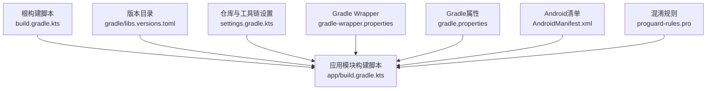
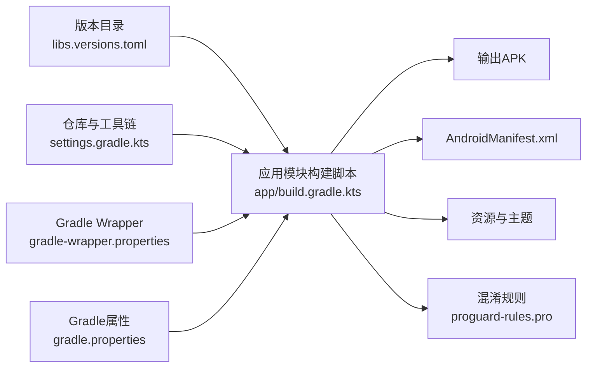
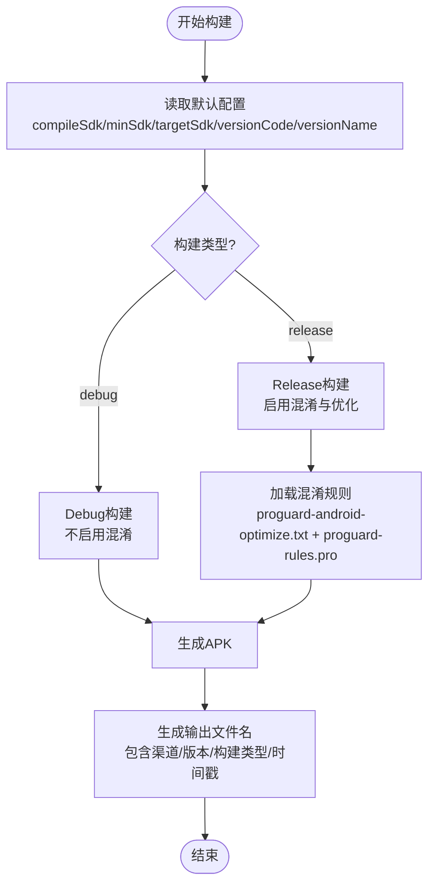
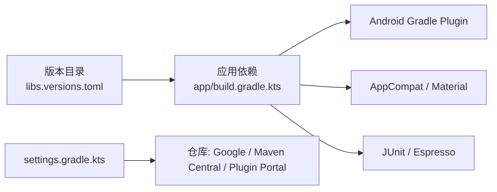

# 配置管理

<cite>
**本文引用的文件**
- [build.gradle.kts](file://build.gradle.kts)
- [app/build.gradle.kts](file://app/build.gradle.kts)
- [gradle/libs.versions.toml](file://gradle/libs.versions.toml)
- [gradle.properties](file://gradle.properties)
- [settings.gradle.kts](file://settings.gradle.kts)
- [app/src/main/AndroidManifest.xml](file://app/src/main/AndroidManifest.xml)
- [app/proguard-rules.pro](file://app/proguard-rules.pro)
- [gradle/wrapper/gradle-wrapper.properties](file://gradle/wrapper/gradle-wrapper.properties)
- [app/src/main/res/values/strings.xml](file://app/src/main/res/values/strings.xml)
- [app/src/main/res/values/themes.xml](file://app/src/main/res/values/themes.xml)
</cite>

## 目录
1. [简介](#简介)
2. [项目结构](#项目结构)
3. [核心组件](#核心组件)
4. [架构总览](#架构总览)
5. [详细组件分析](#详细组件分析)
6. [依赖分析](#依赖分析)
7. [性能与构建优化](#性能与构建优化)
8. [故障排查指南](#故障排查指南)
9. [结论](#结论)
10. [附录](#附录)

## 简介
本文件面向“设备信息”Android应用的配置管理，覆盖Gradle构建配置、Android清单设置、依赖版本管理、代码混淆规则、版本控制策略、构建优化选项与发布配置，并提供最佳实践与常见问题解决方案。目标是帮助开发者快速理解并安全地维护项目的构建与发布流程。

## 项目结构
本项目采用单模块（app）的Android工程结构，使用Kotlin DSL进行Gradle配置，并通过Version Catalog集中管理依赖版本。根级脚本仅声明插件别名，具体构建逻辑集中在app模块中。资源与清单位于app/src/main下，混淆规则位于app/proguard-rules.pro。

图表来源
- [build.gradle.kts:1-4](file://build.gradle.kts#L1-L4)
- [app/build.gradle.kts:1-80](file://app/build.gradle.kts#L1-L80)
- [gradle/libs.versions.toml:1-19](file://gradle/libs.versions.toml#L1-L19)
- [settings.gradle.kts:1-27](file://settings.gradle.kts#L1-L27)
- [gradle/wrapper/gradle-wrapper.properties:1-10](file://gradle/wrapper/gradle-wrapper.properties#L1-L10)
- [gradle.properties:1-13](file://gradle.properties#L1-L13)
- [app/src/main/AndroidManifest.xml:1-23](file://app/src/main/AndroidManifest.xml#L1-L23)
- [app/proguard-rules.pro:1-21](file://app/proguard-rules.pro#L1-L21)

章节来源
- [build.gradle.kts:1-4](file://build.gradle.kts#L1-L4)
- [app/build.gradle.kts:1-80](file://app/build.gradle.kts#L1-L80)
- [gradle/libs.versions.toml:1-19](file://gradle/libs.versions.toml#L1-L19)
- [settings.gradle.kts:1-27](file://settings.gradle.kts#L1-L27)
- [gradle/wrapper/gradle-wrapper.properties:1-10](file://gradle/wrapper/gradle-wrapper.properties#L1-L10)
- [gradle.properties:1-13](file://gradle.properties#L1-L13)
- [app/src/main/AndroidManifest.xml:1-23](file://app/src/main/AndroidManifest.xml#L1-L23)
- [app/proguard-rules.pro:1-21](file://app/proguard-rules.pro#L1-L21)

## 核心组件
- Gradle插件与构建脚本：根脚本声明插件别名；app模块脚本定义编译SDK、默认配置、构建类型、输出命名、编译选项与依赖。
- 版本目录：集中管理AGP、测试库、UI库等版本，统一引用。
- 仓库与工具链：在settings中声明Google/Maven Central/Gradle Plugin Portal，启用Foojay Toolchains约定以自动解析JDK。
- Android清单：声明应用ID、主题、图标、备份规则、主Activity及启动意图。
- 混淆规则：提供ProGuard基础注释与可选保留行号信息的开关。
- Gradle Wrapper与属性：固定Gradle版本与JVM参数，便于团队一致构建。

章节来源
- [app/build.gradle.kts:10-43](file://app/build.gradle.kts#L10-L43)
- [gradle/libs.versions.toml:1-19](file://gradle/libs.versions.toml#L1-L19)
- [settings.gradle.kts:1-27](file://settings.gradle.kts#L1-L27)
- [app/src/main/AndroidManifest.xml:1-23](file://app/src/main/AndroidManifest.xml#L1-L23)
- [app/proguard-rules.pro:1-21](file://app/proguard-rules.pro#L1-L21)
- [gradle/wrapper/gradle-wrapper.properties:1-10](file://gradle/wrapper/gradle-wrapper.properties#L1-L10)
- [gradle.properties:1-13](file://gradle.properties#L1-L13)

## 架构总览
下图展示构建期关键组件之间的依赖关系与数据流向：版本目录被应用模块引用；应用模块通过Gradle插件生成APK；清单与资源参与打包；混淆规则在release构建时生效。

图表来源
- [gradle/libs.versions.toml:1-19](file://gradle/libs.versions.toml#L1-L19)
- [app/build.gradle.kts:1-80](file://app/build.gradle.kts#L1-L80)
- [settings.gradle.kts:1-27](file://settings.gradle.kts#L1-L27)
- [gradle/wrapper/gradle-wrapper.properties:1-10](file://gradle/wrapper/gradle-wrapper.properties#L1-L10)
- [gradle.properties:1-13](file://gradle.properties#L1-L13)
- [app/src/main/AndroidManifest.xml:1-23](file://app/src/main/AndroidManifest.xml#L1-L23)
- [app/proguard-rules.pro:1-21](file://app/proguard-rules.pro#L1-L21)

## 详细组件分析

### Gradle构建配置（app模块）
- 命名空间与编译目标：设置应用命名空间、编译SDK版本、最小与目标SDK版本。
- 默认配置：应用包名、版本号与名称、测试运行器。
- 构建类型：release开启混淆与优化，引用全局与自定义混淆规则。
- 编译选项：Java源与目标兼容版本。
- 输出命名：基于渠道、版本、构建类型与时间戳动态生成APK文件名，便于追踪构建产物。
- 依赖：通过版本目录引入AppCompat、Material、JUnit与Espresso。

图表来源
- [app/build.gradle.kts:18-43](file://app/build.gradle.kts#L18-L43)
- [app/build.gradle.kts:45-72](file://app/build.gradle.kts#L45-L72)
- [app/proguard-rules.pro:1-21](file://app/proguard-rules.pro#L1-L21)

章节来源
- [app/build.gradle.kts:10-43](file://app/build.gradle.kts#L10-L43)
- [app/build.gradle.kts:45-72](file://app/build.gradle.kts#L45-L72)

### 依赖版本管理（Version Catalog）
- 集中定义AGP、测试与UI库的版本号，并在依赖声明中以别名引用，避免散落的硬编码版本。
- 插件版本也通过版本目录管理，确保构建工具一致性。
- 建议：新增依赖时优先加入版本目录，保持单一事实来源。

章节来源
- [gradle/libs.versions.toml:1-19](file://gradle/libs.versions.toml#L1-L19)
- [app/build.gradle.kts:74-80](file://app/build.gradle.kts#L74-L80)

### Android清单文件设置
- 应用元信息：包名、图标、标签、主题、备份与数据提取规则。
- 入口Activity：声明MainActivity为LAUNCHER入口，并允许导出以便系统启动。
- 主题与样式：使用Material Components主题，支持日间/夜间模式。

章节来源
- [app/src/main/AndroidManifest.xml:1-23](file://app/src/main/AndroidManifest.xml#L1-L23)
- [app/src/main/res/values/themes.xml:1-16](file://app/src/main/res/values/themes.xml#L1-L16)
- [app/src/main/res/values/strings.xml:1-3](file://app/src/main/res/values/strings.xml#L1-L3)

### 代码混淆规则（ProGuard/R8）
- release构建启用混淆与优化，并加载默认优化规则与项目自定义规则。
- 当前规则文件提供注释示例，可启用保留行号信息以辅助调试崩溃堆栈。
- 建议：按需添加keep规则以保护反射、序列化、WebView JS接口等必要类或成员。

章节来源
- [app/build.gradle.kts:29-37](file://app/build.gradle.kts#L29-L37)
- [app/proguard-rules.pro:1-21](file://app/proguard-rules.pro#L1-L21)

### 仓库与工具链（settings）
- 插件仓库：限定Google与AndroidX相关插件从Google仓库获取，其他插件从Gradle Plugin Portal。
- 依赖仓库：启用Google与Maven Central。
- 工具链：启用Foojay Resolver以自动解析JDK，减少本地环境差异。

章节来源
- [settings.gradle.kts:1-27](file://settings.gradle.kts#L1-L27)

### Gradle Wrapper与属性
- Wrapper：固定Gradle发行版与校验和，保证团队一致的构建环境。
- JVM参数：设置Gradle守护进程最大堆内存与编码，提升构建稳定性与速度。

章节来源
- [gradle/wrapper/gradle-wrapper.properties:1-10](file://gradle/wrapper/gradle-wrapper.properties#L1-L10)
- [gradle.properties:1-13](file://gradle.properties#L1-L13)

## 依赖分析
- 直接依赖：AppCompat、Material、JUnit、AndroidX Test、Espresso。
- 构建工具：Android Gradle Plugin由版本目录统一管理。
- 仓库访问：Google、Maven Central、Gradle Plugin Portal。

图表来源
- [gradle/libs.versions.toml:1-19](file://gradle/libs.versions.toml#L1-L19)
- [app/build.gradle.kts:74-80](file://app/build.gradle.kts#L74-L80)
- [settings.gradle.kts:1-27](file://settings.gradle.kts#L1-L27)

章节来源
- [gradle/libs.versions.toml:1-19](file://gradle/libs.versions.toml#L1-L19)
- [app/build.gradle.kts:74-80](file://app/build.gradle.kts#L74-L80)
- [settings.gradle.kts:1-27](file://settings.gradle.kts#L1-L27)

## 性能与构建优化
- 并行构建：可在gradle.properties中启用org.gradle.parallel=true以提升多模块构建速度（当前已注释）。
- 增量构建：保持稳定的任务输入与输出，避免不必要的重新编译。
- 构建缓存：启用Gradle构建缓存与远程缓存（如CI），加速重复构建。
- 资源压缩与R8：release已启用混淆与优化，可进一步评估资源压缩与无用代码移除效果。
- 输出命名：基于时间与版本的APK命名有助于定位构建产物，建议在CI中归档对应产物。

[本节为通用指导，无需特定文件引用]

## 故障排查指南
- 构建失败：检查Gradle Wrapper版本与本地JDK是否匹配；确认仓库可达且镜像可用。
- 依赖冲突：通过版本目录统一版本；必要时在依赖声明中显式指定版本或使用强制解析。
- 混淆导致崩溃：临时关闭混淆定位问题；逐步添加keep规则；启用保留行号信息以定位堆栈。
- 清单错误：核对applicationId、targetSdk、权限与Activity声明是否符合预期。
- 构建缓慢：启用并行构建与构建缓存；减少不必要的依赖；清理未使用的资源。

章节来源
- [gradle/wrapper/gradle-wrapper.properties:1-10](file://gradle/wrapper/gradle-wrapper.properties#L1-L10)
- [gradle.properties:1-13](file://gradle.properties#L1-L13)
- [app/proguard-rules.pro:1-21](file://app/proguard-rules.pro#L1-L21)
- [app/src/main/AndroidManifest.xml:1-23](file://app/src/main/AndroidManifest.xml#L1-L23)

## 结论
本项目通过版本目录集中管理依赖与插件版本，结合Gradle插件与清单配置，实现了清晰的构建流程与可追溯的产物命名。release构建启用混淆与优化，配合可选的行号保留规则，兼顾安全性与可调试性。建议在CI中固化Wrapper与JDK版本，启用并行与缓存，持续优化构建性能。

[本节为总结性内容，无需特定文件引用]

## 附录

### 版本控制策略
- 版本号：versionCode用于内部递增，versionName用于对外发布标识。
- 分支策略：建议使用主干开发+发布分支；tag标记稳定版本。
- 变更追踪：每次发布前更新versionCode与必要的资源/清单变更，并在提交信息中注明版本。

章节来源
- [app/build.gradle.kts:18-26](file://app/build.gradle.kts#L18-L26)

### 构建优化选项
- 并行构建：在gradle.properties中启用org.gradle.parallel=true。
- 构建缓存：启用Gradle构建缓存与远程缓存。
- R8/ProGuard：release已启用，可按需调整优化级别与保留规则。

章节来源
- [gradle.properties:1-13](file://gradle.properties#L1-L13)
- [app/build.gradle.kts:29-37](file://app/build.gradle.kts#L29-L37)

### 发布配置
- 签名：建议在CI中使用密钥库与凭据注入，避免将敏感信息提交到仓库。
- 产物归档：基于动态命名的APK在CI中归档，便于回溯与分发。
- 多渠道：如需多渠道，可在app模块中扩展productFlavors并复用输出命名逻辑。

章节来源
- [app/build.gradle.kts:45-72](file://app/build.gradle.kts#L45-L72)

### 第三方依赖集成与兼容性
- AppCompat与Material：通过版本目录管理，确保与AGP与目标SDK兼容。
- 测试库：JUnit与Espresso版本应与AndroidX测试框架保持一致。
- 升级建议：升级AGP或AndroidX时，优先查看官方兼容性矩阵，并在测试环境中验证。

章节来源
- [gradle/libs.versions.toml:1-19](file://gradle/libs.versions.toml#L1-L19)
- [app/build.gradle.kts:74-80](file://app/build.gradle.kts#L74-L80)

### 清单与主题要点
- 应用主题：使用Material Components主题，支持日间/夜间模式。
- 备份与数据提取：启用备份与数据提取规则，遵循Android数据安全要求。
- 入口Activity：确保MainActivity正确声明为LAUNCHER入口。

章节来源
- [app/src/main/AndroidManifest.xml:1-23](file://app/src/main/AndroidManifest.xml#L1-L23)
- [app/src/main/res/values/themes.xml:1-16](file://app/src/main/res/values/themes.xml#L1-L16)