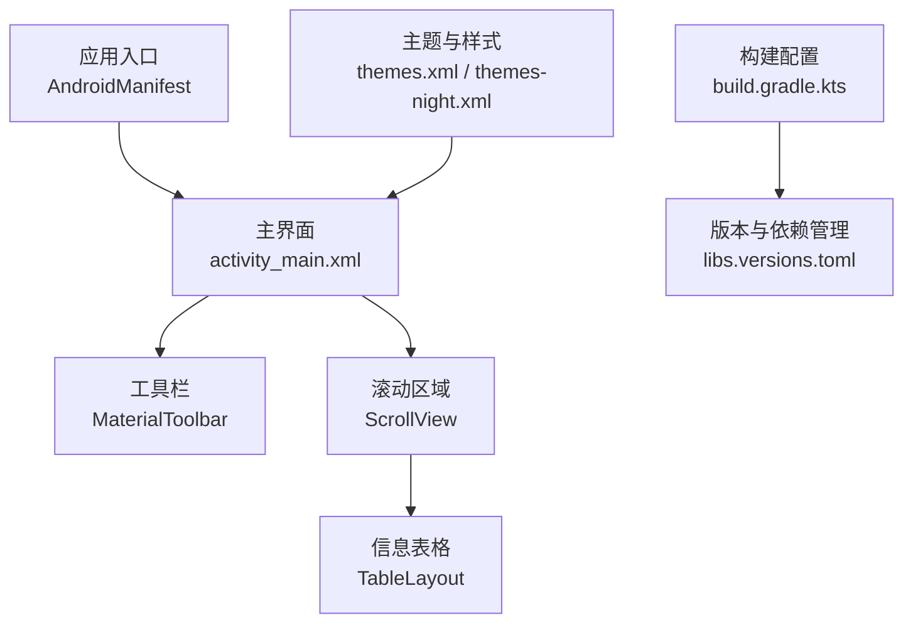
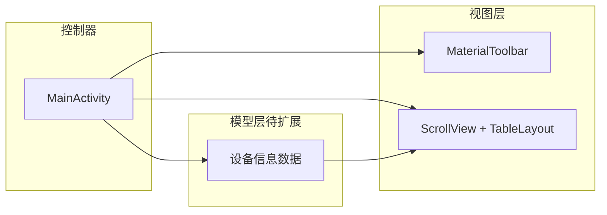
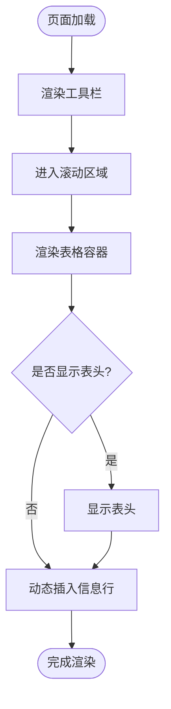
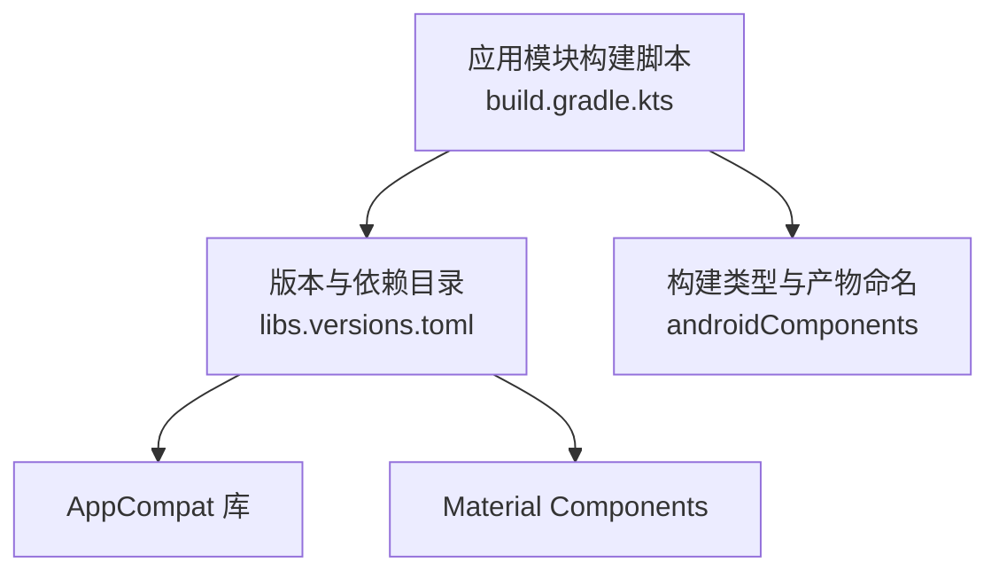
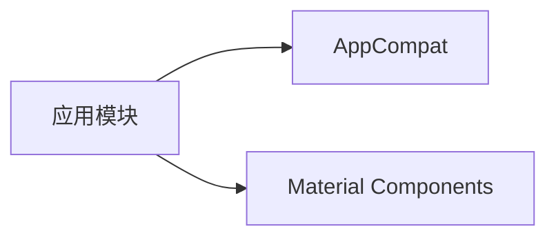

# 项目概述

<cite>
**本文引用的文件**
- [app/src/main/java/com/newland/deviceinformation/MainActivity.java](file://app/src/main/java/com/newland/deviceinformation/MainActivity.java)
- [app/src/main/res/layout/activity_main.xml](file://app/src/main/res/layout/activity_main.xml)
- [app/build.gradle.kts](file://app/build.gradle.kts)
- [gradle/libs.versions.toml](file://gradle/libs.versions.toml)
- [app/src/main/AndroidManifest.xml](file://app/src/main/AndroidManifest.xml)
- [app/src/main/res/values/themes.xml](file://app/src/main/res/values/themes.xml)
- [app/src/main/res/values-night/themes.xml](file://app/src/main/res/values-night/themes.xml)
- [app/src/main/res/values/strings.xml](file://app/src/main/res/values/strings.xml)
</cite>

## 目录
1. [简介](#简介)
2. [项目结构](#项目结构)
3. [核心组件](#核心组件)
4. [架构总览](#架构总览)
5. [详细组件分析](#详细组件分析)
6. [依赖关系分析](#依赖关系分析)
7. [性能与可维护性建议](#性能与可维护性建议)
8. [故障排查指南](#故障排查指南)
9. [结论](#结论)
10. [附录：常见用例示例](#附录常见用例示例)

## 简介
本项目是一个用于展示 Android 设备系统信息与硬件配置的移动应用。应用采用 Material Design 设计语言，提供简洁直观的界面以呈现设备关键信息（如系统版本、设备型号、屏幕参数等）。整体采用轻量级 MVC 风格组织代码：Activity 作为控制器负责生命周期与 UI 交互，布局资源定义视图层，数据获取逻辑可在后续扩展为独立的数据层。

目标读者包括初学者与有经验的开发者：前者可通过概念性介绍快速理解项目用途与结构；后者可参考技术细节进行二次开发与集成。

## 项目结构
项目遵循标准 Android 工程组织方式，包含应用模块、Gradle 构建配置与资源目录。核心入口为 Activity，界面通过 XML 布局定义，主题与样式基于 Material Components。

图表来源
- [app/src/main/AndroidManifest.xml:1-23](file://app/src/main/AndroidManifest.xml#L1-L23)
- [app/src/main/res/layout/activity_main.xml:1-62](file://app/src/main/res/layout/activity_main.xml#L1-L62)
- [app/build.gradle.kts:1-80](file://app/build.gradle.kts#L1-L80)
- [gradle/libs.versions.toml:1-19](file://gradle/libs.versions.toml#L1-L19)
- [app/src/main/res/values/themes.xml:1-16](file://app/src/main/res/values/themes.xml#L1-L16)
- [app/src/main/res/values-night/themes.xml:1-16](file://app/src/main/res/values-night/themes.xml#L1-L16)

章节来源
- [app/src/main/AndroidManifest.xml:1-23](file://app/src/main/AndroidManifest.xml#L1-L23)
- [app/src/main/res/layout/activity_main.xml:1-62](file://app/src/main/res/layout/activity_main.xml#L1-L62)
- [app/build.gradle.kts:1-80](file://app/build.gradle.kts#L1-L80)
- [gradle/libs.versions.toml:1-19](file://gradle/libs.versions.toml#L1-L19)
- [app/src/main/res/values/themes.xml:1-16](file://app/src/main/res/values/themes.xml#L1-L16)
- [app/src/main/res/values-night/themes.xml:1-16](file://app/src/main/res/values-night/themes.xml#L1-L16)

## 核心组件
- 主界面 Activity：应用启动后的首个页面，承载工具栏与信息展示区。当前实现中，Activity 作为控制器负责绑定视图并预留数据填充位置。
- 界面布局：使用 MaterialToolbar 作为标题栏，结合 ScrollView 与 TableLayout 构建可滚动的信息表格，便于在不同屏幕尺寸下良好展示。
- 构建与依赖：通过 Gradle Kotlin DSL 管理编译 SDK、最低 API 级别、版本号与第三方库依赖；统一在版本目录文件中声明依赖版本。
- 主题与样式：基于 MaterialComponents 的 DayNight 主题，支持浅色与深色模式切换，状态栏颜色与品牌色已配置。

章节来源
- [app/src/main/java/com/newland/deviceinformation/MainActivity.java:1-53](file://app/src/main/java/com/newland/deviceinformation/MainActivity.java#L1-L53)
- [app/src/main/res/layout/activity_main.xml:1-62](file://app/src/main/res/layout/activity_main.xml#L1-L62)
- [app/build.gradle.kts:1-80](file://app/build.gradle.kts#L1-L80)
- [gradle/libs.versions.toml:1-19](file://gradle/libs.versions.toml#L1-L19)
- [app/src/main/res/values/themes.xml:1-16](file://app/src/main/res/values/themes.xml#L1-L16)
- [app/src/main/res/values-night/themes.xml:1-16](file://app/src/main/res/values-night/themes.xml#L1-L16)

## 架构总览
应用采用轻量级 MVC 风格：
- 模型（Model）：待扩展的设备信息数据模型（例如系统版本、厂商、型号、屏幕分辨率、内存等），可由系统 API 或本地服务提供。
- 视图（View）：XML 布局文件定义的工具栏与表格，负责渲染与用户交互。
- 控制器（Controller）：Activity 负责生命周期管理、视图绑定与数据到界面的映射。

图表来源
- [app/src/main/java/com/newland/deviceinformation/MainActivity.java:1-53](file://app/src/main/java/com/newland/deviceinformation/MainActivity.java#L1-L53)
- [app/src/main/res/layout/activity_main.xml:1-62](file://app/src/main/res/layout/activity_main.xml#L1-L62)

## 详细组件分析

### 主界面 Activity
- 职责：作为应用入口页面的控制器，负责初始化界面、处理生命周期事件，并在未来承担设备信息的读取与展示逻辑。
- 当前状态：文件存在但内容未解析成功，建议在后续开发中完善 Activity 的实现，包括视图绑定、数据加载与错误处理。

章节来源
- [app/src/main/java/com/newland/deviceinformation/MainActivity.java:1-53](file://app/src/main/java/com/newland/deviceinformation/MainActivity.java#L1-L53)

### 界面布局（activity_main.xml）
- 工具栏：使用 MaterialToolbar，标题居中，背景与阴影已设置，提升视觉层次。
- 内容区：ScrollView 包裹 TableLayout，支持纵向滚动；表格列宽自适应，分隔线样式已定义。
- 表头：预留了属性与值的表头行（当前隐藏），便于后续动态插入设备信息行。

图表来源
- [app/src/main/res/layout/activity_main.xml:1-62](file://app/src/main/res/layout/activity_main.xml#L1-L62)

章节来源
- [app/src/main/res/layout/activity_main.xml:1-62](file://app/src/main/res/layout/activity_main.xml#L1-L62)

### 构建配置与依赖（build.gradle.kts 与 libs.versions.toml）
- 编译与目标：指定 compileSdk、minSdk、targetSdk 与 Java 版本，确保兼容性与特性可用。
- 输出命名：自定义 APK 文件名规则，包含版本、构建类型与时间戳，便于追踪与归档。
- 依赖管理：集中声明 appcompat 与 material 依赖，统一版本管理，减少冲突风险。

图表来源
- [app/build.gradle.kts:1-80](file://app/build.gradle.kts#L1-L80)
- [gradle/libs.versions.toml:1-19](file://gradle/libs.versions.toml#L1-L19)

章节来源
- [app/build.gradle.kts:1-80](file://app/build.gradle.kts#L1-L80)
- [gradle/libs.versions.toml:1-19](file://gradle/libs.versions.toml#L1-L19)

### 主题与样式（themes.xml 与 themes-night.xml）
- 主题基类：继承自 MaterialComponents 的 DayNight 主题，自动适配浅色与深色模式。
- 品牌色与状态栏：配置主色、次色与状态栏颜色，保证一致的视觉体验。
- 夜间模式：提供独立的夜间主题资源，优化暗色环境下的可读性。

章节来源
- [app/src/main/res/values/themes.xml:1-16](file://app/src/main/res/values/themes.xml#L1-L16)
- [app/src/main/res/values-night/themes.xml:1-16](file://app/src/main/res/values-night/themes.xml#L1-L16)

### 清单与入口（AndroidManifest.xml）
- 应用元信息：名称、图标、主题、备份与数据提取规则。
- 活动声明：MainActivity 设置为可导出并作为启动入口，包含 LAUNCHER 分类。

章节来源
- [app/src/main/AndroidManifest.xml:1-23](file://app/src/main/AndroidManifest.xml#L1-L23)

## 依赖关系分析
- 直接依赖：
  - AppCompat：提供向后兼容的 API 与基础控件。
  - Material Components：提供 Material Design 风格的 UI 组件与主题。
- 间接依赖：由上述库引入的基础运行时与资源。

图表来源
- [gradle/libs.versions.toml:1-19](file://gradle/libs.versions.toml#L1-L19)
- [app/build.gradle.kts:74-80](file://app/build.gradle.kts#L74-L80)

章节来源
- [gradle/libs.versions.toml:1-19](file://gradle/libs.versions.toml#L1-L19)
- [app/build.gradle.kts:74-80](file://app/build.gradle.kts#L74-L80)

## 性能与可维护性建议
- 数据加载策略：将设备信息查询封装为异步任务，避免阻塞主线程；对频繁访问的系统 API 做缓存以减少开销。
- 列表渲染优化：当信息条目较多时，考虑使用 RecyclerView 替代 TableLayout，以获得更好的滚动性能与复用机制。
- 主题与资源：保持主题与资源分离，便于多语言与多主题扩展；避免硬编码颜色值，统一从资源引用。
- 构建产物管理：保留带时间戳的 APK 命名策略，便于版本回溯与测试分发。

[本节为通用建议，不直接分析具体文件]

## 故障排查指南
- 启动失败：检查 AndroidManifest 中的 MainActivity 声明是否正确，以及主题是否存在。
- 界面空白：确认 activity_main.xml 中的 TableLayout 与 ScrollView 层级正确，且无可见性错误导致内容被隐藏。
- 主题异常：验证 themes.xml 与 themes-night.xml 中的主题继承与颜色资源是否完整。
- 依赖冲突：若出现编译错误，检查 libs.versions.toml 中依赖版本是否与 AGP 和 AndroidX 兼容。

章节来源
- [app/src/main/AndroidManifest.xml:1-23](file://app/src/main/AndroidManifest.xml#L1-L23)
- [app/src/main/res/layout/activity_main.xml:1-62](file://app/src/main/res/layout/activity_main.xml#L1-L62)
- [app/src/main/res/values/themes.xml:1-16](file://app/src/main/res/values/themes.xml#L1-L16)
- [app/src/main/res/values-night/themes.xml:1-16](file://app/src/main/res/values-night/themes.xml#L1-L16)
- [gradle/libs.versions.toml:1-19](file://gradle/libs.versions.toml#L1-L19)

## 结论
该项目提供了一个基于 Material Design 的 Android 设备信息展示应用骨架，具备清晰的界面结构与构建配置。当前阶段重点在于完善 Activity 的数据获取与展示逻辑，并可根据需求扩展更多设备维度信息。通过模块化与主题化设计，项目具备良好的可维护性与可扩展性。

[本节为总结性内容，不直接分析具体文件]

## 附录：常见用例示例
- 查看系统版本与设备型号：在信息表格中新增“系统版本”“设备型号”两行，分别填入对应值。
- 展示屏幕参数：添加“分辨率”“像素密度”“屏幕尺寸”等条目，帮助用户了解屏幕规格。
- 内存与存储概览：增加“运行内存”“内部存储”等信息，便于评估设备能力。
- 深色模式适配：利用 Night 主题自动切换配色，确保信息在暗色环境下清晰可读。

[本节为概念性示例，不直接分析具体文件]