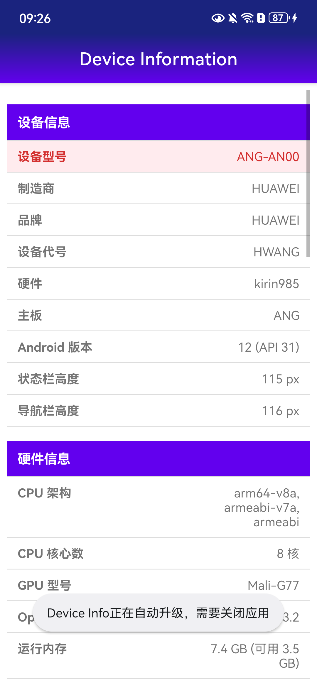
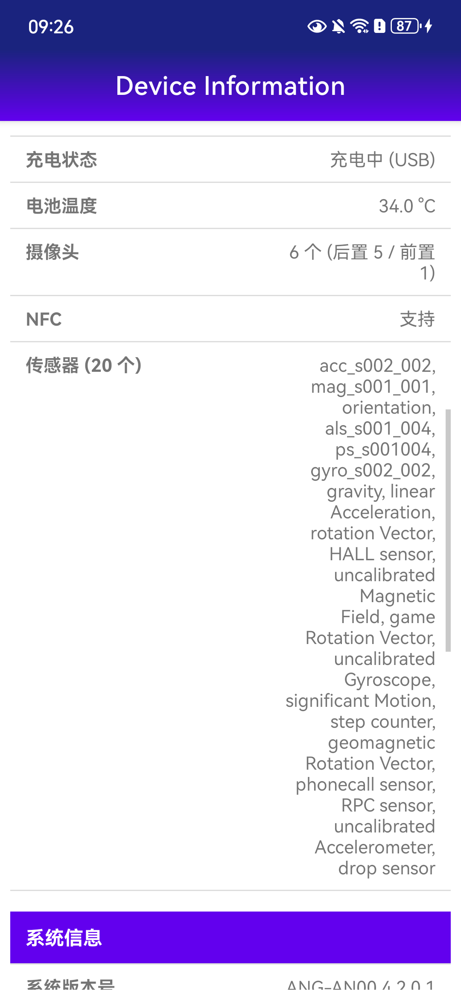
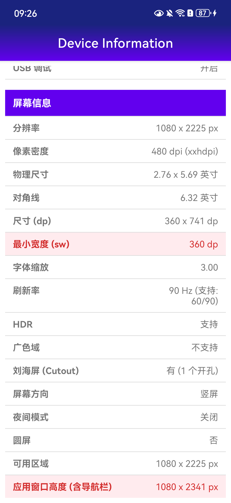

# Device Info

<p align="center">
  
</p>

<p align="center">
  一款<b>零权限</b>的轻量级 Android 设备信息查看工具。<br>
  以分组表格形式展示设备与屏幕的关键参数，重要指标红色高亮，一目了然。
</p>

## 应用截图

<p align="center">
  
  
  
</p>

> 截图设备：HUAWEI ANG-AN00 / Android 12 (API 31)。

## 功能特性

- **零权限申请**：`AndroidManifest.xml` 不申请任何权限，纯本地读取系统公开参数，无隐私风险
- **四大分组表格**：「设备信息」「硬件信息」「系统信息」「屏幕信息」，检测到外接/副屏时自动追加「显示屏信息」分组；深紫色分组标题 + 分隔线表格，结构清晰
- **关键指标高亮**：设备型号、最小宽度 (sw)、应用窗口高度等适配常用指标以红色突出显示
- **硬件全景**：CPU 架构/核心数、GPU 型号、OpenGL ES、内存、存储、电池、摄像头、NFC、传感器一览无余
- **密度等级换算**：像素密度自动映射为 `ldpi ~ xxxhdpi` 资源限定符，方便对照适配规则

## 展示信息一览

### 设备信息

| 项目 | 说明 | 数据来源 |
| --- | --- | --- |
| 设备型号 | 高亮显示 | `Build.MODEL` |
| 制造商 | | `Build.MANUFACTURER` |
| 品牌 | | `Build.BRAND` |
| 设备代号 | | `Build.DEVICE` |
| 硬件 | | `Build.HARDWARE` |
| 主板 | | `Build.BOARD` |
| Android 版本 | 版本号 + API Level | `Build.VERSION.RELEASE` / `Build.VERSION.SDK_INT` |
| 状态栏高度 | px | 系统资源 `status_bar_height` |
| 导航栏高度 | px | 系统资源 `navigation_bar_height` |

### 硬件信息

| 项目 | 说明 | 数据来源 |
| --- | --- | --- |
| CPU 架构 | 支持的 ABI 列表 | `Build.SUPPORTED_ABIS` |
| CPU 核心数 | | `Runtime.getRuntime().availableProcessors()` |
| GPU 型号 | 临时 EGL pbuffer 上下文查询 | `GLES20.GL_RENDERER` |
| OpenGL ES 版本 | | `ConfigurationInfo.getGlEsVersion()` |
| 运行内存 | 总量 (可用) | `ActivityManager.MemoryInfo` |
| 内部存储 | 总量 (可用) | `StatFs` + 数据目录 |
| 外置 SD 卡 | 总量 (可用)，无卡时显示「无」 | `getExternalFilesDirs()` + `StatFs` |
| 电池电量 | 百分比 | `ACTION_BATTERY_CHANGED` 粘性广播 |
| 充电状态 | 未充电 / 充电中 (AC/USB/无线) / 已充满 | 同上 |
| 电池温度 | °C | 同上 |
| 摄像头 | 总数 (后置 / 前置) | `CameraManager` |
| NFC | 支持 / 不支持 | `NfcAdapter` |
| 传感器 | 数量 + 名称列表 | `SensorManager` |

### 系统信息

| 项目 | 说明 | 数据来源 |
| --- | --- | --- |
| 系统版本号 | Build 号 | `Build.DISPLAY` |
| 安全补丁级别 | | `Build.VERSION.SECURITY_PATCH` |
| 内核版本 | | `System.getProperty("os.version")` |
| 运行时间 | 开机至今 | `SystemClock.elapsedRealtime()` |
| 系统语言 | | `Configuration.getLocales()` |
| 时区 | | `TimeZone.getDefault()` |
| 开发者选项 | 开启 / 关闭 | `Settings.Global.DEVELOPMENT_SETTINGS_ENABLED` |
| USB 调试 | 开启 / 关闭 | `Settings.Global.ADB_ENABLED` |

### 屏幕信息

| 项目 | 说明 | 数据来源 |
| --- | --- | --- |
| 分辨率 | 物理像素 | `DisplayMetrics.widthPixels/heightPixels` |
| 像素密度 | dpi + 密度限定符 | `DisplayMetrics.densityDpi` |
| 物理尺寸 | 宽 x 高（英寸） | 像素 ÷ `xdpi/ydpi` 计算 |
| 对角线 | 英寸 | 勾股定理计算 |
| 尺寸 (dp) | | `Configuration.screenWidthDp/screenHeightDp` |
| 最小宽度 (sw) | 高亮显示，布局适配关键指标 | `Configuration.smallestScreenWidthDp` |
| 字体缩放 | | `DisplayMetrics.scaledDensity` |
| 刷新率 | 当前值 + 支持列表 | `Display.getRefreshRate()` / `getSupportedRefreshRates()` |
| HDR | 支持 / 不支持 | `Display.getHdrCapabilities()` (API 26+) |
| 广色域 | 支持 / 不支持 | `Display.isWideColorGamut()` (API 26+) |
| 刘海屏 (Cutout) | 无 / 有 (开孔数) | `DisplayCutout` (API 28+) |
| 屏幕方向 | 竖屏 / 横屏 | `Configuration.orientation` |
| 夜间模式 | 开启 / 关闭 | `Configuration.uiMode` |
| 圆屏 | 是 / 否 | `Configuration.isScreenRound()` |
| 可用区域 | 扣除系统栏后的实际窗口区域 | `getWindowVisibleDisplayFrame()` |
| 应用窗口高度 (含导航栏) | 高亮显示 | 可用区域 + 导航栏高度 |

### 显示屏信息（仅多屏设备显示）

对每个非默认显示屏列出：显示屏名称、分辨率、像素密度（含限定符）、尺寸 (dp)。

## 项目结构

```
.
├── app/
│   ├── build.gradle.kts               # 模块配置 + APK 自定义命名
│   └── src/main/
│       ├── AndroidManifest.xml        # 零权限声明
│       ├── java/com/newland/deviceinformation/
│       │   └── MainActivity.java      # 单 Activity：构建设备信息数据并渲染表格
│       └── res/
│           ├── layout/activity_main.xml   # MaterialToolbar + ScrollView + TableLayout
│           └── drawable/                  # Logo、标题栏渐变、表格分隔线等
├── gradle/libs.versions.toml          # 版本目录（统一依赖管理）
├── history-apks/                      # 历史版本安装包归档
└── screenshots/                       # README 截图
```

### 技术要点

- **语言/框架**：Java + AndroidX AppCompat + Material Components
- **版本要求**：minSdk 24 (Android 7.0)，targetSdk/compileSdk 36
- **UI 结构**：渐变标题栏（`MaterialToolbar`）+ `ScrollView` 内嵌 `TableLayout`；分组标题行与高亮数据行在 `MainActivity` 中动态构建
- **依赖管理**：Gradle Version Catalog（`gradle/libs.versions.toml`）

## 构建与安装

```bash
./gradlew assembleDebug
```

APK 输出至 `app/build/outputs/apk/debug/`，命名规则为：

```
DEVICE-INFO-<版本号>-<构建类型>-<yyyyMMddHHmm>.apk
```

示例：`DEVICE-INFO-2.0.1-DEBUG-202608261114.apk`。

历史版本安装包见 [`history-apks/`](history-apks/)，可直接 `adb install` 安装体验。

## 版本历史

| 版本 | 主要变更 |
| --- | --- |
| 2.0.2 | 新增「硬件信息」「系统信息」分组与屏幕扩展项（CPU/GPU/内存/存储/电池/摄像头/传感器/刷新率/HDR/刘海屏等），保持零权限 |
| 2.0.1 | 新增「应用窗口高度 (含导航栏)」高亮指标 |
| 2.0.0 | 分组表格 UI、多屏信息支持、更换 Logo、自定义 APK 命名 |

## License

仅用于学习与设备适配参考。
